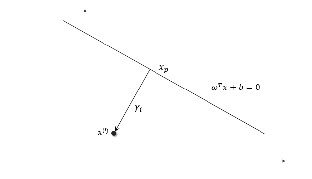

## 支持向量机

来源于不同类别的数据，它们的特征一般来说是可以区分的。对于某个特征，总是可以使用足够高维的向量 $$x_i = [x_{i1}, \, x_{i2},,,\,x_{im}]$$ 来表示，其中 *m* 为特征的维度，这样大量的特征在高维空间中形成了点云。具有明显差异的两类特征可以使用一个超平面进行分割，而一般这样的超平面可能不止一个，显然有的超平面会比其他的更加合理。支持向量机算法就是在这种目的下，希望找到一个超平面，使得特征点离超平面的最小间隔最大。所谓的最小间隔，就是指在所有点中，距离超平面最小的那个值。

假设上图中的实线即为这样的超平面，设其方程为

$$
\omega^T x +b = 0
$$

我们说这样的超平面使得特征点到超平面的最小间隔最大，这一说法涉及到三个概念，比较拗口，所以这里分开说明，首先是“特征点到超平面的间隔”，然后是“最小间隔”，最后是“最小间隔最大”。

为了计算空间中一个点到超平面的距离，我们考虑如下位置关系，假设点 $$x_i$$ 距离超平面的距离为 $$\gamma_i$$，我们过点作一条垂线，垂足为 $$x_p$$，显然 $$x_p$$ 满足方程

$$
\omega^T x_p + b = 0
$$

并且可以证明从 $$x_p$$ 指向 $$x_i$$ 的方向为 $$\omega$$ ，于是存在下述关系

$$
x_i = x_p + \gamma_i \frac{\omega}{\|\omega\|}
$$

将 $$x_i$$ 代入函数 $$f(x) = \omega^T x + b$$

$$
\begin{aligned}
f(x_i) &= \omega^T (x_p + \gamma_i \frac{\omega}{\|\omega\|}) + b\\
&= \omega^T x_p + b + \gamma_i \|\omega\|\\
&=\gamma_i \|\omega\|\\
\gamma_i& = \frac{\omega^T}{\|\omega\|}x_i + \frac{b}{\|\omega\|}
\end{aligned}
$$

对于第二个类别的数据，$$x_i$$ 位于超平面的另一边，如下图

则类似地有

$$
x_i = x_p - \gamma_i \frac{\omega}{\|\omega\|}
$$

$$
\gamma_i =-\left( \frac{\omega^T}{\|\omega\|}x_i + \frac{b}{\|\omega\|}\right)
$$

若假设第一个类别的标签为 $$y_i = 1$$，第二类别为 $$y_i = -1$$，那么可以将距离统一写成

$$
\gamma_i =y_i \left(\frac{\omega^T}{\|\omega\|}x_i + \frac{b}{\|\omega\|}\right)
$$

这里的 $$\gamma_i$$， 就是特征点到超平面的间隔。对于一个特定的超平面，用 $$\omega, b$$ 来定义，不同的特征到它有不同的间隔值，而最小的那个间隔就被定义为

$$
\gamma = \min_{i=1,,,n} \gamma_i
$$

为了找到最合适的分割面，我们定义的目标就是搜寻 $\omega, b$， 使得上述得到的最小间隔有最大的值，即

$$
\max_{\omega, b}\,\gamma
$$

把前面两个定义合并，且将最小间隔的定义作为约束条件，那么问题就变成下面的形式

$$
\max_{\omega, b}\,\gamma\\
s.t. \quad y_i \left(\frac{\omega^T}{\|\omega\|}x_i + \frac{b}{\|\omega\|}\right) \ge \gamma\,\,,\, i = 1,,,n
$$

如果令 $$\hat \gamma_i = \|\omega\| \gamma_i, \hat \gamma = \min_{i=1,,,n} \hat \gamma_i$$，那么优化问题又可变换为

$$
\max_{\omega, b} \,\frac{\hat \gamma}{\|\omega\|}\\
s.t. \quad y_i(\omega^T x_i + b) \ge \hat \gamma
$$

end
