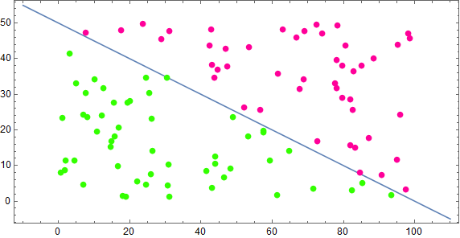
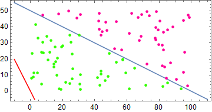
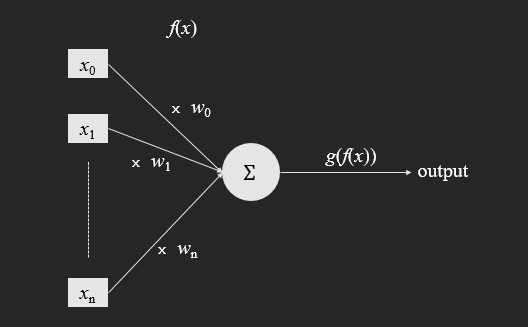

### 线性分类观点

考虑数据集 $$S = \{x^{(i)}\in R^d\mid i=1,2,,,n\}$$ ，其中的样本可以被线性分割成两个类别：$$\mathcal{C}_1, \mathcal{C}_2$$ ，然后我们再为每一个 $$x$$ 分配一个类别标签值 $$y$$，当 $$x^{(i)}$$ 属于类别 $$\mathcal{C}_1$$ 时，$$y_i=1$$ ，否则 $$y_i=-1$$ 。定义分割超平面为

$$
\omega^T x + b = 0
$$

其中 $$\omega, x$$ 都是 *d* 维向量，并且规定 $$\|\omega\| = 1$$（由于同时缩放 $$\omega, b$$ 不会对超平面的位置产生任何影响，所以无论如何我们都可以作如此假设）。然后对任意的 $$x \in S$$ ，定义函数

$$
r(x) = \omega^T x+ b
$$

容易证明 $$r(x)$$ 的模实际上就是点 $$x$$ 到超平面的距离，至于 $$x$$ 在超平面的哪一侧，则由 $$r(x)$$ 的符号决定。并且规定，如果 $$x$$ 能被正确分类，那么当 $$y=1$$ 时，$$r(x) > 0$$ ，否则 $$r(x) < 0$$ （很明显，这可以通过改变 $$\omega ,b$$ 的符号做到，而且同样不会对超平面的位置产生影响）。于是我们看到，如果点 $$x^{(i)}$$ 被超平面错误分类，例如 $$x^{(i)}$$ 的类别标签 $$y_i = 1$$ ,但是 $$r(x^{(i)})$$ 却小于 0，则有

$$
y_i r(x^{(i)}) < 0
$$

然后定义目标函数

$$
J(\omega, b) = -\sum_{x^{(i)} \in \mathcal{E}} y_i r(x^{(i)})
$$

其中 $$\mathcal{E}$$ 表示被超平面错分的数据集合。显然，被错误分类的数据越少， $$J(\omega,b)$$ 的值也越小，并且极值为 0。所以我们的优化目标就是

$$
\min_{\omega ,b} \quad J(\omega, b)
$$

如果定义向量 $\mathbf{w} = [b\quad \omega]$$ ，并且再对每个数据增加一个维度，将其设值为 1，即 $$\mathbf{x} = [1\quad x]$$，那么超平面方程就可以写成更紧凑的形式

$$
\mathbf{w}^T \mathbf{x} = 0
$$

而且，优化目标也变成了

$$
\min_{\mathbf{w}}\quad J(\mathbf{w})
$$

使用梯度下降法，可以求取这个优化问题的解，迭代格式如下

$$
\mathbf{w}^{(k+1)} = \mathbf{w}^{(k)} + \alpha \nabla_{\mathbf{w}} J(\mathbf{w^{(k)}})
$$

其中

$$
\nabla_{\mathbf{w}} J(\mathbf{w}) = -\sum_{\mathbf{x}^{(i)} \in \mathcal{E}} y_i \mathbf{x}^{(i)}
$$

### 一个简单的实现

首先我们生成一些训练数据，所有点在 $$[0,0],[100,0],[100,50],[0,50]$$ 围成的矩形之中，然后使用直线 $$x+2y=100$$ 把所有点分成两类，代码如下

```java
//定义直线方程
Function<double[], Double> strightLine = x -> 100 - x[0] - 2*x[1];
//随机数生成器
Random random = new Random();
random.setSeed(123);

//这里将类别标签值放在每个数组的第三个索引位置
List<double[]> data = IntStream.rangeClosed(1, 100).boxed()
                .map(i -> new double[]{random.nextDouble() * 100, random.nextDouble() * 50})
                .map(p -> new double[]{p[0], p[1], strightLine.apply(p) > 0 ? 1 : -1})
                .collect(Collectors.toList());
```

结果如下图



接下来初始化一些参数

```java
//直线系数数组
final double[] w = {1, 1, 1};
//系数数组，用于存储每次更新后的值
final double[] w2 = new double[3];
//学习速率
final double alpha = 0.01;
//判断直线是否将点 x 正确分类
Function<double[], Boolean> isRight = x -> x[3] * (w[0] + w[1] * x[0] + w[2] * x[1]) > 0;
//判断梯度下降是否收敛，这里使用两次更新差的模作为衡量标准，阈值设为 0.01
final double epsilon = 0.01;
BiFunction<double[], double[], Boolean> isConverge = (before, after) -> {
            double[] sub = {after[0] - before[0], after[1] - before[1], after[2] - before[2]};
            return Math.sqrt(sub[0] * sub[0] + sub[1] * sub[1] + sub[2] * sub[2]) < epsilon;
        };
```

最后使用梯度下降法进行计算

```java
do{
  w2[0] = w[0];
  w2[1] = w[1];
  w2[2] = w[2];
  double[] delta = data.stream()
                    .filter(isRight::apply)
                    .map(x -> new double[]{x[2] * 1, x[2] * x[0], x[2] * x[1]})
                    .reduce(new double[]{0, 0, 0}, (d1, d2) -> new double[]{d1[0] + d2[0], d1[1] + d2[1], d1[2] + d2[2]});

  w[0] -= alpha * delta[0];
  w[1] -= alpha * delta[1];
  w[2] -= alpha * delta[2];
}while(!isConverge.apply(w, w2));
```

总共迭代次数 4358 次，最终结果

$$
\mathbf{w} = [-622.05\quad 6.20\quad12.23]
$$

中间过程如下图




### 单层感知器

上面描述分类算法就被称为感知器，当然是最简单的二分类单层感知器。感知器是神经网络的基础单元，上面对感知器的描述是站在线性分类器的角度，如果用神经元的形式来描述，它的分类过程可以用下图表示



其中 $$x_0 = 1, w_0 = b$$ 。这里的 $$x_i,\, i =0,1,,,d$$ 是数据 $$\mathbf{x}$$ 的分量，$$w_i,\, i =0,1,,,d$$ 是 $$\mathbf{w}$$ 的分量。并且可以发现，和前面超平面分类的解释相比，这里的 $$w_i$$ 更像是特征 $$x_i$$ 的权重系数。当计算出 $$\mathbf{w}^T \mathbf{x}$$ 之后，通过激活函数 $$f(x)$$ 进行判断，并输出结果。

$$
f(x) = \left\{\begin{aligned}
& -1\quad x < 0\\

&1 \quad \quad x > 0
\end{aligned}
  \right.
$$
