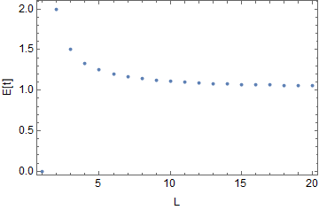

### 简单匹配算法的时间复杂度

考虑在文本 text 中寻找特定的字符串 str，最直观的想法是，从文本的第一个字符开始逐个搜索匹配，一旦遇到不一样的字符，则中断，然后从第二个文本字符开始，重复这一过程，直到完全匹配上字符串为止，如下图所示。


下面来分析一下上述算法的时间复杂度，首先假设文本长度为 n ，匹配字符串的长度为 m，匹配伪码如下

```ruby
for i = 0 -> n-m
  matched = true;
  for j = 0 -> m
    if text[i + j] != str[j]
      matched = false;
      break
    end
  end  
  if matched
    break with "message: matched at " + i
  end
end
```

算法有内外层循环，我们假设目标字符串的第一个字符位于文本 text 中的第 k 个位置，那么外层循环将执行 k 次。而内层循环的判断次数实际上是两个字符串 text[i:i+m] 和 str 的相同前缀长度加一，这里假设为 t。于是该算法总的判断次数应该是 kt。显然由于随机性，k 与 t 的具体值我们不可能知道，但是可以利用概率论的方法确定 k 和 t 的期望，然后算出其时间复杂度的量级。

一个长为 n 的文本，包含一个长为 m 的字符串，如果位置完全随机，那么字符串出现在任何位置的概率为 $\frac {1}{n - m + 1}$ ，从而

\[
E[k] = \sum_{i=1}^{n-m+1} \frac{i}{n - m + 1} = \frac{n-m+2}{2}
\]

而对 t 的估计，就需要计算两个长度为 m 的字符串的相同前缀长度的期望，什么意思呢？比如有两个字符串

```
strA = "alsjdlsinc"
strB = "alslckascs"
```

它们的相同前缀长度等于 s = 2，那么对于任意两个相同长度的字符串，其相同前缀长度的期望是多少呢？显然，这涉及到具体的字符集，我们假设所用的字符集的大小为 L，现在来计算相同前缀长度 s 的概率。

s = 0，意味着两个串的第一个字符就不一样，也就是其中一个串的第一个字符有 L 种选择，另一个只能从剩下的 L - 1 个字符中选择了，这样两个串的第一个字符不同的组合方式有 \\(L(L-1)\\) 种，而两个字符的总的组合方式有 \\(L^2\\) 种，所以 s = 0 的概率为

\[
p(s=0) = \frac{L-1}{L}
\]

s = 1 时，两个串的第一个字符相同，它们可以是 L 种字符中的一个，第二个字符不一样，有 \\(L(L-1)\\) 种组合，而总的组合方式有 $L^4$ 种，于是

\[
p(s=1) = \frac{L\times L (L-1)}{L^4} = \frac{L-1}{L^2}
\]

以此类推，可以得到概率序列

\[
p(s=i) = \frac{L-1}{L^{i+1}},\quad i \in\{0,,,m\}
\]

而比较次数 t = s + 1，于是

\[
E[t] = \sum_{i=0}^{m} (i+1) p(s=i) = \sum_{i=0}^{m} \frac{(i+1)(L-1)}{L^{i+1}}
\]

如果令 m = 10，那么比较次数的期望值与字符集大小的关系如下图



可以看到，对于较大的 L ， $E[t]$ 基本上等于 1，对于较小的 L ，$E[t]$ 也会收敛到 2。

而 k 与 t 的取值显然是独立的，于是比较次数的期望就大致为

\[
E[kt]=E[t]E[k] \approx \frac{n-m+2}{2}
\]

所以该算法的平均时间复杂度为 $O(n-m)$，看起来还不错，但是还存在可以改进的地方，根据我们对该算法的描述，在搜索匹配字符的过程中，如果匹配失败，那么搜索串会


end
