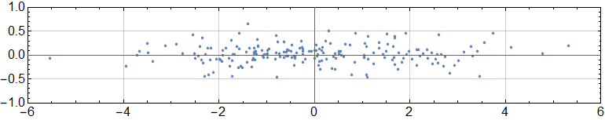

## 主成分分析

如果样本点具有很高维的特征，那么我们就必须要使用很长的数组去存储，但是如果这些特征中有许多都是不必要的，那么这不仅浪费了存储空间，而且也为训练过程带来了额外的计算量。例如在手写数字识别中，需要将图片分割成 n by n 的矩阵，令有像素的块为 1，没有像素的块为 0，然后再用一个 n*n 容量的数组去存储一副图片的特征。

（每个图片可以使用矩阵来分割，并且存储成数组）

但是可以发现，这样的数组大部分的分量都是 0，而这些 0 并不能作为某个数字的特征。所以很多时候我们需要对拿到的数据进行处理，提取出具有代表性的特征，才能更好地加入训练模型之中。

主成分分析便是一种有效的数据降维处理方法，为了对问题进行说明，我们先用具有两个维度的样本集作为例子。

设有特征集

$$
S = \{x_i\mid i=1,2,,,n\}
$$

其中每个点 $$x_i$$ 含有两个分量。那么根据点集的分布情况，可以发现，在某些方向上，点的散布性更强，而更强的散布性则意味着更好的代表性。

（散点的分布在一个方向上有很好的散布性，而在另一个方向上的散布性稍差）

为了衡量这种散布性，我们考虑一条过原点的直线

$$
\omega^T x = 0
$$

其中 $$\omega^T = [\omega_1 \quad \omega_2]$$，并且规定 $$\|\omega\| =1$$。然后定义函数

$$
f(x) = \omega^T x
$$

可以证明这是点 $$x$$ 到直线 $$\omega^T x = 0$$ 的距离。于是我们可以使用这条直线作为基线，将特征映射成点到直线的距离，然后利用距离的散布作为特征的散布。

若定义

$$
Y = \{y_i = \omega^T x_i\mid x_i \in S\}

$$

然后利用方差作为数据的散布衡量，那么我们的目标其实就是寻找 $$\omega$$ 使得

$$
Var(Y)
$$

具有最大值。

为了一般性讨论，我们考虑更高维的数据，假设特征维度为 *d* ，那么

$$
y_i = \omega_1 x_{i1} +  \omega_2 x_{i2}  + ... +  \omega_d x_{id}
$$

并且有

$$
Y = \left[
\begin{aligned}
y_1 \\y_2\\...\\y_n
\end{aligned}
\right]

=\omega_1\left[
\begin{aligned}
x_{11} \\x_{21}\\...\\x_{n1}
\end{aligned}
\right]
+
\omega_2\left[
\begin{aligned}
x_{12} \\x_{22}\\...\\x_{n2}
\end{aligned}
\right]
+ ...
 +
 \omega_d\left[
 \begin{aligned}
 x_{1d} \\x_{2d}\\...\\x_{nd}
 \end{aligned}
 \right]
$$

如果再定义

$$
X_i = \left[
\begin{aligned}
x_{1i} \\x_{2i}\\...\\x_{ni}
\end{aligned}
\right]
$$

那么就有

$$
Y = \sum_{i=1}^d \omega_i X_i
$$

我们在这里将所有特征点作为一个矩阵来考虑，即

$$
X = [X_1 \quad X_2 \quad ...\quad X_d]
$$

然后假设其协方差矩阵为

$$
\Sigma = \left[
\begin{aligned}
\sigma_{11}\quad&\sigma_{12}\quad..&\sigma_{1d} \\
\sigma_{21}\quad&\sigma_{22}\quad..&\sigma_{2d}\\
..\quad&..\,\,\,\quad..&..\\
\sigma_{d1}\quad&\sigma_{d2}\quad..&\sigma_{dd}\\
\end{aligned}
\right]
$$

其中 $$\sigma_{ij} = Cov(X_1, C_2)$$。下面我们将证明 $$Var(Y)$$ 的最大值为 $$\Sigma$$ 的最大特征值。

根据方差的性质

$$
Var(Y) = \sum_{i=1}^d\sum_{j=1}^d \omega_i \omega_j \sigma_{ij} = \omega^T \Sigma \omega
$$

容易知道 $$\Sigma$$ 为实对称矩阵，于是它拥有一组可以作为单位正交基的特征向量

$$
e_1,e_2...e_d
$$

满足

$$
e_i^T e_j = \left\{
\begin{aligned}
  1\quad i = j\\0\quad i \ne  j
\end{aligned}\right.
$$

以及相对应的特征值

$$
\lambda_1, \lambda_2 ... \lambda_d
$$

利用这组基向量，我们可以将 $$\omega$$ 分解成

$$
\omega = \sum_{j=1}^d \alpha_j e_j
$$

那么

$$
Var(Y) = \sum_{i=1}^d \sum_{j=1}^d \alpha_i \alpha_j e_i^T \Sigma e_j = \sum_{i=1}^d \alpha_i^2 \lambda_i \le \lambda_{max}\sum_{i=1}^n\alpha_i^2
$$

其中 $$\lambda_{max}$$ 是最大的特征值，上述公式取等号的条件是，与 $$\lambda_{max}$$ 相对应的系数 $$\alpha_i$$ 为 1，其他的系数为 0。再考虑到约束

$$
\|\omega\|^2=\sum_{i=1}^n \sum_{j=1}^n \alpha_i \alpha_j e_i e_j = \sum_{i=1}^n \alpha_i^2 =1
$$

于是可以得出结论

$$
Var(Y) \le  \lambda_{max}
$$

当上述方差取到最大值的时候，其相应的特征向量为 $$\omega^{(1)}$$，那么对应的映射值就为

$$
Y = \sum_{i=1}^d \omega^{(1)}_{i} X_i
$$

这里的 $$Y$$ 就是对 $$X$$ 的一种表征，它只有一个维度，并且与最大的特征值相关，所以称之为 $$X$$ 的第一主成分。

但是显然，虽然第一主成分能够一定程度上代表原始特征，却失去了原始特征的很多信息，下面我们将考虑更多的次要成分。

在我们计算第一主成分的时候，考虑的是用一条直线（在高维情况下为超平面）作为基线，然后将特征点投影上去，用距离作为特征点的代表，并且这条直线使得距离有很好的散布性。同样的道理，计算第二个主成分，也是要找到一条直线或者超平面来做投影，但是它必须要和计算第一主成分时的基线正交，否则得到的第二主成分将有一部分含有第一主成分的信息，这显然是不合理的。于是计算第二主成分的系数向量 $$\omega^{(2)}$$ 必须满足条件

$$
\omega^{(2)} \cdot \omega^{(1)}  = 0
$$

以及当然

$$
\|\omega^{(2)}\| = 1
$$
