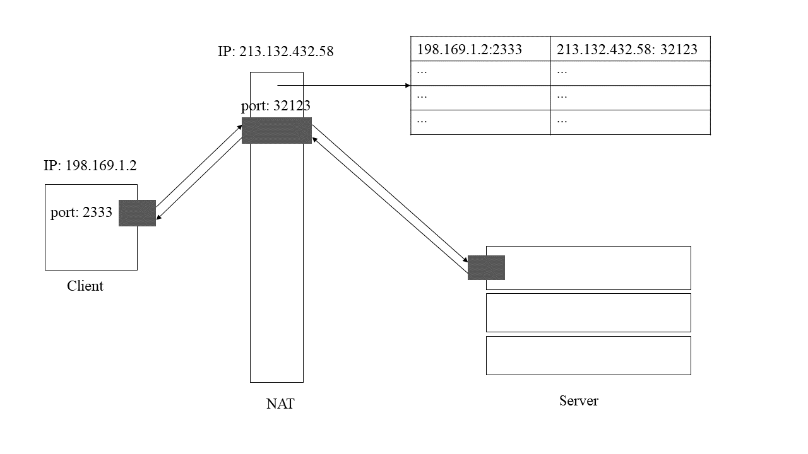

由于IP地址的总量有限，无法让每一台联网设备都拥有一个独一无二的，可供全球任意访问的IP地址，所以 NAT 技术被广泛应用于有多台主机但只有一个公网地址的私有网络中。

当位于局域网中的设备上某个应用 A 访问 Internet 时，请求将首先被发送到 NAT 网关(假设它的公网IP为 213.132.432.58)，此时 NAT 网关记录下 A 在局域网中的 IP (比如198.169.1.2) 以及端口号 (比如2333)，并给该应用分配一个唯一端口号(比如 32123)，然后再将请求发送到要访问的服务器。服务器的返回数据包显然包含该网关的IP地址以及端口号(32123)，当 NAT 网关的端口 32123 收到数据时，自然知道该数据是发送给它的私有网络上的设备 198.169.1.2 的 2333 端口的，于是将数据包转发给应用 A ，这就是 NAT 技术的大致过程。

NAT 技术解决了局域网中的设备进行 Internet 访问的问题，但是反过来，要从外网访问局域网中的设备就不好办了。假如我们想发布一个网站，

end

end
