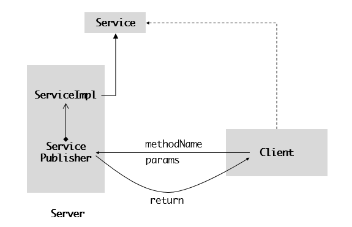

### RPC 调用的基本过程

很多时候，我们想要软件提供的某些功能，但因为各种原因不想把这些软件放到本地，而是放到服务器上，于是就需要通过远程调用来实现这一目的，也就是 RPC。RPC 的全称为 Remote Procedure Call ，即远程过程调用，这种设计方法暴露出来的接口，使得远程服务的调用看起来就像在调用本地方法一样。比如下面的服务

```java
public interface Service{
  public String serve1(String[] args);

  public String serve2(double[] ds);
}
```

它的实现类在服务端，为了简单起见，我们首先给一个很简单的实现

```java
public class ServiceImpl implements Service {

    @Override
    public String serve1(String[] args) {
        return "serve1: " + Stream.of(args).collect(Collectors.joining(" "));
    }

    @Override
    public String serve2(double[] ds) {
        return "serve2: " + DoubleStream.of(ds).sum();
    }
}
```

对客户端而言，本身不知道具体实现是怎样的，唯一知道是有这么一个服务或者说是接口。为了调用接口中的方法，客户端能做的仅仅是向服务器发送它想调用的方法和参数，然后再从服务器取回方法返回值。具体的发送方式可以使用 ObjectOutputStream ，将方法名称字符串和参数对象数组依次发送。

```java
ObjectOutputStream oos = new ObjectOutputStream(socket.getOutputStream());
oos.writeUTF(methodName);
oos.writeObject(params);
```

另一方面，服务端为了能够处理客户端传来的请求，首先得监听一个端口，当收到请求方法和参数后，就利用自己的实现类来处理该请求，这被称为发布一个服务，我们可以用一个 ServicePublisher 类来做抽象

```java
public class ServicePublisher{
...
}
```

现在来考虑一下这个 ServicePublisher 类应该怎样实现，显然我们应该给它一个 ServiceImpl 对象成员，然后根据客户端传来数据调用具体方法，比如下面这样

```java
if("serve1".equals(methodName)){
  serviceImpl.serve1(params);
}else if("serve2".equals(methodName)) {
  serviceImpl.serve2(params);
}
...
```

好了，一个最简单的 RPC 框架就起来了，它包含了服务接口（客户端+服务端）、服务实现类（仅服务端）、服务发布类（仅服务端）以及客户调用代码（仅客户端），这些内容的关系就如下图



但这仅仅是我们在编码之前的设想，它给出了大致的思路，还需要在编程细节方面有更多的思考。比如在服务发布类里面，我们简单地使用条件判断来确定该执行的方法就不太好操作，一来是这种硬编码方法很糟糕，二来是参数类型的转换也很繁琐。但如果我们使用反射，就能很好地解决这问题，只不过客户端需要额外传入参数类型数组

```java
Method method = serviceImpl。getClass().getMethod(methodName, parameterTypes);
Object result = method.invoke(serviceImpl, params);
```

结合来讲，发布类的代码如下

```java
public class ServicePublisher {

    public void publish(Service service){

        ServerSocket serverSocket = null;
        Socket socket = null;
        ObjectInputStream ois = null;
        ObjectOutputStream oos = null;
        try {
            serverSocket = new ServerSocket(12345);
            while (true) {
                System.out.println("waiting for connection... ");
                socket = serverSocket.accept();

                // 从网络获得方法名称和参数列表信息
                ois = new ObjectInputStream(socket.getInputStream());
                String methodName = ois.readUTF();
                Class<?>[] parameterTypes = (Class<?>[])ois.readObject();
                Object[] params = (Object[]) ois.readObject();

                // 执行方法
                Method method = service.getClass().getMethod(methodName, parameterTypes);
                Object result = method.invoke(service, params);

                // 将结果写进网络流，返回客户端
                oos = new ObjectOutputStream(socket.getOutputStream());
                oos.writeObject(result);

            }
        }catch (Exception e){
            e.printStackTrace();
        }finally {
            if(ois != null) {
                try {
                    ois.close();
                } catch (IOException e) {
                    e.printStackTrace();
                }
            }
            if(oos != null) {
                try {
                    oos.close();
                } catch (IOException e) {
                    e.printStackTrace();
                }
            }
            if(serverSocket != null) {
                try {
                    serverSocket.close();
                } catch (IOException e) {
                    e.printStackTrace();
                }
            }
            if(socket != null) {
                try {
                    socket.close();
                } catch (IOException e) {
                    e.printStackTrace();
                }
            }
        }
    }

    public static void main(String[] args) {
        new ServicePublisher().publish(new ServiceImpl());
    }

}
```

客户端的服务调用代码如下

```java
public class Client {

    public Object run(String methodName, Object[] params, Class<?>[] parameterTypes) {
        Socket socket = null;
        ObjectOutputStream oos = null;
        ObjectInputStream ois = null;
        try {
            socket = new Socket("127.0.0.1", 12345);
            oos = new ObjectOutputStream(socket.getOutputStream());
            oos.writeUTF(methodName);
            oos.writeObject(parameterTypes);
            oos.writeObject(params);

            ois = new ObjectInputStream(socket.getInputStream());
            return ois.readObject();
        } catch (Exception e) {
            e.printStackTrace();
        }finally {
            if(oos != null) {
                try {
                    oos.close();
                } catch (IOException e) {
                    e.printStackTrace();
                }
            }
            if(ois != null) {
                try {
                    ois.close();
                } catch (IOException e) {
                    e.printStackTrace();
                }
            }
            if(socket != null) {
                try {
                    socket.close();
                } catch (IOException e) {
                    e.printStackTrace();
                }
            }
        }
        return null;
    }

    public static void main(String[] args) {
        String[] params = {"hello ", "java ", "rpc"};
        Object value = new Client().run("serve1",
                new Object[]{params},
                new Class<?>[]{String[].class});
        System.out.println((String) value);
    }

}

```

### 引入动态代理

这能用，但是违背了我们的初衷，它看起来有些怪异，毕竟我们想要的是以一种更正常的方式调用

```java
Service service = ...;
service.serve1(new String[]{"hello ", "java ", " rpc"});
```

这种方式的问题在于如何获得 Service 实例，但通常来讲是不可能的，因为客户端并不知道服务端的 Service 实现类。RPC 的处理方法让我想起了一句编程名言

> 如果某件事情看起来挺难办的，那就再加一层抽象。

我们可以自己实现 Service 接口，然后在我们自己的实现类中像刚才那样通过网络远程调用，从而把问题分为两个层次。大概像下面这样

```java
public class Client {

    public static void main(String[] args) {
        Service service = new Service() {
            @Override
            public String serve1(String[] args) {
                ...
            }

            @Override
            public String serve2(double[] ds) {
                ...
            }
        };

        service.serve1(new String[]{"hello ", "java ", "rpc"});
    }
}
```

具体的联网方法和前面一样，这里就不写了。但是我们也能看到，需要在每一个方法里面都写基本相同的逻辑，十分繁琐。这时候就看到动态代理的应用场景了，增强内容就是联网并上传函数名以及参数，然后将增强内容注入到 Java 的动态代理框架生成代理类，代码如下

```java
public class Client {

    public static void main(String[] args) {

        Service service  = (Service)Proxy.newProxyInstance(Service.class.getClassLoader(), new Class<?>[]{Service.class},
                (proxy, method, args1) -> {
                    Socket socket = null;
                    ObjectOutputStream oos = null;
                    ObjectInputStream ois = null;
                    try {
                        socket = new Socket("127.0.0.1", 12345);
                        oos = new ObjectOutputStream(socket.getOutputStream());
                        oos.writeUTF(method.getName());
                        oos.writeObject(method.getParameterTypes());
                        oos.writeObject(args1);

                        ois = new ObjectInputStream(socket.getInputStream());
                        return ois.readObject();
                    } catch (Exception e) {
                        e.printStackTrace();
                    }finally {
                        if(oos != null) {
                            oos.close();
                        }
                        if(ois != null) {
                            ois.close();
                        }
                        if(socket != null) {
                            socket.close();
                        }
                    }
                    return null;
                });
        String s = service.serve1(new String[]{"hello ", "java ", "rpc"});
        System.out.println(s);
    }
}
```

在写这段代码的时候我发现一个问题，那就是如果在获取 ObjectOutputStream 实例之前获取 ObjectInputStream 实例的话，程序就一直阻赛在那里了，不知道是怎么回事。

### 应用场景实例

上面的代码基本上完成了 RPC 的核心内容，现在我们可以来干一些事情了。之前准备学习 LightGBM，一个微软开源的梯度提升框架，但是发现本地电脑的环境无法编译源码，于是就把放到云服务器上面，但是又不想在 shell 里切来切去，所以就想把 LightGBM 的训练任务当成服务发布出来，然后在本地远程调用就行了。

在正式写 RPC 代码之前，我们先来看看 LightGBM 的简单用法。从 github 拉取到源码之后，首先进行编译，之后在主文件夹里出现一个叫 lightgbm 的可执行文件，为了让系统都能找到该文件，最好先把路径放到环境变量里边去

```shell
$ vim /etc/profile
```

在里面添加

```
export LGBM_HOME=/path/to/LightGBM
export PATH=...:${LGBM_HOME}
```

然后再更新 profile 文件

```
$ source /etc/profile
```

最精简的训练方法是只给一个配置文件

```
$ lightgbm config=trains.conf
```

并且在当前目录下还包含有训练数据，测试数据等等。现在我们的目的就是想办法在客户机上操作服务器运行这行命令，当然在此之前还需要把数据文件上传。好了，现在我们来定义 RPC 服务接口

```java
public interface LGBMService{
  LGBMService run(HashMap<String, String> args);
}
```

这里的 run 方法就对 lightgbm 命令进行了抽象，它的参数是一个哈希表，刚好与 lightgbm 的参数形式相对应。为了使客户端和服务端都能导入该接口，我们可以把这个接口打包并安装到 maven 本地库。然后考虑客户端

```java
public class LGBMApp{

  public static void main(String[] args) {
      LGBMService service = (LGBMService)Proxy.newProxyInstance(LGBMService.class.getClassLoader(),
          new Class<?>[]{LGBMService.class}, new LGBMHandler("path/to/workspace"));

      HashMap<String, String> config = new HashMap<>();
      config.put("config", "train.conf");
      service.run(config);
  }

}
```

上面的 LGBMHandler 类是一个 InvocationHandler 的实现，里面定义了增强方法，在这里的任务是上传数据，开启训练命令，以及接受结果文件。为了让方法调用看起来就像是运行在本地，所以把数据上传和下载过程都隐藏在 LGBMHandler 里面。并且在 LGBMHandler 的构造方法中给出了远程服务器 IP，端口号和工作空间路径，运行时将把此路径下的所有文件上传。

```java


```


end

end
