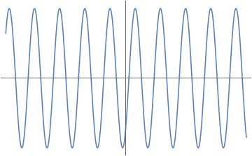

首先考虑一维波动方程

$$
\frac{\partial^2 u}{\partial t^2} = c^2 \frac{\partial^2 u}{\partial x^2}
$$

它的一个特解为

$$
u = u_0 \exp[-i(kx-\omega t)]
$$

其中 $$k$$ 为波数，可由色散关系给出

$$
k = \frac{\omega}c
$$

上述解的图像如下

现在，

end
