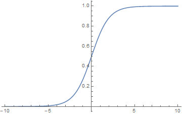

从几何意义上看，将一组特征作为高维空间中的点集，线性分类就是在这个高维空间中找到一个超平面将点集分成两个部分。事实上，这一概念在分类问题中相当基础，无论是感知器还是支持向量机，都是在寻找这一超平面，而另一些算法，比如逻辑回归分类，则是在对超平面进行变换。假设分类超平面的方程为

\[
\omega^Tx=0    
\]

定义分类函数

\[
f(x) = \omega^T x
\]

那么根据 \\(f(x)\\) 的正负，便能对数据作出分类决策。但是这里存在一个问题是，我们无法单纯地通过 \\(f(x)\\) 的大小来确定分类得确切程度，当然我们可以说 \\(f(x)\\) 的绝对值越大，分类结果的确定性越强，但是在没有对数据进行规范化时，大小的概念并不明确。这时，如果我们考虑 logistic 函数

\[
h(x) =\frac 1 {1+e^{-x} }   
\]

在一维情况下，它的图像如下

我们看到，变量的值趋于正无穷时，函数值趋于 1，而变量趋于负无穷时，函数值趋于 0。反过来，如果函数值接近于 1，说明自变量较大，而如果函数值接近 0，则说明自变量在负的方向上较大。那么当我们用 logistic 函数对线性分类函数进行叠加后，便相当于给了线性分类函数自身确信程度度量。定义

\[
g(x) =h(f(x))=\frac 1 {1+e^{-\omega^T x} }   
\]

此时 \\(g(x)\\) 与 0 或 1 的接近程度就能够代表分类的确信程度（至少是我们所认为的）。

现在，我们假设两个类别的标签分别为 0 和 1，那么对于任意样本点 \\((x^{(i)}, y_i)\\)，可以认为条件概率

\[
    \begin{aligned}
p(y_i=1\mid x^{(i)})     &= g(x^{(i)})\\
p(y_i=0\mid x^{(i)})    &= 1 - g(x^{(i)})
\end{aligned}
\]

\[
    \begin{aligned}
        p(y_i = 1\mid x^{(i)}) = \frac{1}{1+ e^{-\omega^T x^{(i)}}}\\
        p(y_i = 0\mid x^{(i)}) = \frac{e^{-\omega^T x^{(i)}}}{1 + e^{-\omega^T x^{(i)}}}
    \end{aligned}
    \]

而上面两个式子写成统一形式为

\[
p(y_i\mid x^{(i)}) =   g(x^{(i)})^{y_i} \left(1-g(x^{(i)})\right)^{1-y_i}
\]

显然，这一概率形式由参数 \\(\omega\\) 确定，为了对该参数进行估计，我们需要一组训练集 \\(\mathcal{S} = \{(x^{(i)},y_i)\mid i =1,2,3...n\}\\) 。下面我们应用极大似然估计的方法，首先建立似然函数

\[
L(\omega)    =\prod_{i=1} ^n p(y_i\mid x^{(i)}) 
\]

\[
    l(\omega) = \sum_{i=1}^n \left(
        I(y_i=0) \ln\frac{1}{1+e^{-\omega^T x^{(i)}}}
        +
        I(y_i=1) \ln\frac{e^{-\omega^T x^{(i)}}}{1+e^{-\omega^T x^{(i)}}}
        \right)
    \]

\[
    l(\omega) = \sum_{i=1}^n \left(
        I(y_i=0) \ln\frac{e^{\omega^T x^{(i)}}}{1+e^{\omega^T x^{(i)}}}
        +
        I(y_i=1) \ln\frac{1}{1+e^{\omega^T x^{(i)}}}
        \right)
    \]

\[
    l(\omega) = \sum_{i=1}^n \left(
        I(y_i=0) \ln\frac{e^{\omega_0^T x^{(i)}}}{e^{\omega_0^T x^{(i)}}+e^{\omega_1^T x^{(i)}}}
        +
        I(y_i=1) \ln\frac{e^{\omega_1^T x^{(i)}}}{e^{\omega_0^T x^{(i)}}+e^{\omega_1^T x^{(i)}}}
        \right)
    \]

其中 \\(\omega_0 = \omega , \omega_1=\mathbf{0}\\)

\[
    l(\omega) = \sum_{i = 1}^n \left(
        I(y_i=0) \omega_0^T x^{(i)} + I(y_i=1)\omega_1^T x^{(i)}-[I(y_i=0) + I(y_i=1)]\ln(e^{\omega_0^T x^{(i)}} + e^{\omega_1^T x^{(i)}}) 
        \right) 
    \]

然后两边取对数得到对数似然函数

\[
l(\omega) = \ln L(\omega)     = \sum_{i=1}^n y_i \ln g(x^{(i)}) + \sum_{i=1}^n (1-y_i)\ln (1-g(x^{(i)}))
\]

为了获得上式的最大值，我们使用梯度下降法，对向量 \\(\omega\\) 的第 j 个分量 \\(\omega_j\\) 求导 

\[
    \begin{aligned}
\frac{\partial \ln L(\omega)} {\partial \omega_j}&= \sum_{i=1}^n y_i \frac{\partial \ln g_i}{\partial g_i} \frac{\partial g_i}{\partial \omega_j}+\sum_{i=1}^n (1-y_i) \frac{\partial \ln(1-g_i) }{\partial (1-g_i)}\frac{\partial (1-g_i)}{\partial \omega_j}\\
&=\sum_{i=1}^n \left(y_i \frac 1 {g_i} - (1-y_i)\frac{1}{1-g_i}\right)\frac{\partial g_i}{\partial \omega_j}
\end{aligned}
\]

为了简单起见，在上式中，我们令 \\(g_i = g(x^{(i)})\\)。其中

\[
\frac{\partial g_i}{\partial \omega_j} = \frac{\partial h(f_i)}{\partial f_i}\frac{\partial f_i}{\partial \omega_j} = -\frac{e^{-\omega^T x^{(i)}}}{(1+e^{\omega^T x^{(u)}})^2} x_{j}^{(i)} =g_i (1-g_i) x_j^{(i)}
\]

于是 \\(l(\omega)\\) 对 \\(\omega\\) 的梯度就可以表示为

\[
\begin{aligned}
\nabla_\omega l(\omega)    &= \sum_{i=1}^n \left(y_i \frac 1 {g_i} - (1-y_i)\frac{1}{1-g_i}\right)\nabla_\omega g_i \\
&=\sum_{i=1}^n \left(y_i \frac 1 {g_i} - (1-y_i)\frac{1}{1-g_i}\right)g_i (1-g_i) x^{(i)}\\
&= \sum_{i=1}^n \left(y_i (1-g_i)-(1-y_i)g_i\right)x^{(i)}\\
&= \sum_{i=1}^n (y_i -g_i) x^{(i)}
\end{aligned}
\]

最后代入到梯度下降的迭代公式中，得到

\[
\omega = \omega -\alpha \sum_{i=1}^n (y_i -g_i) x^{(i)}
\]

为了利用向量化编程，我们把上式写成向量化形式

\[
\omega=\omega - \alpha [x^{(0)},x^{(1)}... x^{(n)}]\cdot 
\left[
    \begin{aligned}
    y_1 - g_1\\
    y_2-g_2\\
    ...\\
    y_n - g_n
    \end{aligned}
    \right]  
    =\omega - \alpha X (Y-G)                                   \]

其中 \\(X\\) 的每一列表示一个样本向量。

\[
    \begin{aligned}
l(\omega) &= \ln L(\omega)     = \sum_{i=1}^n y_i \ln g(x^{(i)}) + \sum_{i=1}^n (1-y_i)\ln (1-g(x^{(i)}))\\
&=\sum_{i=1}^n \left(
    y_i \ln{p(y_i=1 \mid x)} + (1-y_i)\ln {p(y_i = 0\mid x)}
    \right) \\
    &=\sum_{i=1}^n \sum_{j = 0}^1 \left( sign(y_i = j) \ln{p(y_i = j \mid x)}
    \right)
\end{aligned}
\]

### Softmax 回归

条件概率
\[
    p(y=k | x) = \frac{e^{\omega_k^T x}}{\sum_{k=1}^K e^{\omega_k^T x}}
    \]

损失函数

\[
    \begin{aligned}
    l(\omega_1, \omega_2, ...\omega_K) &= \sum_{i=1}^n \sum_{k = 1}^K [I(y_i=k)\ln p(y_i=k \mid x^{(i)})]\\
    &=\sum_{i=1}^n\left( \sum_{k=1}^K [I(y_i=k)\omega_k^T x^{(i)}] - \sum_{k=1}^K I(y_i=k)\ln\sum_{k=1}^K e^{\omega_k^Tx^{(i)}}\right)
    \end{aligned}
    \]

其中

\[
    \sum_{k=1}^K I(y_i = k) = 1
    \]

所以

\[
    l(\omega_1, \omega_2, ...\omega_K) =\sum_{i=1}^n\left( \sum_{k=1}^K [I(y_i=k)\omega_k^T x^{(i)}] -\ln\sum_{k=1}^K e^{\omega_k^Tx^{(i)}}\right)
    \]

然后对 \\(\omega_{tj}\\) 求导

\[
    \begin{aligned}
    \frac{\partial l}{\partial \omega_{tj}}
    &=\sum_{i=1}^n \left(I(y_i=t) x^{(i)}_j 
    - \frac{e^{\omega_t^Tx^{(i)}} x_j^{(i)}}{\sum_{k=1}^K e^{\omega_k^Tx^{(i)}}}
    \right)\\
    &=\sum_{i=1}^n \left(
        I(y_i=t)-p(y_i=t\mid x^{(i)})
        \right)x_j^{(i)}
    \end{aligned}
    \]

所以损失函数对 \\(\omega_t\\) 的梯度

\[
    \nabla_{\omega_t} = \sum_{i=1}^n \left(
        I(y_i=t)-p(y_i=t\mid x^{(i)})
        \right)x^{(i)}
    \]