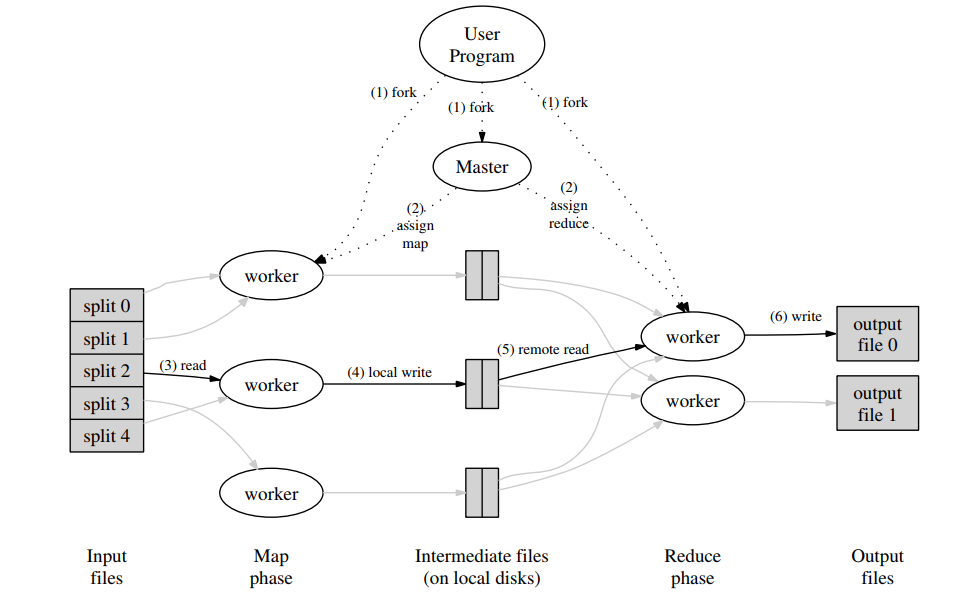

>本文来自 Jeff Dean 的论文 [MapReduce: Simplified Data Processing on Large Clusters](https://static.googleusercontent.com/media/research.google.com/zh-CN//archive/mapreduce-osdi04.pdf)，介绍了 MapReduce 思想，总结了其中的一些技术细节。

这篇论文作为  MapReduce 的开山鼻祖已经过去好多年了，连 Hadoop 框架都已经快过时了，但是 MapReduce 的思想还是很值得品味的。



上图为 MapReduce 框架的执行逻辑，其中的过程解释如下

1. 首先，用户程序中的 MapReduce  库将输入文件分割成 M 块，其中每一块的大小从16MB到64MB不等（由用户控制），然后在集群上启动程序拷贝。

2. 在所有程序拷贝中，有一个特殊角色——即 master。剩下的就为 worker，并由 master 分配任务。总共有 M 份 map 任务，R份 reduce 任务待分配。master 选择空闲的 worker，并给它们每一个赋予 map 或者 reduce 任务。
3. 分配到 map 任务的 worker 从相应的输入分块中读取内容。它从输入数据中解析出键值对，并传给用户定义的 Map 函数。由 Map 函数产生的中间键值对被缓存在内存中。
4. 缓存中的键值对定期被写入本地磁盘，并由划分函数分成 R 块。这些被写到本地磁盘上的键值对所在的地址被报告给 master，然后由 master 负责将这些地址通知给 reduce worker 们。
5. 当一个reduce从 master 接收到地址信息通知后，便使用RPC调用来读取map worker 磁盘上的缓存数据。当一个reduce worker 读取到所有中间数据后，通过其关键字key进行排序，使得所有相同key的数据都聚在一起。如果中间数据的量很大，那么就采用外部排序。
6. reduce workder 遍历排好序的中间数据，每次遇到不同的中间关键字key，就像用户的Reduce函数传入这个key及其相关的values。Reduce函数的返回值追加到最终输出结果文件的后面。
7. 当所有map和reduce任务都完成之后，master唤醒用户程序。这时，用户程序的MapReduce调用便返回到用户代码了。

这就是 MapReduce 的总体执行过程，下面我们来看看其中的技术细节

#### 容错

**worker 失效**
master 会定期 ping 每一个 worker ，如果某个 worker 在规定时间内没有回应，则表示它挂掉了。于是将该worker 完成的和正在执行的所有 map 任务重新标记为 idle 状态，可以被调度到其他 worker 重新执行。之所以将已完成的 map 任务结果也抛弃掉，是因为它们输出在本地磁盘上，如果机器挂掉了，那么这些数据也就读不出来了。但是 reduce 任务的结果能被保留下来，因为它们是被保存在全局文件系统上的。
如果一个 map 任务先在 worker A 上执行，A挂掉后在 worker B 上执行，那么所有执行 reduce 任务的 worker 都会受到通知，以便修正数据读取位置。

**master 失效**
master 可以定期向文件系统写入检查点，如果 master 机器挂掉了，则通过备份的信息进行恢复。

#### 本地读取
由于输入数据被存储在集群机器的本地磁盘上，GFS 将每个文件分成多个64MB的块，并存储多分拷贝到不同的机器上。利用这一点，master 在分配任务的时候采用就近原则，尽量让 map 任务读取本机上的数据，如果不能满足，那么就让它读取和它在同一网关机器上的数据。

#### 任务备份
影响 MapReduce 执行时间长度的原因之一是 “straggler”，即在最后几个 map 或 reduce 任务上花费过长时间的机器。Straggler 的产生有很多原因，比如机器的硬盘故障，或者由于其他任务引起 CPU、内存等竞争。针对这一问题，可以在 MapReduce 快要完成的时候，将正在执行的任务备份执行，只要其中一个拷贝完成，则该任务就被标记为完成。

#### 划分函数
MapReduce 中 reduce 任务的数量由用户指定，比如（R），于是中间关键字数据集就需要由划分函数进行分割。默认情况下，利用哈希值来实现，比如 hash(key) mod R，可以产生相当均匀的划分。但是在某些情况下，也可以使用关于 key 的其他函数来划分数据。例如，当输出数据为URL时，为了把同一个主机中得到的数据写入同一个输出文件，就可以定义这样一个函数：hash(hostname(urlkey)) mod R。

#### 顺序保证
我们确保在给定的划分中，中间键值对以 key 的增序进行处理，这样一来，使得从每个划分得到的输出文件是排好序的。

#### 组合函数
在某些情况下，map 任务可能会产生大量重复的键值对，比如词频统计这个例子中，由于单词出现的频率服从 Zipf 分布，也即是说，每个 map 任务都会产生大量类似 <the, 1> 这样的键值对。而我们却没有必要把每一个这样的键值对都发送给 reduce 任务，而是可以先对它们进行部分合并（比如合并成 <the, n>, n 为该键值对数量） ，然后再发送出去，这就可以用组合函数来实现。

组合函数在每一个执行 map 任务的机器上执行，事实上，它的实现可以和 reduce 函数一样，唯一的不同是，它们对输出值的处理方式，reduce 的输出被写入了最终文件，而组合函数的输出需要作为中间数据发送给reduce 任务。

#### 输入输出类型

MapReduce 库提供多种数据类型支持，例如 "text" 输入模式将每一行看作一个键值对，其中的行号作为键，行内容作为值。每一个具体的输入处理实现都知道该怎样对数据进行分隔（比如 text 模式下，数据分隔符为断行符号）。必要的时候，用户可以实现 reader 接口实现自定义的输入类型，但大多用户仅仅使用预定义的几种输入类型即可满足需求了。

当然，一个 reader 除了能从文件中读取数据外，还可以从数据库或者内存中的数据结构中读取数据。

#### 副作用

在有些情况下，用户可能会觉得在 map 或 reduce 任务中输出一些辅助性的文件很有用。但是这些副作用产物的原子性和幂等性须由应用程序的编写者来控制。典型的案例是，应用向一个临时文件写入数据，并在完成之后对文件原子性地重命名。

对于单个任务产生的多个输出文件，我们没有提供原子性的两步提交支持。而这在实际应用上也没有出现什么问题。

#### 略过“坏”记录

有时候，用户代码里的bug可能会在处理某些记录时让 Map 或 Reduce 函数崩溃，使得 MapReduce 过程一直无法完成。通常的解决办法是修复这个 bug，但某些时候，如果 bug 存在于第三方库，这一方案就不可行，于是只能适当略过这些引起崩溃的记录。所以 MapReduce 就提供了一个可选模式来选择并忽略那些引起崩溃的记录。

每一个 worker 进程都有一个信号处理器来捕获分割冲突和总线错误。在运行用户的 Map 和 Reduce 方法之前，MapReduce 库在一个全局变量中赋予参数的序列号。当用户代码产生一个信号时，该信号处理器便在最后一刻向 master 发送一个包含此序列号的 UDP 包。当 master 看到某个记录引起不止一次的程序崩溃时，便认为此条记录应该被忽略，并在以后的重启计算中进行相应设置。

#### 本地执行

调试 Map 或 Reduce 方法中的问题可能会相当棘手，毕竟实际的计算位于分布式文件系统中，常常是数千台机器同时运行，并且由 master 动态地调整任务分配。为了帮助调试，监控和小规模测试，我们还实现了在本地机器上使用串行方式运行 MapReduce 任务。用户能控制整个流程，因此可以将计算限制在特定的 Map 任务中。通过特殊的标识符，用户可以很容易地使用各种趁手的调试和测试工具（比如 gdb）。

#### 状态信息

master 在内部运行一个 HTTP 服务器，并能展示一组人类可读的状态信息页面。这些页面显示了计算的进度，比如有多少任务已经完成，有多少还在运行，输入数据量，中间数据量，输出数据量，处理比率等等。另外还有页面显示每个任务生成的标准错误和标准输出文件。用户通过这些数据能大致估计总的计算时间，以及是否还需要添加更多的计算资源。

另外，位于最上层的状态页面会显示那些 worker 崩溃了，以及它们正在执行的具体 map 和 reduce 任务。显然，这些信息在诊断用户代码的 bug 时相当有用。

MapReduce 库提供一个计数器来对各种事件的发生次数进行统计。例如，用户代码想要统计已经处理过的文字数量。

为了使用这一功能，用户代码创建一个计数对象，然后在 Map 和 Reduce 方法中进行累加。例如

```c
Counter* uppercase;
uppercase = GetCounter("uppercase");
map(String name, String contents):
for each word w in contents:
    if (IsCapitalized(w)):
        uppercase->Increment();
    EmitIntermediate(w, "1");
```

这些计数值定期从单独的 worker 机器上被发送到 master （由 ping 的回应数据携带（前面提到 master 会定期 ping worker））。master 负责将这些计数值收集起来并在任务完成后返回给用户代码。当前的计数信息也会在 master 的状态页面上实时显示供用户查看。在统计计数值得时候，master 会剔除掉重复计算任务以免双倍计数（任务备份或者失败任务重启都是重复计算）。

有的计数值会自动被 MapReduce 保存，比如输入键值对数量和输出键值对数量。

#### 完结

关于 MapReduce 的技术性原理就差不多这样了，后面的内容主要是关于一些实例的计算。


