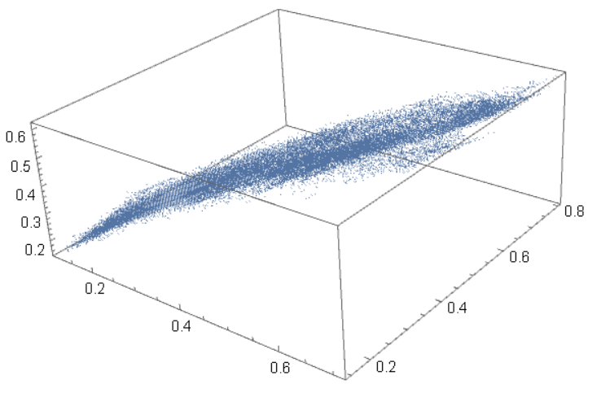
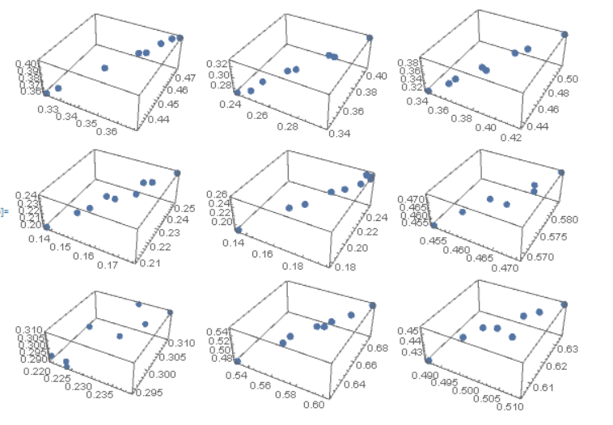
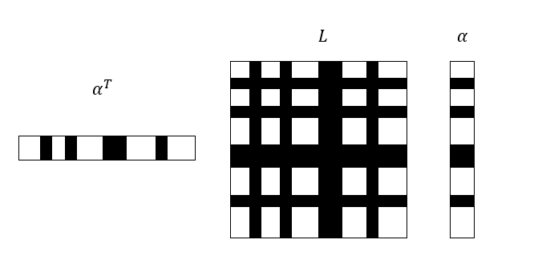
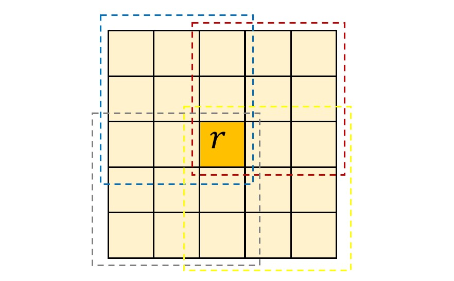

本文算法思想主要来自于下文，算法优化部分为原创

> A. Levin, D. Lischinski and Y. Weiss, "A Closed-Form Solution to Natural Image Matting," in IEEE Transactions on Pattern Analysis and Machine Intelligence, vol. 30, no. 2, pp. 228-242, Feb. 2008.

我们先对算法进行介绍，然后再考虑优化问题。

#### 简介

抠图是一种很重要的图像处理应用，简单来说，抠图就是保留需要的像素，并删去图片的其他部分。于是潜在地，图片就被分为了两个部分，被称为前景和背景，若前景像素用 F 表示，背景像素用 B 来表示，那么图片中的每个像素都能通过是 F 和 B 的线性插值得到

$$
I = \alpha F + (1 - \alpha) B
$$

其中向量 \\(\alpha\\) 的每个元素是对应像素的透明度。对于一张待抠取的图片来说，\\(I\\) 是已知的，因为这是能看见的部分，而 \\(F, B, \alpha\\) 属于未知量，因为不同的抠图目的，前景和背景的定义肯定不同。进一步，对于一般有三个颜色通道的 RGB 图片，那么在每个通道上都能列出一个方程，于是有

$$
\begin{aligned}
I_r = \alpha F_r + (1 - \alpha) B_r\\
I_g = \alpha F_g + (1 - \alpha) B_g\\
I_b = \alpha F_b + (1 - \alpha) B_b
\end{aligned}
$$

也就是说，在每个像素上，都能得到一个像上面这样的线性方程组，但却有 7 个未知量，因此需要添加额外的约束条件。如果能解出上述方程组，那么只需单独拿出前景部分，问题就解决了。

#### 目标函数推导

为了简化讨论，首先从单通道问题入手，即求解方程组

$$
I_i = \alpha_i F_i + (1 - \alpha_i) B_i
$$

这里的下标 \\(i\\) 表示像素索引。假设在图片的任意一个像素窗口 \\(w_j\\) 上（如图所示）（其中 j 表示窗口索引），\\(F_i, B_i ,\alpha_i\\) 近似为常量，那么上述等式关系可以在该窗口上近似成立，即

$$
I_i \approx \alpha_i F_j + (1 - \alpha_i) B_j  \,,\quad i \in w_j
$$

对上述方程进行变换

$$
\begin{aligned}
I_i &\approx \alpha_i F_j + (1 - \alpha_i) B_j\\
\Rightarrow I_i &\approx\alpha_i F_j + B_j - \alpha_i B_j\\
\Rightarrow \alpha_i &\approx \frac {I_i} {F_j - B_j} - \frac{B_j}{F_j - B_j}\\
\Rightarrow \alpha_i &\approx a_j I_i + b_j \,,\quad i \in w_j
\end{aligned}
$$

其中 \\(a = \frac 1 {F_j - B_j}, b = - \frac{B_j}{F_j - B_j}\\)，也就是说，如果在窗口 \\(w_j\\) 上，能找到 \\(\alpha_i, a_j, b_j\\) 使上述公式成立，那么问题就解决了。如果令 

$$
J_j(\alpha_i,a_j, b_j) = \sum_{i \in \omega_j} (\alpha_i - a_j I_i - b_j)^2 \,,\quad i \in w_j
$$

那么问题便转换成了求解 \\(J_j(\alpha_i, a_j, b_j)\\) 取最小值时的参数，由于整张图是由许多互相重叠的窗口组成的，那么总体的目标函数就可以表达为

$$
J(\alpha, a, b) = \sum_{j \in W}\left(\sum_{i \in \omega_j} (\alpha_i - a_j I_i - b_j)^2 + \epsilon a_j^2\right)
$$

其中 \\(W\\) 表示窗口索引集合，\\(\epsilon\\) 表示正则项系数。若假设窗口尺寸为 3 x 3 ，且窗口总数为 n，那么

$$
\begin{aligned}
J(\alpha, a, b) &= \sum_{k=1}^n\left(\sum_{i =1}^9 (\alpha_{ki} - a_k I_{ki} - b_j)^2 + \epsilon a_j^2\right)\\
&= \sum_{k=1}^n \left(
    \left|
    \left[
    \begin{aligned}
    a_k I_{k1} + b_k \\...\\ a_k I_{k9} + b_k\\\sqrt{\epsilon}a_k
    \end{aligned}
    \right]
    -
    \left[
        \begin{aligned}
        \alpha_{k1}\\...\\\alpha_{k9} \\0
        \end{aligned}
        \right]
     \right|^2
    \right)   \\
    &= \sum_{k=1}^n \left(
    \left|
    \left[
    \begin{aligned}
    I_{k1} &\quad 1 \\...\\ I_{k9} &\quad 1\\\sqrt{\epsilon}&\quad 0
    \end{aligned}
    \right]
    \cdot \left[\begin{aligned}
    a_k \\ b_k
    \end{aligned}\right]
    -
    \left[
        \begin{aligned}
        \alpha_{k1}\\...\\\alpha_{k9} \\0
        \end{aligned}
        \right]
     \right|^2
     \right)
\end{aligned}
$$

若令

$$
G_k = \left[
    \begin{aligned}
    I_{k1} &\quad 1 \\...\\ I_{k9} &\quad 1\\\sqrt{\epsilon}&\quad 0
    \end{aligned}
    \right]
,
    \bar{\alpha}_k = \left[
        \begin{aligned}
        \alpha_{k1}\\...\\\alpha_{k9} \\0
        \end{aligned}
        \right]
,
c_k = \left[\begin{aligned}
    a_k \\ b_k
    \end{aligned}\right]
$$

则目标函数可以写成矩阵形式

$$
J(\alpha, a, b) = \sum_{k = 1}^n \left|G_k \cdot c_k -\bar{\alpha}_k \right|^2
$$

为了最小化目标函数，在每一个窗口上对其求偏导数，并令偏导数等于 0

$$
\frac{\partial J(\alpha, a, b)}{\partial c_k} = 2G_k^T (G_k c_k - \bar{\alpha}_k) = 0
$$

通过上式，计算 \\(c_k\\) 等于

$$
c_k = (G_k^T G_k)^{-1}(G_k \bar{\alpha}_k)
$$

将上式代入目标函数后，得到只与 \\(\alpha\\) 有关的目标函数

$$
\min J(\alpha, a,b) = \min_{c_k = (G_k^T G_k)^{-1}(G_k \bar{\alpha}_k)} J(\alpha)
$$

其中

$$
\begin{aligned}
G_k \cdot c_k - \bar{\alpha}_k&= G_k (G_k^T G_k)^{-1} G_k^T \bar {\alpha}_k - \bar{\alpha}_k \\
&= \left[G_k (G_k^T G_k)^{-1} G_k^T  - I\right] \bar{\alpha}_k\\
&= \bar{G}_k \bar{\alpha}_k
\end{aligned}
$$

在这里 \\(\bar{G}_k=G_k (G_k^T G_k)^{-1} G_k^T  - I\\)，于是

$$
\begin{aligned}
J(\alpha) &=\sum_{k=1}^n \left|G_k \cdot c_k -\bar{\alpha}_k \right|^2\\
&= \sum_{k=1}^n (G_k \cdot c_k -\bar{\alpha}_k)^T (G_k \cdot c_k -\bar{\alpha}_k)\\
&=\sum_{k=1}^n \bar{\alpha}_k^T \bar{G}_k^T \bar{G}_k \bar{\alpha}_k \\
&= \sum_{i=1}^n \bar{\alpha}_k^T L_k \bar{\alpha}_k
\end{aligned}
$$

在上面最后一步中 \\(L_k = \bar{G}_k^T \bar{G}_k\\)。当然这只是在单通道图片（即灰度图）中的情况，接下来讨论彩色图片的情况。

#### 彩色图片情况

在彩色图片中，以 RGB 模式为例，每个像素点都有 3 个颜色值，这就组成了一个颜色空间，以下图为例

如果用每个像素点的 RGB 值为坐标，则该图片在颜色空间中的形状如下

可以看到，这些点大致呈线性关系，为了进一步说明，我们随机选择 9 个 3 x 3 的像素窗口，并绘制像素点在颜色空间中的位置，如下所示

同样也呈现出明确的线性关系，于是给出如下假设：
>> 在彩色图片上的一个小范围内，所有像素点在颜色空间中大致呈线性排列，即
>> $$
>> I_i = \beta_i I_1 + (1 - \beta_i) I_2
>> $$

当然，前景和背景颜色同样满足上述关系，于是在任一个像素窗口 \\(w_j\\)内有

$$
\begin{aligned}
F_i &= \beta_i^F F_1 + (1- \beta_i^F)F_2\\
B_i &= \beta_i^B B_1 + (1- \beta_i^B)B_2
\end{aligned}
$$

其中的 \\(F_1, F_2, B_1, B_2\\) 是与具体窗口有关的量，它们描述了此窗口的像素点在颜色空间中的方向，然后代入公式

$$
I_i = \alpha_i F_i + (1 - \alpha_i) B_i
$$

得到 

$$
\begin{aligned}
& I_i =  \alpha_i \beta_i^F F_1 + \alpha_i (1 - \beta_i^F) F_2 + (1-\alpha_i) \beta_i^B B_1 + (1-\alpha_i)(1 - \beta_i^B) B_2\\
& \Rightarrow I_i - B_2 = \alpha_i \beta_i^F F_1 - \alpha_i \beta_i^F F_2 + \alpha_i F_2 + \beta_i^B B_1 - \alpha_i \beta_i^B B_1  + \alpha_i \beta_i^B B_2 -\beta_i^B B_2 - \alpha_i B_2 \\
&\Rightarrow I_i - B_2 = \alpha_i \beta_i^F (F_1 - F_2) +( \beta_i^B - \alpha_i \beta_i^B) (B_1  - B_2)   + \alpha_i (F_2- B_2 )\\
&\Rightarrow \left[(F_1 - F_2)\quad (B_1 - B_2) \quad (F_2 - B_2)\right]\cdot \left[\begin{aligned}
\alpha_i \beta_i^F \\ \beta_i^B - \alpha_i \beta_i^B\\ \alpha_i
\end{aligned}\right] = I_i - B_2
\end{aligned}
$$

由于在多通道情况中，每个像素都有 3 个颜色值，所以这里的\\(F_i, B_i, I_i\\) 都是 3 x 1 的向量，所以上式又可展开成

$$
\left[
    \begin{aligned}
    (F_1^1 - F_2^1)\quad (B_1^1 - B_2^1) \quad (F_2^1 - B_2^1)\\
    (F_1^2 - F_2^2)\quad (B_1^2 - B_2^2) \quad (F_2^2 - B_2^2)\\
    (F_1^3 - F_2^3)\quad (B_1^3 - B_2^3) \quad (F_2^3 - B_2^3)
    \end{aligned}
    \right]
\cdot \left[\begin{aligned}
\alpha_i \beta_i^F \\ \beta_i^B - \alpha_i \beta_i^B\\ \alpha_i
\end{aligned}\right] = \left[
    \begin{aligned}
    I_i^1 - B_2^1\\I_i^2 - B_2^2\\I_i^3 - B_2^3
    \end{aligned}
    \right]
$$

若令 

$$
H_j = \left[(F_1 - F_2)\quad (B_1 - B_2) \quad (F_2 - B_2)\right]
$$

则有

$$
\left[\begin{aligned}
\alpha_i \beta_i^F \\ \beta_i^B - \alpha_i \beta_i^B\\ \alpha_i
\end{aligned}\right] = 
H_j^{-1}
\cdot
\left[
    \begin{aligned}
    I_i^1 - B_2^1\\I_i^2 - B_2^2\\I_i^3 - B_2^3
    \end{aligned}
    \right]
$$

假设 \\(H_j^{-1}\\) 的最后一行等于 \\([a_j^1\quad a_j^2 \quad a_j^3]\\)，那么可以得到

$$
\begin{aligned}
\alpha_i &= a_j^1 (I_i^1 - B_2^1) + a_j^2 (I_i^2 - B_2^2) + a_j^3 (I_i^3 - B_2^3)\\
&= \sum_{t=1}^3 a_j^t I_i^t + b_j
\end{aligned}
$$

接下来，与之前单通道情况类似，定义目标函数

$$
J(\alpha, a, b) = \sum_{j\in W} \left(
    \sum_{i \in w_j} \left(
        \alpha_i - \sum_{t=1}^3 a_j^t I_i^t - b_j
        \right)^2 + \epsilon \sum_{t=1}^3(a_j^t)^2
    \right)
$$

用和之前一样的方法，将上式化简为

$$
J(\alpha, a, b) = \sum_{i = 1}^n \left|
    G_k c_k -\bar{\alpha}_k
    \right|^2
$$

其中 

$$
G_k = \left[
    \begin{aligned}
    I_1^1 \quad I_1^2 \quad I_1^3 \quad 1 \\
    I_2^1 \quad I_2^2 \quad I_2^3 \quad 1 \\
    I_3^1 \quad I_3^2 \quad I_3^3 \quad 1 \\
    ...\\
    I_9^1 \quad I_9^2 \quad I_9^3 \quad 1 \\
    \sqrt{\epsilon} \quad 0 \quad 0 \quad 0 \\
    0 \quad \sqrt{\epsilon} \quad 0 \quad 0 \\
    0 \quad 0 \quad \sqrt{\epsilon} \quad 0
    \end{aligned}
    \right],
    c_k = \left[
        \begin{aligned}
        a_j^1 \\
        a_j^2 \\
        a_j^3 \\
        b_j
        \end{aligned}
        \right]
,\alpha_k = \left[
        \begin{aligned}
        \alpha_{k_1}\\
        \alpha_{k_2}\\
        \alpha_{k_3}\\
        ... \\
        \alpha_{k_9}\\
        0 \\
        0 \\
        0
        \end{aligned}
        \right]
$$

之后同样可推得

$$
J(\alpha) = \sum_{i=1}^n  \bar{\alpha}_k^T L_k \bar{\alpha}_k
$$

#### 构建拉普拉斯矩阵

首先，我们复习下矩阵乘法的分块形式，假设矩阵 \\(M\\) 和向量 \\(v\\) 按如下分块

$$
M =\left[ \begin{aligned}
M_{00} &\quad  M_{01} \\ 
M_{10} &\quad M_{11}
\end{aligned}
\right],
v = \left[ \begin{aligned}
v_1 \\ 
v_2
\end{aligned}
\right]
$$

那么

$$
\begin{aligned}
v^TMv &= [v_0^T \quad v_1^T]
\left[ \begin{aligned}
M_{00} &\quad  M_{01} \\ 
M_{10} &\quad M_{11}
\end{aligned}
\right]
\left[ \begin{aligned}
v_0 \\ 
v_1
\end{aligned}
\right] \\
&=[v_0^T M_{00} + v_1^T M_{10} \quad v_1^T M_{01} + v_1^T M_{11}]  
\left[ \begin{aligned}
v_0 \\ 
v_1
\end{aligned}
\right]\\&=v_0^T M_{00}v_0 + v_0^T M_{10}v_1 + v_1^T M_{01} v_0 + v_1^T M_{11} v_1
\end{aligned}
$$

如果我们假设 \\(M_{10} = 0, M_{01} = 0\\)，即 \\(M\\) 是一个带状矩阵，那么就有

$$
v^T M v = \sum_{i=0}^1 v_i^T M_{ii} v_i
$$

这让我们看到了和前面推导的公式的相似之处

$$
J(\alpha) = \sum_{i=1}^n  \bar{\alpha}_k^T L_k \bar{\alpha}_k
$$

而且我们知道，\\(\bar{\alpha}_k\\) 其实就是向量 \\(\alpha\\) 的一个子向量，这和 \\(v_i\\) 与 \\(v\\) 的关系相当，唯一的区别是 \\(\bar{\alpha}_k\\) 元素的位置在 \\(\alpha\\) 上不是连续的，但这并不重要。于是，通过这种类比，我们可以推断，存在一个矩阵 \\(L\\) ，使得 

$$
J(\alpha) = \sum_{i=1}^n  \bar{\alpha}_k^T L_k \bar{\alpha}_k = \alpha^T L \alpha
$$

由于刚才我们假设 \\(M\\) 是带状矩阵，那么有理由相信 \\(L\\) 肯定也是带状矩阵。因为 \\(\bar{\alpha}_k\\) 在 \\(\alpha\\) 上不是连续的，对于单个 \\(\bar{\alpha}_k^T L_k \bar{\alpha}_k\\) 来说，其乘法关系在全量的矩阵表示形式下如图所示，图中黑色的部分代表对应的 \\(\bar{\alpha}_k\\) 和 \\(L_k\\)。

现在，我们面临着和矩阵乘法分块相反的问题，那就是把已经分块的矩阵重新拼凑成原矩阵，即组装 \\(L\\)。这与有限元中通过单元刚度矩阵组装总体刚度矩阵的方法十分相似，说不定它们之间还存在着更深刻的联系。

在讨论如何通过 \\(L_k\\) 来组装 \\(L\\) 之前，我们先回顾 \\(\bar{\alpha}_k, \alpha\\) 这两个量的物理意义，\\(\alpha\\) 是由每个像素的透明度组成的向量，由于图片是二维的，所以我们按横向扫描所有像素，它的具体形式为

$$
\alpha = [\alpha_1 \quad \alpha_2 \quad ... \quad \alpha_N]^T
$$

而 \\(\bar{\alpha}_k\\) 是第 \\(k\\) 个窗口的所有像素透明度组成的向量，同样按横向扫描

$$
\bar{\alpha}_k = [\alpha_{k_1} \quad \alpha_{k_2}\quad ...\quad \alpha_{k_9}]^T
$$

其中的下标 \\(k_1, k_2,...\\) 等是 \\(\alpha\\) 中的元素索引。这里需要注意一下，前面在定义 \\(\bar{\alpha}_k\\) 的时候，最后还有一个元素为 0，这里我们去掉了，因为可以证明，如果向量 \\(v\\) 的某些位等于 0，那么只需要去掉这些位，以及相应的 \\(M\\) 的行和列，其结果是等价的

$$
v^T M v = \hat{v}^T \hat{M}^T \hat{v}
$$

其中 \\(\hat{v},\hat{M}\\) 是修改之后的向量和矩阵。

现在我们举个简单的例子，假设

$$
\alpha = [\alpha_1 \quad \alpha_2 \quad \alpha_3 \quad \alpha_4]^T
$$

$$
\bar{\alpha}_k = [\alpha_1 \quad \alpha_2\quad \alpha_4]^T
$$

$$
L_k = \left[
    \begin{aligned}
    L_{11}^k&\quad L_{12}^k \quad L_{13}^k\\
    L_{21}^k&\quad L_{22}^k \quad L_{23}^k\\
    L_{31}^k&\quad L_{32}^k \quad L_{33}^k
    \end{aligned}
    \right]
$$

那么按照向量矩阵乘法的要求， \\(L_k\\) 在 \\(L\\) 中的位置分布如下

$$
L = \left[
    \begin{aligned}
    L_{11}^k&\quad L_{12}^k\quad 0 \quad L_{13}^k\\
    L_{21}^k&\quad L_{22}^k\quad 0 \quad L_{23}^k\\
    0&\quad  0\quad \quad0 \quad 0\\
    L_{31}^k&\quad L_{32}^k\quad 0 \quad L_{33}^k
    \end{aligned}
    \right]
$$

也就是说，\\(L_k\\) 的元素在 \\(L\\) 中的位置与 \\(\bar{\alpha}_k\\) 元素的下标有关，其对应关系为 

$$
L_k(i, j) \rightarrow L(k_i, k_j)
$$

其中 \\(k_i\\) 为 \\(\bar{\alpha}_k\\) 中第 \\(i\\) 个元素的下标。由于不同的 \\(L_k\\) 可能在 \\(L\\) 上的位置重叠，我们只需要将它们相加即可，因为矩阵乘法只是简单的线性操作。

使用上述方法构造出 \\(L\\) 之后，我们便得到了关于目标函数的新的表示形式

$$
J(\alpha)=\sum_{i=1}^n  \bar{\alpha}_k^T L_k \bar{\alpha}_k = \alpha^T L \alpha
$$

其中，\\(L\\) 又被称为拉普拉斯矩阵。从而，优化的目标为

$$
\min_{\alpha}\quad \alpha^T L \alpha
$$

根据前面我们对 \\(\bar{G}_k, L_k, L\\) 的推导可以证明， \\(L\\) 的每一个元素都是非负的，并且按照定义 \\(\alpha\\) 的每一个元素也是非负的，这样一来，就只需要令 \\(\alpha\\) 的每一个元素都为 0，从而使 \\(\alpha^T L \alpha\\) 达到极小值 0，但这显然毫无意义。

这里的问题就出在我们没有对 \\(\alpha\\) 施加约束条件，因为，我们知道肯定有一部分 \\(\alpha_i\\) 是等于 1 的（即我们要提取的前景），所以大部分抠图算法都要求使用者提供约束条件，也就是说，给出部分绝对正确的前景和背景。Trimap 图便是一种这样的约束形式。

考虑上面第一张图，如果我们要抠取小狗的图像，那么其对应的 trimap 图如第二张图所示。其实就是把原图分割成三个部分，分别是100%背景，100%前景以及不那么确定的部分，这个不确定的部分就是我们要求解的，其余的都算约束。于是加上约束的优化目标就变成了

$$
\begin{aligned}
    &\min \alpha^T L \alpha\\
    s.t. \quad &\alpha_i = 0 \quad for  \quad i\in BG\\
    &\alpha_i = 1 \quad for  \quad i\in FG
    \end{aligned}
$$

其中 \\(BG\\) 是背景索引集合，\\(FG\\) 是前景索引集合。

#### 问题的求解

现在我们使用拉格朗日乘子法来求解该问题，首先建立拉格朗日函数

$$
\begin{aligned}
l(\alpha, \lambda) &= \alpha^T L \alpha + \sum_{i\in BG}\xi_i \alpha_i + \sum_{i\in FG} \eta_i (1-\alpha_i)    \\
&=\alpha^T L \alpha + \sum_{i=1}^N \lambda_i \alpha_i + \sum_{i\in FG}\eta_i\\
&=\alpha^T L \alpha + \lambda \alpha + C
\end{aligned}
$$

其中 \\(C\\) 为常数，\\(\lambda\\) 在索引 \\(i \notin BG \land i\notin FG\\) （即 \\(\alpha_i\\) 未知）上的值为 0。然后计算拉格朗日函数对 \\(\alpha\\) 的导数，并令其等于 0，便可获得最优解

$$
\frac{\partial l(\alpha, \lambda)}{\partial \alpha} = L \alpha + \lambda = 0
$$

于是，问题转化成了求解线性方程组

$$
L\alpha = -\lambda
$$

需要注意的是，\\(\alpha\\) 和 \\(\lambda\\) 中都有部分是已知量，并且在\\(\alpha\\) 上是未知量的索引，在 \\(\lambda\\) 上的值刚好等于 0。我们可以用下图直观的表示

其中黑色部分都是未知量。关于这种情况的线性方程组，有好几种方法可以求解，其中一类方法选择将 \\(\lambda\\) 未知的部分填充，以其中一个方程为例

$$
L_{11}\alpha_1 + L_{12} \alpha_2 + ... + L_{1N} \alpha_N  = -\lambda_1
$$

假如这里的 \\(\alpha_1\\) 已知，\\(\lambda_1\\) 未知，如果在 \\(L_{11}\\) 前面乘以一个非常大的数，比如\\(10e20\\)，并令 \\(-\lambda_1=10e20 L_{11}\\)，即方程变为

$$
10e20 L_{11}\alpha_1 + L_{12} \alpha_2 + ... + L_{1N} \alpha_N  =10e20 L_{11}
$$

很显然，后续 \\(L_{12} \alpha_2, L_{13}\alpha_3... \\) 之和与 \\(10e20\\) 相比都是极小的量，于是求解出来的 \\(\alpha_1\\) 和其本身的值也会相差无几。使用这种方式修改每一个未知的 \\(\lambda_i\\) 和对应的 \\(L_{ii}\\)，得到可以正常求解的线性方程组，按一般方式进行求解即可。

#### 存储与求解形式的优化

以一张 1080p 的图片为例，两个方向上的像素分别有 1920 和 1080 个，总的像素数量为 2073600 个，那么矩阵 \\(L\\) 的维度也就为 2073600，于是总的元素数量就等于 \\(2073600^2\\)。这是一个相当大的矩阵，使得这种算法几乎不可应用。幸运的是，\\(L\\) 本身的性质能节省大量的存储空间，根据 \\(L_k\\) 的定义 

$$
L_k = \bar{G}_k^T \bar{G}_k
$$

可见，\\(L_k\\) 是对称矩阵，从而 \\(L\\) 也是对称的。而且，\\(L\\) 本身是一个带状矩阵，那么其带宽是多大呢？我们可以从 \\(L\\) 的组装方式来分析

$$
L_k(i, j) \rightarrow L(k_i, k_j)
$$

对于 \\(L\\) 的第 \\(r\\) 行来说，只要第\\(k\\) 个窗口的 \\(k_i = r\\)，那么此时 \\(L_k(i, j)\\) 便被填充到 \\(L\\) 矩阵的 \\(r\\) 行中，列号为 \\(k_j\\)。而这里的 \\(r\\) 只是图片的一个像素索引，包含此索引的窗口如下图所示（我们已用不同颜色的虚线标出）

若设图片的宽度为 \\(w\\) 像素，那么我们可以利用 \\(r\\) 推断上图中所有像素点的索引，即从小到大为

$$
r - 2 - 2 w, r-1-2w,r-2w,...,r+2w, r+1 +2w ,r+2+2w
$$

由于\\(k_j\\) 要取遍上述所有值，并且要被填充到第 \\(r\\) 行，那么填充的中心就为第 \\(r\\) 列，填充的宽度为
$$
r+2+2w - (r - 2 - 2 w) = 4 w
$$

既然第 \\(r\\)行的填充中心为第\\(r\\)列，且填充宽度为 \\(4w\\)，于是整个矩阵 \\(L\\) 的带宽也就为 \\(4w\\)。再考虑到 \\(L\\) 是对称矩阵，那么真正需要存储的元素个数就变成了 

$$
(h \times w) \times 2 w
$$

其中 \\(h\\) 为图片的高度。对比全矩阵的 \\((h\times w)^2\\)，存储量已大幅减少。但这还远为结束，如果再仔细观察上面图中窗口像素的索引

$$
\begin{aligned}
r-2-2w,r-1-2w, r-2w, r+1-2w, r+2-2w\\
r-2-w,r-1-w, r-w, r+1-w, r+2-w\\
r-2,r-1, r, r+1, r+2\\
r-2+w,r-1+w, r+w, r+1+w, r+2+w\\
r-2+2w,r-1+2w, r+2w, r+1+2w, r+2+2w\\
\end{aligned}
$$

可以看到，每行的填充区域被分成了五个区域，这些区域之间的部分的值其实也是 0。所以每一行，真正被填充的只有 25 列，这样一来，总共需要被存储的元素就降为了 \\(25 w \times h / 2\\)。

这还没完，虽然我们刚才对需要存储的矩阵元素数量进行了大幅优化，但是需要求解的线性方程组规模仍然很宏大。我们已经知道 \\(\alpha\\) 中有部分值是已知的，那么是否可以把这部分的计算量给省出来呢？答案是显然的。前面，我们为了获得完整的线性方程组，将 \\(\lambda\\) 的未知部分给填充了，但下面的事实将表明，这一行动似乎是多此一举。现在，我们将 \\(\alpha\\) 元素的顺序调整一下，分成已知的和未知的两个部分，并且 \\(L, \lambda\\) 也进行相应调整，得到

$$
\begin{aligned}
&\left[
    \begin{aligned}
    L_{11}\quad L_{12}\\
    L_{21}\quad L_{22}
    \end{aligned}
    \right]
\left[
    \begin{aligned}
    \alpha_{unknown}\\
    \alpha_{known}
    \end{aligned}
    \right]=
\left[
    \begin{aligned}
    \lambda_{known}\\
    \lambda_{unknown}
    \end{aligned}
    \right]\\
    \Rightarrow& L_{11} \alpha_{unknown} + L_{12} \alpha_{known} = \lambda_{known}\\
    \Rightarrow & L_{11}\alpha_{unknown} = -L_{12}\alpha_{known} + \lambda_{known}
\end{aligned}
$$

可以看到，这里我们直接忽略掉 \\(\lambda\\) 未知的那部分，从而得到了一个与原先等价的，但却更小的线性方程组。该方程组的个数等于未知 \\(\alpha\\) 元素的数量，即 trimap 图中灰色的部分，可见，此时问题的规模急剧减小，并且跟图片本身的大小解耦，这样一来通过控制 trimap 未知区域的大小就可以控制问题的规模，比如说，未知区域的面积占图片面积的 1/10，那么需要求解的线性方程组则是原来的 1/100。

从理论上分析了优化方案之后，接下来我们该讨论具体的算法和数据结构了。但在这之前，我们来捋一捋从方程构建到求解的整个过程

1. 首先，需要两张图，一张是需要抠取内容的原图，另一张是表示约束的 trimap 图。
2. 使用小窗口对原图进行扫描，移动步长为一个像素，即这些窗口是相互重叠的，并在每个窗口上构建矩阵 \\(L_k\\)
3. 通过大量的小矩阵 \\(L_k\\) 组装拉普拉斯矩阵 \\(L\\)（这一步有待优化）
4. 利用 trimap 图构造 \\(\alpha\\) 和 \\(\lambda\\)
5. 求解线性方程组 \\(L\alpha = \lambda\\)（待优化）

虽然我们顺序地给出了上述过程，但是这并不意味着必须严格按照顺序执行，比如可以在构建 \\(L_k\\) 的同时将其累加到 \\(L\\) 矩阵，于是便省去了存储 \\(L_k\\) 的空间。并且也不必构造全量的 \\(L\\)，而是只需要得到与 \\(\alpha_{unknown}\\) 相关的的行和列，并按稀疏格式存储。

