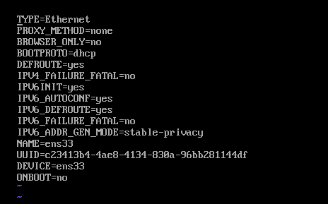

#### 原理篇

**IP 地址**：设备在网络中的逻辑地址，对于全球互联网来说，每台设备都有一个公网 IP， 可以被 Internet 中的任意设备发现，而在局域网中，设备具有局域网 IP，无法被局域网以外的设备直接访问。公网 IP 在 Internet 中是唯一的，而局域网 IP 只在局域网中是唯一的，不同的局域网下不同设备可能拥有相同的 IP。

**MAC 地址**：设备网卡的物理地址，每个网卡都有一个 MAC 地址，，是其在网络中的唯一标识。

**网关**：网关是这样一种设备，它连接了两种不同的网络，比如广域网和局域网之间通过网关相连接，使局域网内部设备可以访问广域网，在这种情境下，可以认为网关有两种 IP 地址，即广域网 IP 和局域网 IP。在典型的家庭局域网中，网络提供商为客户分配了一个广域网 IP，但是一个家庭可能有多台设备需要联网，因此会采用路由器来分发网络，此时的路由器便可以认为是一个网关，我们常用的路由器登陆地址 192.168.1.1 便是该网关的局域网 IP 地址，通过路由器联网的设备 IP 地址应该和网关的局域网 IP 位于同一子网下，即类似如 192.168.1.X。值得注意的是，在不引起歧义的情况下，“网关”一词也可指代网关的局域网 IP 地址，比如有的材料会说 “我们设置网关为 "XXX.XX.XXX.XX"”，其实是在设置网关的局域网 IP。

**子网掩码**：子网掩码的作用是为了将 IP 地址分离成网络号和主机号。比如在网关 IP 为 192.168.1.1 的局域网中，子网掩码设置为 255.255.255.0，将其与该子网设备 IP：192.168.1.X 的二进制表示进行与运算，将得到 192.168.1.0， 这便是该局域网的网络号，取反后得到 X ，即主机号。之所以将 IP 分离成网络号和主机号，是因为两台计算机在通信时需要知道对方是否和自己位于同一子网下，如果位于同一子网，那么只需将数据发送给对应的 IP 即可，否则需要将数据发送到网关，再由网关发送到广域网中的设备。比如一台局域网 IP 为 192.168.1.10 的设备 A 要将数据发送给 B:192.168.1.12，这时 A 利用自己配置的子网掩码同时解析这两个 IP 的网络号，当然它会得到两个 192.168.1.0，这表明对方主机和自己在同一个子网下。而如果对方主机 IP 为 48.10.128.111，那么显然将得到两个不同的网络号，主机 A 需要将数据发送给网关。

**网络地址转换(NAT)**：网络地址转换是实现位于不同的网络中的设备进行通信的技术，前面提到的网关连接了广域网和局域网，那么这种连接是怎么实现的呢？答案就是使用网络地址转换。当位于局域网中的设备在向公网服务器发送请求的时候，路由器会将请求中的源主机换成自己的公网 IP，并将该请求的来源记录下来。而当服务器的应答数据包抵达路由器时，它又会将该数据包转发给局域网中的目标主机，这就实现了局域网设备和公网服务器间的通信。


**桥接**：桥接是一种网络连接方式，它连接了两个或多个不同的网络区块。需要注意它与网关使用网络地址转换的区别，桥接的方式使得两个网络的地位处于对等状态，即便其中一个网络的数据需要经由另一个网络，比如说网络 A 与互联网相连，网络 B 和 A桥接之后，那么 B 中的设备也可以访问互联网，但是这不意味这 A 会修改 B 的请求数据，就像路由器修改子网设备的数据那样。

#### 实践篇

首先是装 vmware 或者 virtual box，这里下载的系统是 CentOS 7.6 的最小安装版。安装成功之后第一件事便是查看网络是否通畅，一般情况下，我们会得到 network is unreachable 错误，这说明网络服务还未开启，如果执行一次 service network start 之后，仍然是这个错误，那么需要修改网卡配置文件

```
vi /etc/sysconfig/network-scripts/ifcfg-eth0
```

或者

```
vi /etc/sysconfig/network-scripts/ifcfg-ens33
```

或者

```
vi /etc/sysconfig/network-scripts/ifcfg-enp0s3
```

是哪一个网卡只有具体看，比如同样的 Centos 镜像，在 vmware 和 virtual box 中的网卡就不一样。打开之后可能看到如下的配置



前面的都可以不用管，这里只需要将 ONBOOT=YES 即可。修改后重启网络服务 

```
service network restart
```

即可联网成功。
