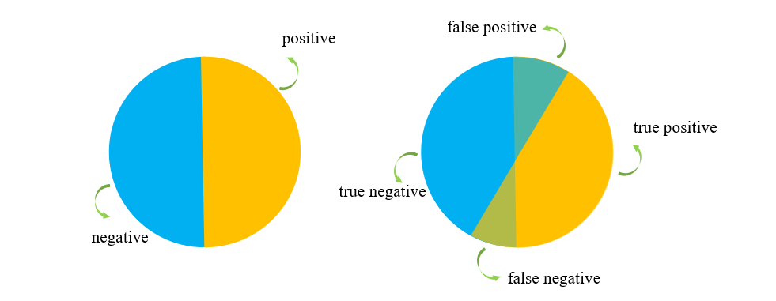

很多目标检测算法的论文都会强调自己的 mAP，看了很多资料发现许多人对这一概念解释得不清不楚，于是本篇便想来梳理一下 mAP 的定义和计算方式。

#### 精确率(Precision)和召回率(Recall)

首先我们介绍精确率和召回率，这里的精确率比较容易和准确率搞混，通常我们所说的准确率是正确预测的样本数量除以总样本数量。而精确率和召回率与样本类别有关，召回率就更不好理解了，有的资料将召回率又称作查全率，但我觉得更精确的定义应该是“某一类别的查全率”，也就是说在多分类预测问题中，不同的类别有不同的召回率以及精确率。为了进一步说明，我们做一些约定，首先假设我们面临的是二分类问题，所有样本被分为正样本 **P** (positive) 和负样本 **N** (negative)，而预测结果则有正确 **T** (true) 和 **F** (false) 之分，那么预测结果则存在4种情况

1) 把正样本预测为正样本 true position，假设这一情况的样本数量也用 TP 表示
2) 把正样本预测为负样本 false negative，用 FN 表示
3) 把负样本预测为正样本 false positive，用 FP 表示
4) 把负样本预测为负样本 true negative，用 TN 表示

精确率分两类，一类是预测为正的样本中真实的正样本率，第二类是预测为负的样本中真实负样本率，用公式表示就为

\[
    pp = \frac{TP} {TP + FP},\quad pn = \frac {FN}{TN + FN}
    \]

而召回率则分别是把正样本预测为正的比率和把负样本预测为负的比率

\[
    rp = \frac{TP}{TP + FN},\quad rn = \frac{FN}{TN + FP}
    \]

可见，对于同一类样本，精确率和召回率的分母不同。

#### PR 曲线

PR 曲线是以召回率为横坐标，精确率为纵坐标绘制的曲线。看到这里我们便有一个疑问，既然以召回率和精确率为坐标轴，说明两者是变化的，那一个模型的召回率和精确率怎么会变化呢？

