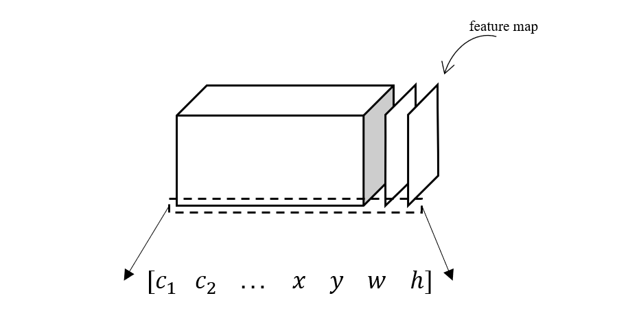

在这一系列文章中，我们将使用 pytorch 框架来实现 yolov3 目标检测算法，在理解 yolo 系列算法的同时，也希望对 pytorch 框架有更深入的认识。

对于初学者来说，我觉得最先应该理解的还是目标检测这种任务的基本流程，而 yolo 原论文则不太适合新手直接去看。但是奇怪的是网上对 yolo 的介绍大都是对原论文的翻译，如果强行去啃，很容易就迷失在各种名词概念中无法自拔，所以我希望这篇对 yolo 的介绍能做到由浅入深，老少咸宜，不求面面俱到，但求写出来的东西都是容易被理解的。

首先，我们看神经网络这个东西，把它当成一个黑箱，我们从一端输入特征，另一端输出计算结果。对于分类问题，输出端给出的是一个向量，向量维度等于类别数量，而每个元素则表示对应类别的置信度。对于回归问题也类似，只不过输出的是需要拟合的值。而目标检测问题的输出则稍微复杂一点，输入一张图片，我们希望给出图片中物体的种类和坐标位置。通常来说，可以使用向量来表示种类，就像分类问题那样，而物体的位置则可以用矩形边界框的位置和大小表示，把这些值排列起来又是一个向量。

\[
    [x, y, w, h]
    \]

当然，为了存储的方便，还可以把用于分类的向量合并起来，得到一个更大的向量

\[
    [c_1, c_2, c_3, ... c_n, x, y, w, h]
    \]

通过这个向量，我们便能得到图片中一个物体的类别和具体位置。但是，一般情况下，一张图片肯定不止一个需要检测的对象，在具有多个物体情况下如何对输出数据进行组织就是一个相当关键的问题，我个人认为这也是理解 yolo 前至关重要的概念。如果我们仍然简单的把多个向量在长度方向上堆叠，那么不同物体数量的图片，其输出向量的长度也不同，这在神经网络中显然不好实现。那么把这些向量在另一个维度上排列呢？也就是像下面这样的矩阵形式

\[
    \left[
        \begin{aligned}
        c_1^1 &\quad c_2^1&\quad ... &\quad x^1 \quad y^1 \quad w^1 \quad h^1\\
        c_1^2 &\quad c_2^2&\quad ... &\quad x^2 \quad y^1 \quad w^1 \quad h^1\\
        ...\\
        c_1^n &\quad c_2^n&\quad ... &\quad x^n \quad y^n \quad w^1 \quad h^1
        \end{aligned}
        \right]
    \]

这种形式有效缩短了输出向量的维度，但还是存在不同数量物体导致输出维度不同的问题。其实我们可以看到，无论怎样排列，只要我们使用一个固定长度的向量来表示一个物体，就都会遇到这样的问题。那么怎样才能避免呢？一个可行的方案是固定物体的上限，也就是说输出固定维度的矩阵，假如矩阵的维度大于实际的物体数量，那么将超出的部分用 0 来填充，当我们发现所有类别上的置信度都极其接近于 0 时，也就知道这个位置上没有任何物体。

但事实上，很少有神经网络只输出一个矩阵，对于最后一层是全连接层的神经网络来说，它输出一个向量，而对于全卷积神经网络来说，它输出的是由特征图堆叠而成的立体结构。我们知道，卷积层使用多个卷积核对前一层的特征图做卷积运算，每一个卷积核都会输出一个特征图，于是卷积层的总输出便是多个特征图的堆叠。对于像 AlexNet，VGG 这样的用于简单分类的神经网络，在多层卷积之后接全连接层，这样就把卷积层提取的特征映射成图片属于各类别的置信度向量，从而完成对图片的分类。而全卷积神经网络的思路则更灵活，它同样可以用于图片的分类，而且是对图片中的多个元素进行分类，怎么做到的呢？我们先不管具体的训练过程，来看看它的输出是怎么表达类别置信度的。由于全卷积神经网络的输出实际上可以看作是三维的数据立方体，于是我们可以把类别置信度向量放在特征图的堆叠方向上

    

