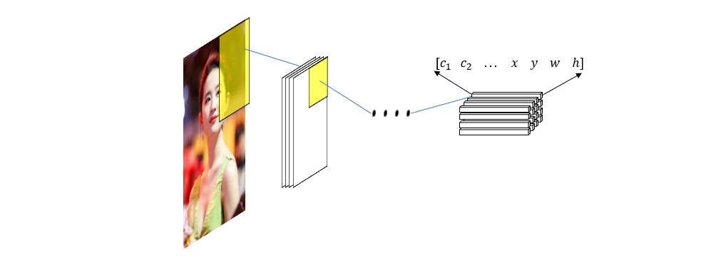
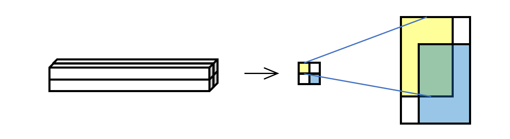
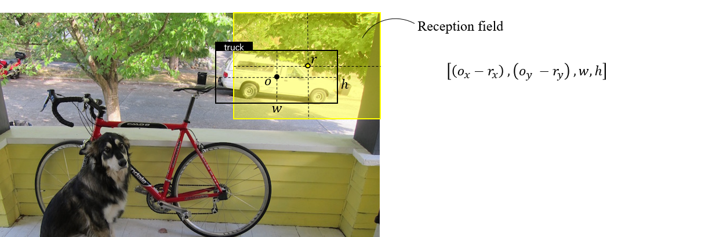
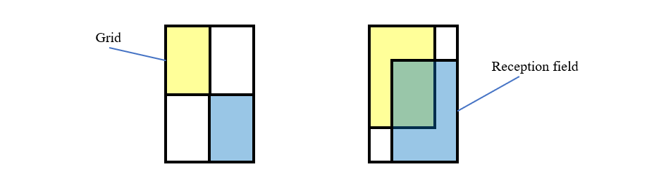
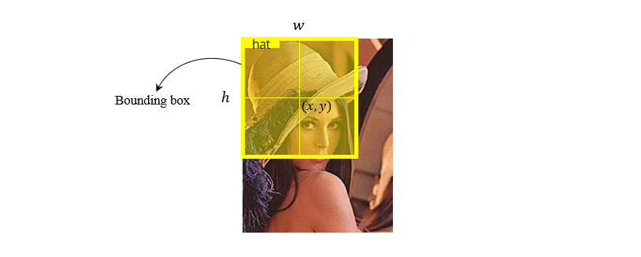

上一部分我们大致了解了使用全连接神经网络进行目标检测的总体思路，简单的说就是把图片中的每个区域都映射成向量，向量中的元素表示了目标的类别和位置信息。

在这一篇中，我们延续之前的思路，来丰富算法过程中的细节，从而导出 yolo 算法的第一个版本。首先，我们还是来分析最终的输出张量（也就是特征图的堆叠结构）。输出特征图上的每个点都对应原始图片的一个区域，也就是它的感受野（比如下图中的黄色和蓝色区域），于是这个点上的向量就代表了感受野上的物体存在情况（是否存在物体，哪种类别，在什么位置，大小是多少）。

但是这里所谓的“感受野上存在的物体”是一个比较笼统的概念，因为物体可能完全位于其中，也可能部分位于其中，而“部分位于其中”又存在很多种位置分布，所以有必要对“感受野上存在物体”给出一个明确的定义。另一方面，由于目标检测是一个监督学习问题，所以必须通过 ground truth 为训练集和测试集中的每张图片制作标签，在这里就是和网络输出特征图维度相同的张量。我们知道，输出特征图上的每个特征向量都是其对应感受野的预测值，于是 ground truth 张量上的每个向量也应该反应相应区域的物体包含情况。但是同样地，物体与感受野的相对位置是很随意的，所以为了制作每张图的 ground truth 张量，我们也需要对“感受野上存在物体”给一个明确的定义。

关于这点，我们可以先抛出一个不成熟的想法：当物体的中心位于感受野之内时，便认为感受野包含物体，然后用物体中心的坐标相对感受野中心坐标的偏移作为物体的位置，物体的大小就用长和宽表示，这样就给出了 ground truth 张量中的一个向量。

但这种思路有个不太好的地方就是在知道具体的网络结构之前，我们是无法知晓每个输出位置上的感受野的大小和位置的，这样也就没法给出物体的相对位置了。

在 yolo 的论文中，作者给出了一个巧妙的方法，将图片划分成和输出向量数量相同的 \(S\times S\) 个小格子，这样就可以和感受野形成隐含的一一对应的关系，然后用格子代替感受野来和 ground truth 做相对位置计算。当物体的中心落在某一个格子中时，则认为此物体位于该格子所对应的感受野之中。这样来看，格子就相当于做了感受野的代理，因为感受野在某种意义上是不可见的，通过格子这层代理之后，便将感受野与物体的位置关系转换到格子与物体的位置关系上来了。在构造 ground truth 张量以及计算损失函数的时候都是基于格子的，于是感受野便彻底属于隐含概念了，所以在原论文中便没有提及这方面的内容，但是我们应该了解这层关系。

现在，是时候介绍 Bounding Box 的概念了，简单的说，它就是输出向量预测的物体位置和大小，以及一个置信度

每个 bounding box 具有 5 个值，分别是中心点坐标 \(x, y\)，box 的宽度和高度 \(w, h\)，以及感受野（或者说“格子”）含有物体的置信度（注意这里不是某一类物体，只要有物体都算），这个置信度由下式定义

$$
confidence = Pr(Object) * IOU^{truth}_{pred}
$$

其中 \(Pr(Object)\) 是感受野包含物体的概率，\(IOU_{pred}^{truth}\) 是 bounding box 和物体所在位置的交并比，交并比的概念相当直观，就是两个方形区域的交集面积比上并集面积。这个式子体现的想法也相当简单，就是在位置和形状两个维度上的预测准确率的乘积。

