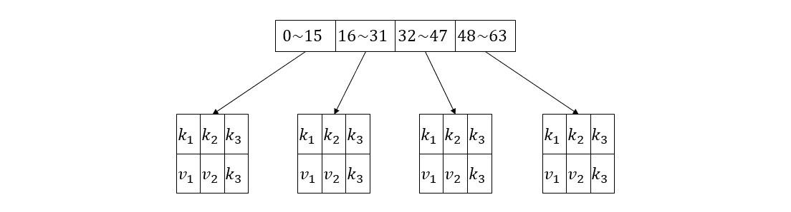

##### 问题背景

最近的项目遇到一个问题，我们的程序要不停的处理第三方源源不断发送过来的图片，出于某种需要，如果收到的图片和前面的图片有重复或者相似，那么就不再处理了。由于数据量很大，不可能每收到一张图片就暴力的对比前面的所有图片，所以就需要一种能够快速进行相似搜索的算法。当然类似的问题已经有很多成熟的方案了，这里就记录一下我所理解的局部敏感哈希算法原理。

##### 问题分解

相似搜索大致可以分为下面几个子问题：
1. 对我们要搜索的对象做编码，将需要占据大量内存的图片、文本或者其他什么玩意儿映射成一个字符串或者整数，此编码在这里又被称为签名向量；
2. 选择距离度量函数，确保相似的签名在度量空间中有较近的距离；
3. 建立签名向量的数据结构，使得相似签名可以很高效的搜索出来。

第一个问题我们采用的是感知哈希来对图片进行编码，第二个问题使用汉明距离就很合适了。下面着重介绍第三个问题。

##### 数据结构

简单的说，我们的数据结构就是由多个哈希表组成的数组



在上图的具体例子中，我们的签名向量有64位，被分成4个段，每个段和一个哈希表相对应，哈希表的键就是签名段，值就是实际的签名向量。

##### 查询算法

在查询一个新的签名向量是否和数据结构中的签名相似时，首先把此签名也分 4 段，然后用每个段去查找对应的哈希表，总共会得到最多 4 个候选的签名向量，再逐一计算相似度就可以了。由于从哈希表中取数据的时间复杂度只有 \(O(1)\)，所以这种查询方法的代价就只和分段数量（段长度）有关了，但即便每一段的长度只有 1，在上面的例子中每次查询也只需要计算最多64次相似度，比起成千上万的数据量其实已经相当优越了。下面给出伪代码：

```java
// 初始化
init: 
  len = ? // 签名长度
  n = ? // 分段数量
  simi_thresh = ? // 相似度阈值
  buckets = (1..n).map(_ -> new HashMap())

// 查询过程
check(signature):
  segSigns = signature.slice(len / n) // 签名分段
  candidates = buckets.zip(segSigns).map((bucket, segSign) -> bucket.get(segSign))
  similairty = candidates.map(candidate -> similarity(candidate, signature)).max()
  return similarity > simi_thresh

```

##### 简评

为了直观的理解这一算法，我们思考两种极端情况。首先把每一段的长度设置为 1，这时两个签名但凡有一位数据相同，就会被作为候选项计算一次相似度。第二种情况是把整个签名作为一段，这时两个完全相同的签名才会被作为候选数据（当然已经没有必要计算相似度了）。可以看到，第一种情况算法复杂度最高，但检测适应性最好，第二种情况算法复杂度为 \(O(1)\)，但只能检测相同的签名。

位于上述两种极端情况之间的中间情况其实就意味着，如果两个签名向量的部分连续位相同，那么它们应该比较相似度，这是性能与适应性之间的一种折中选择。简单的说，我们追求的效果就是签名向量个别位的不同不影响检测，但又不至于筛出过多的候选项，所以参数的设置对于具体的问题是很重要的。