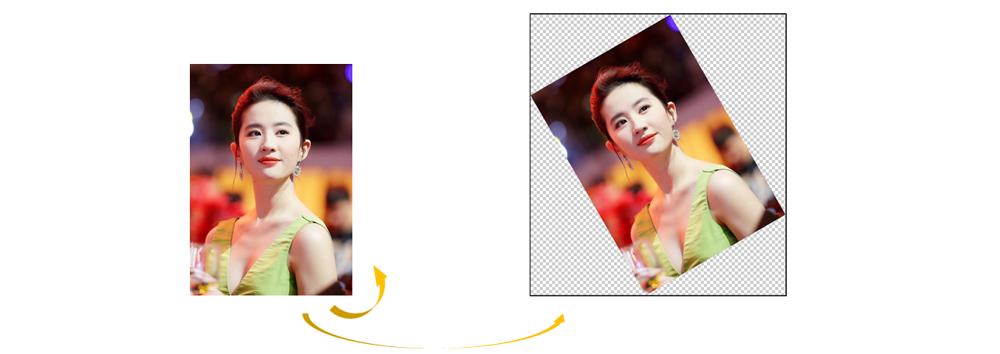
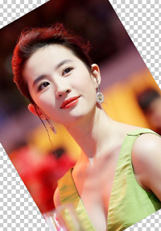
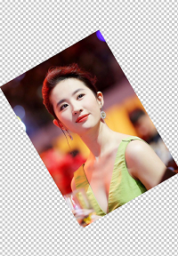

##### 实现效果

1. 保持原图内容不发生缩放；
2. 旋转后空缺的区域为透明色；



##### 关键函数

```java
/**
 * Imgproc.java
 * 计算旋转矩阵
 */
public static Mat getRotationMatrix2D(Point center, double angle, double scale)

/**
 * Imgproc.java
 * 应用仿射变换
 */
public static void warpAffine(Mat src, Mat dst, Mat M, Size dsize, int flags, int borderMode, Scalar borderValue) 
```

##### 实现思路

首先尝试一下最简单的实现

```java
Mat src = ...;
int angle = 30;
// 以图片中心作为旋转轴
Point center = new Point(src.width() / 2.0, src.height() / 2.0);
// 不缩放
double scale = 1
Mat rotationMatrix2D = Imgproc.getRotationMatrix2D(center, angle, scale);
Mat dst = new Mat();
Imgproc.warpAffine(src, dst, rotationMatrix2D, src.size(), Imgproc.INTER_LINEAR, Core.BORDER_CONSTANT, new Scalar(0, 0, 0, 0));

```


从结果可以看到两个问题，1. 旋转后，缺失的部分被填充成了黑色，即便我们设置的 alpha 通道值为 0；2. 由于画布大小的限制，部分画面被裁切掉了。

第一个问题很简单，由于输入的图片本身只有三个通道，旋转操作不会再额外添加一个 alpha 通道，所以背景会被我们指定的颜色填充。解决方法是在旋转之前把原图转换成 4 通道图片

```java
Imgproc.cvtColor(src, src, Imgproc.COLOR_BGR2RGBA);
```

这时图片的RGB通道有可能错位，导致色彩失真，因此完成旋转之后还需要再转换一次

```java
Imgproc.cvtColor(dst, dst, Imgproc.COLOR_RGBA2BGRA);
```



接下来看第二个问题，如果要求旋转后的图片内容完全显示，则需要旋转后的图片尺寸更大，具体为 
\[
  w_d = w_s\cos(\alpha) + h_s \sin(\alpha), \quad h_d = w_s\sin(\alpha) + h_s \cos(\alpha)
  \]

其中 \(w_s, h_s\) 是原图的宽度和高度，\(\alpha\) 为逆时针旋转角度（360度制）。

现在如果尝试把 dst 的尺寸调整为上面计算的值，会发现不起作用，因为根据仿射变换的公式来看

\[
  dst(i, j) = src(M_{11}i + M_{12}j + M_{13}, M_{21}i + M_{22}j + M_{23})
  \]

单纯的扩大 dst 只会使多余的部分映射到 src 之外的区域，结果还是空白。所以我们只能选择退一步，先得到完整的内容，也就是说在旋转的时候加一定程度的缩放。至于缩放因子，可以用下式计算

\[
  scale = \min \left(\frac {w_s} {w_d}, \frac {h_s}  {h_d}\right)
  \]



但是缩放显然偏离了让图片内容保持原尺寸的目标，为了保持原尺寸，我们可以在旋转之前对图片进行放大，并令放大系数等于旋转的缩放系数，这样一来，放缩相抵，便可完美实现原尺寸旋转，最后裁去多余的面积即可。

##### 代码实现

```java
    /**
     * 图片旋转，透明背景
     * */
    static Mat rotate(Mat src, double angle) {

        if(src.channels() == 4) {
            return rotate(src, angle, new Color(0, 0, 0, 0));
        }
        // 对于没有alpha通道的图片，首先添加alpha通道后再旋转
        Imgproc.cvtColor(src, src, Imgproc.COLOR_BGR2RGBA);
        Mat dst = rotate(src, angle, new Color(0, 0, 0, 0));
        Imgproc.cvtColor(dst, dst, Imgproc.COLOR_RGBA2BGRA);
        return dst;

    }

    /**
     * 图片旋转，指定背景颜色
     * @param src 原图 mat
     * @param angle 旋转角度
     * @param color 背景颜色
     * */
    static Mat rotate(Mat src, double angle, Color color) {
        double r = angle / 360.0 * 2 * Math.PI;

        // 旋转后图片的长宽
        int dstWidth = (int)(src.width() * Math.cos(r) + src.height() * Math.sin(r));
        int dstHeight= (int)(src.width() * Math.sin(r) + src.height() * Math.cos(r));
        // 旋转前后图片缩小比例
        double ratio = Math.min(src.height() / (double) dstHeight,
                src.width() / (double) dstWidth);
        // 为了不让旋转后图片缩小，先进行放大
        Mat resizedSrc = resize(src, (int) (src.width() / ratio), (int) (src.height() / ratio));

        // 获得旋转矩阵
        Point center = new Point(resizedSrc.width() / 2.0, resizedSrc.height() / 2.0);
        Mat rotationMatrix2D = Imgproc.getRotationMatrix2D(center, angle, ratio);

        Mat dst = new Mat();
        // 应用仿射变换
        Imgproc.warpAffine(resizedSrc, dst, rotationMatrix2D, resizedSrc.size(), Imgproc.INTER_LINEAR, Core.BORDER_CONSTANT, new Scalar(color.getRed(), color.getGreen(), color.getBlue(), color.getAlpha()));

        // 裁掉多余的部分
        int left = Math.max(0, dst.width() / 2 - dstWidth / 2);
        int top = Math.max(0, dst.height() / 2 - dstHeight / 2);
        int right = Math.min(dst.width(), dst.width() / 2 + dstWidth / 2);
        int bottom = Math.min(dst.height(), dst.height() / 2 + dstHeight / 2);
        Mat submat = dst.submat(top, bottom, left, right);

        release(resizedSrc, rotationMatrix2D, dst);
        return submat;
    }
```