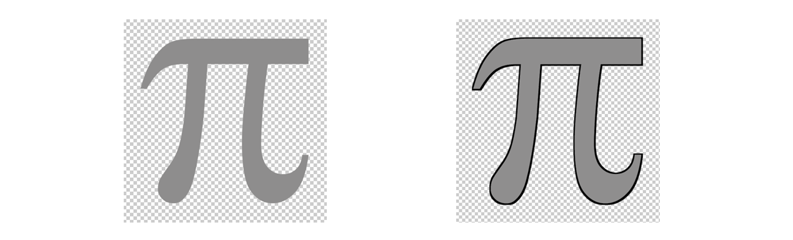
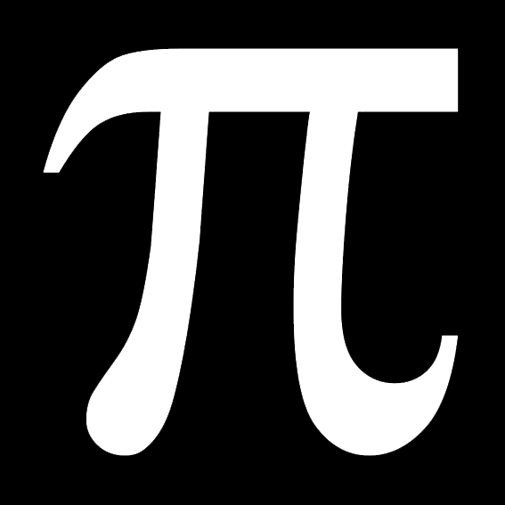
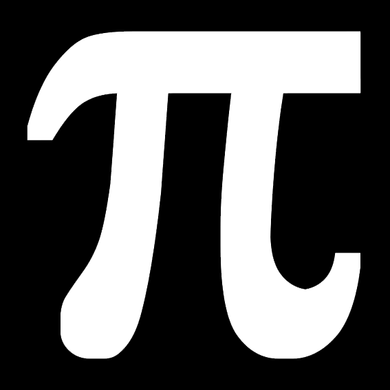

##### 实现效果



##### 关键函数

```java
/**
 * Imgproc.java
 * @param src 原图
   @param dst 目标图
   @param kernel 膨胀参数
 */
public static void dilate(Mat src, Mat dst, Mat kernel)
```

##### 实现思路

1. 分离出 alpha 通道；

2. 应用 dilate 函数膨胀；

3. 为原始图片添加背景，颜色为需要的描边色彩；
4. 