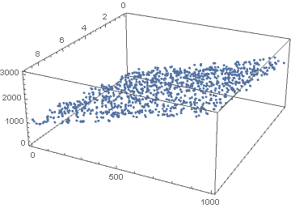
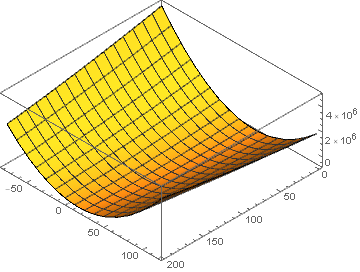
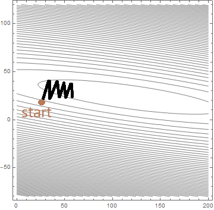
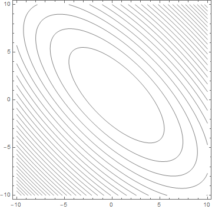

对数据进行归一化或者标准化是一种常用的数据预处理步骤，一般给出的解释是消除数据量纲差异对模型训练的影响，为了搞清楚会产生何种影响，我们尝试使用自造的数据集来一次模拟分析。

现在给一个3维空间中的平面

\[
  z(x, y) = 100 x + 20 y
  \]

在此平面附近随机生成样本集合 \(S = \{(x_i, y_i, z_i)\mid i=1...n, 0\le x \le 10, 0 \le y \le 50\}\)，然后利用这个样本集来做回归学习，将模型定义为 

\[
  \hat{z}(x, y) = \theta_1 x + \theta_2 y
  \]

其中 \(\theta_1 , \theta_2\) 便是要训练的系数。

下面我们生成训练数据，方法是在上述平面上取点，并添加随机噪声

```python
random = np.random

# 定义平面方程
z = lambda x, y: 100 * x + 20 * y + random.rand(400)

# 生成随机点
n = 1000
x = random.rand(n) * 10
x = x.astype(int)
y = random.rand(n) * 50
y = y.astype(int)

data=pd.DataFrame([x, y]).T
data.columns=["x", "y"]
data["z"] = data.apply(lambda row: z(row[0], row[1]), axis=1)
```



定义平方误差损失函数

\[
  l(x_i, y_i, z_i) = \left( z_i - \hat{z}(x_i, y_i) \right)^2
  \]

优化目标函数为

\[
  \begin{aligned}
  L(\theta_1, \theta_2) &=\frac 1 {2n} \sum_{i=1}^n \left( z_i - \hat{z}(x_i, y_i) \right)^2\\
  &=\frac 1 {2n}\sum_{i=1}^n (z_i - \theta_1 x_i - \theta_2 y_i)^2\\
  &=\frac 1 {2n}\sum_{i=1}^n (x_i^2\theta_1^2 + y_i^2 \theta_2^2 + 2x_iy_i \theta_1 \theta_2- 2x_iz_i\theta_1 -2y_iz_i \theta_2+ z_i^2)
  \end{aligned}
  \]

舍去与 \(\theta_1, \theta_2\) 不相关的常数项，我们得到

\[
  L(\theta_1, \theta_2) = \frac 1 {2n}\left(\sum_{i=1}^n x_i^2 \theta_1^2 + \sum_{i=1}^n y_i^2 \theta_2^2+ 2\sum_{i=1}^n x_i y_i \theta_1 \theta_2 - 2 \sum_{i=1}^nx_i z_i \theta_1 - 2\sum_{i=1}^n y_i z_i \theta_2\right)
  \]

这是一个很简单的凸优化问题，具有全局最优解，利用刚才生成的样本集，我们画出目标函数的图像可以更直观的看到这一点



在应用梯度下降法求解问题时

\[
  (\theta_1, \theta_2) = \arg \min_{\theta_1, \theta_2} L(\theta_1, \theta_2)
  \]

其迭代格式为 

\[
  \theta^{(n+1)} = \theta^{(n)} - \alpha \frac{\partial L}{\partial \theta}\mid_{\theta = \theta^{(n)}}
  \]

上式的几何意义是，参数点 \((\theta_1, \theta_2)\) 沿着目标函数梯度方向以步长为 \(\alpha\) 前进。下图，我们在目标函数的等高线图上标出了训练过程



可以看到，从初始点开始，每一次迭代，参数的更新方向都垂直于等高线，逐步接近椭圆中心（也就是最优点）。但同时也发现，参数更新的路径十分怪异，它以Z字形的方式来回震荡，导致收敛速度十分缓慢。很明显，造成这种震荡的直接原因就在于这椭圆形的等高线，更深层次的原因则是目标函数中 \(\theta_1, \theta_2\) 的系数量级的不同。在这个例子中

\[
  \sum_{i=1}^n x_i^2 = 27995, \quad\sum_{i=1}^n y_i^2 = 787213
  \]

接下来我们对训练集做归一化处理

```python
from sklearn.preprocessing import MinMaxScaler
minmax = MinMaxScaler()
minmax.fit(data)
normalize_data=minmax.transform(data)
```

依照前面的方法计算出目标函数，其等高线如下所示



这时椭圆的长轴于短轴之比已明显小于未归一化的数据，也就是说，前面提到的震荡效应可以很大程度上被减弱。可见，数据归一化能够有效提高模型训练的收敛速度。


