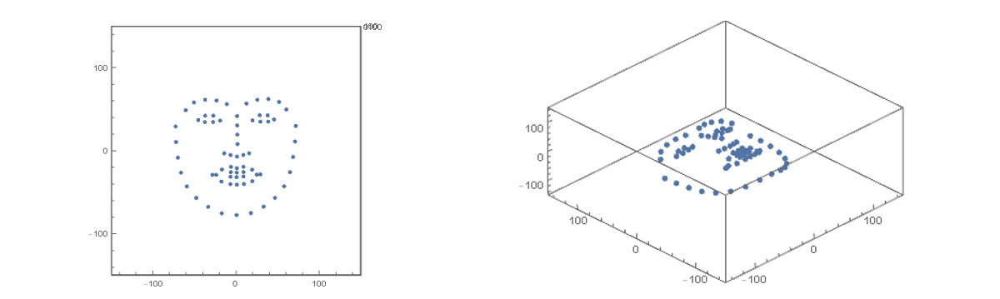

人脸姿态估计指的是根据一幅2维的人脸图像，计算出这个人在实际3维空间中的面部朝向。问题的输入条件就是一张人脸图片，输出自然就是可以表示方位的三个旋转角度 (pitch, yaw, roll)，其中 pitch 表示俯仰角，yaw 表示摇头角，roll 表示摆头角，分别如下面 3 图所示


算法的思路很简单，可以考虑这样一种场景，假设我们有一张标准的3d人脸模型，如果投影和输入图片的人脸大致重合，那么此时 3d 模型的方位就可以看作是图片中人脸在实际空间中的方位了。如果投影和图像的差异很大，那我们再对 3d 模型进行旋转，平移，拉伸等操作，可以明确的是，只要经过合适的调整，总会出现两者相重合的情况。

所以现在的问题就变成了三个子问题：1. 怎样得到标准的人脸 3d 模型；2. 对 3d 模型的各种变换操作怎样从数字上体现出来；2. 如何量化的表示“重合”这一概念。

我们先来看第二个问题，在数学上，旋转、平移、拉伸操作其实都是矩阵运算，举个简单的例子，在二维平面上旋转一条线段，就是使用旋转目标 src 去乘以二维旋转矩阵，得到的 dst 便是旋转后的线段。


平移操作更简单一点，在坐标分量上加一个偏移量即可。拉伸也同理，只需要在不同的方向上乘以缩放系数。于是，空间中的一个对象，经过上述变换后，最终得到的东西由下式给出

\[
  dst = (src \cdot R + t)\cdot s
  \]

其中 \(t\) 是平移矩阵，大小为 \(n\times 3\)，它的每一列数值为常量，是对应方向上的移动距离


\[
    t=\left[
    \begin{aligned}
    &dx  &dy\quad&dz\\
    &dx  &dy\quad&dz\\
    &dx  &dy\quad&dz\\
    &...& ... \quad &...
    \end{aligned}
    \right]
  \]

\(s\) 是缩放向量，具体形式为 

\[
  s=\left[
    \begin{aligned}
    \lambda_x \quad 0\quad 0\\
     0\quad  \lambda_y\quad 0\\
    0\quad 0\quad \lambda_z
    \end{aligned}
    \right]
  \]

这里的 \(\lambda_x, \lambda_y,\lambda_z\) 是三个方向上的缩放系数。

下面我们重点讨论一下旋转矩阵 \(R\) 的形式，与二维情况不同的是，三维旋转有三个旋转轴，针对每一个旋转轴都有一个旋转矩阵形式，具体来说

\[
    R_x=\left[
    \begin{aligned}
    &1  &0&\quad 0\\
    &0  &\cos(\alpha) &\quad-sin(\alpha)\\
    &0  &\sin(\alpha) &\quad \cos(\alpha)
    \end{aligned}
    \right]
  \]

\[
    R_y=\left[
    \begin{aligned}
    &\cos(\beta)  &0&\quad -sin(\beta)\\
    &0  &1 &\quad0\\
    &\sin(\beta)  &0 &\quad \cos(\beta)
    \end{aligned}
    \right]
  \]

\[
    R_z=\left[
    \begin{aligned}
    &\cos(\gamma)  &-sin(\gamma)&\quad 0\\
    &\sin(\gamma)  &\cos(\gamma) &\quad 0\\
    &0  &0 &\quad 1\quad 
    \end{aligned}
    \right]
  \]

其中 \(\alpha, \beta,\gamma\) 分别是关于 \(x,y,z\) 轴的旋转角度，最终的旋转矩阵是上述这三个矩阵相乘之积

\[
  R = R_x R_y R_z
  \]

于是经过变换后的模型就是 \(\alpha, \beta, \gamma, \lambda_x, \lambda_y, \lambda_z, dx, dy, dz\) 这些变量的函数

\[
  dst(\alpha, \beta, \gamma, \lambda_x, \lambda_y, \lambda_z, dx, dy, dz) = (src \cdot R + t)\cdot s
  \]

搞定了标准 3d 人脸模型的变换之后，接下来我们来解决如何量化投影与人脸图像重叠的问题。由于 3d 模型其实就是一系列点坐标，所以我们首先也应该把二维人脸图像使用点坐标来表示。关于人脸关键点检测的算法有很多，这里我们使用 dlib 框架提供的 68 点检测模型，效果图如下


下面我们给出有 68 个关键点的[标准3d人脸模型](standard_face_landmark.csv)，它看起来就像下面这样



有了标准人脸关键点之后，我们需要对其进行空间变换，也就是前面推导的

\[
  dst = (src \cdot R + t)\cdot s
  \]

然后再将其投影到 xy 平面上，当然这个投影矩阵比较简单，只需要提取 dst 中每个点的前两个坐标就可以了


\[
    prj=\left[
    \begin{aligned}
    &1 \quad 0\\
    &0 \quad 1\\
    &0  \quad 0 
    \end{aligned}
    \right]
  \]

投影后的点集合为

\[
  dst_{p} = dst \cdot prj
  \]

为了衡量投影与图片人脸关键点的重合程度，我们采用平方误差损失函数

\[
  \begin{aligned}
L &= \frac 1 n \sum_{i=1} \mid\mid dst_p(i) - p_i \mid\mid^2\\
&= \frac 1 n \sum_{i=1}^n \mid\mid (src_i \cdot R + t_i)\cdot s \cdot prj - p_i \mid\mid^2
  \end{aligned}
  \]

其中 \(p_i\) 是人脸图像第 i 个关键点的坐标。于是最终要求解的问题便为

\[
  \alpha,\beta, \gamma = \arg \min_{\alpha, \beta, \gamma} L(\alpha, \beta, \gamma, \lambda_x, \lambda_y, \lambda_z, dx, dy, dz)
  \]

下面我们采用梯度下架法来求解，参数迭代格式为 

\[
  p = p - \eta \frac{\partial L}{\partial p}
  \]

其中 \(\eta\) 是学习速率，\(p\) 代表一种参数，也就是前面的 \(\alpha,\beta...\) 等等，经过多次迭代，\(L\) 应该能收敛到一个稳定值，此时便完成了整个优化过程。

接下来，利用上述思路，我们来实际编程试验一下，由于目标函数 \(L\) 的形式还是有点复杂，手动求导不太现实，所以这里我们采用 pytorch 来完成自动求导的功能，首先是定义上面提到的几个参数

```python
alpha = torch.tensor(0.0, requires_grad=True, dtype=torch.float64)
beta = torch.tensor(0.0, requires_grad=True, dtype=torch.float64)
gamma = torch.tensor(0.0, requires_grad=True, dtype=torch.float64)
lambdaX = torch.tensor(1.0, requires_grad=True, dtype=torch.float64)
lambdaY = torch.tensor(1.0, requires_grad=True, dtype=torch.float64)
lambdaZ = torch.tensor(1.0, requires_grad=True, dtype=torch.float64)
dx = torch.tensor(1.0, requires_grad=True, dtype=torch.float64)
dy = torch.tensor(1.0, requires_grad=True, dtype=torch.float64)
dz = torch.tensor(1.0, requires_grad=True, dtype=torch.float64)

```

由于要对它们求导，所以需要 requires_grad 为 True。然后定义投影到 xy 平面的矩阵 

```python
## 投影矩阵
prj = torch.tensor([[1, 0],
                   [0, 1], 
                   [0, 0]], dtype=torch.float64)
```

以及旋转矩阵

```python
def rx(a): 
    """
     关于x轴的旋转矩阵
    """
    RX = torch.zeros(3, 3, dtype=torch.float64)
    RX[0, 0] = 1
    RX[1, 1] = a.cos()
    RX[1, 2] = -a.sin()
    RX[2, 1] = a.sin()
    RX[2, 2] = a.cos()
    return RX

def ry(b): 
    """
     关于y轴的旋转矩阵
    """
    RY = torch.zeros(3, 3, dtype=torch.float64)
    RY[0, 0] = b.cos()
    RY[0, 2] = b.sin()
    RY[1, 1] = 1
    RY[2, 0] = -b.sin()
    RY[2, 2] = b.cos()
    return RY

def rz(r): 
    """
     关于z轴的旋转矩阵
    """
    RZ = torch.zeros(3, 3, dtype=torch.float64)
    RZ[0, 0] = r.cos()
    RZ[0, 1] = -r.sin()
    RZ[1, 0] = r.sin()
    RZ[1, 1] = r.cos()
    RZ[2, 2] = 1
    return RZ

def r(a, b, r):
    """
    空间旋转矩阵
    """
    R = torch.mm(rx(a), ry(b))
    R = torch.mm(R, rz(r))
    return R

```

这里我们给旋转矩阵赋值的方式有点怪异，没有直接从数组建立，这是因为旋转矩阵也需要包含梯度信息。

接下来定义空间变换函数和目标函数

```python
def transform(src):
    """
    空间变换
    """
    ## 缩放矩阵
    s=torch.zeros(3, 3, dtype=torch.float64)
    s[0, 0] = lambdaX
    s[1, 1] = lambdaY
    s[2, 2] = lambdaZ
    
    ## 位移向量
    t = torch.zeros(1, 3, dtype=torch.float64)
    t[0, 0] = dx
    t[0, 1] = dy
    t[0, 2] = dz

    R = r(alpha, beta, gamma)
    dst = torch.mm(src, R)+ t
    dst = torch.mm(dst, s)
    return dst

def L(src, p):
    """
    目标函数
    """
    dst = transform(src)
    dst = torch.mm(dst, prj)    
    L = dst - p
    
    return (L[::,0]**2+L[::, 1]**2).sum()/len(src)
```

最后，以迭代的方式优化目标函数

```python

src = np.loadtxt("/path/to/src.csv")
src = torch.from_numpy(src)

p = np.loadtxt("/path/to/p.csv")
p = torch.from_numpy(p)

iter=128000
lr = 0.00001

def gd(params):
    """
    梯度下降
    """
    for p in params:
        p.data -= lr * p.grad
        p.grad.data.zero_()

for i in range(iter):
    l = L(src, p)
    if i % 1000 ==0:
        print(l)    

    l.backward()
    
    gd([alpha, beta, gamma, lambdaX, lambdaY, lambdaZ, dx, dy, dz])
    
```

这里我们把学习率设的很小，否则结果不收敛。下面我们用 zack 的脸来跑个例子


首先根据原图来看，zack脸部大致是朝左斜向下的，具体来说，俯仰角（绕 x 轴） \(-\pi/2< pitch <0\)，偏航角（绕y轴）\(-\pi/2< yaw < 0\)，翻滚角（绕z轴）几乎为 0。当然我这里给的范围比较粗糙，主要是为了检验算法是否会得出离谱的结果。

cas
c
asd
casdc
asc
a
s

cas
c
as
c

sa
c
as
dc
c
