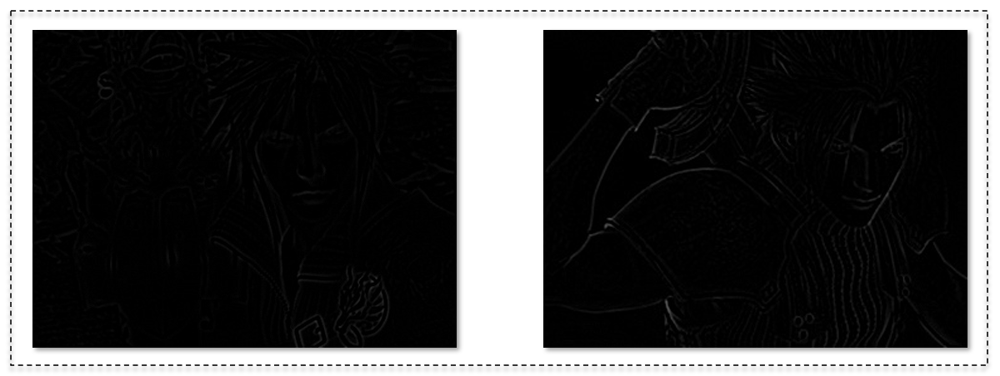

图片质量评估是计算机视觉领域比较依赖人主观意识的课题，就我当前遇到的问题来看，还是觉得把主要任务明确成评估人像的清晰度比较合理。

说到一张清晰的图片，我们首先会想到毫无杂质的画面，其内容边缘界限分明，感官上就像下面两张图所形成的对比

应用图像处理中的边缘检测技术，我们可以找到画面中像素值变化剧烈的位置，也就是所谓的物体轮廓，在采用拉普拉斯算子对这两张图的灰度滤波之后，我们可以看到其边缘线的分布

从滤波后的图像来看，