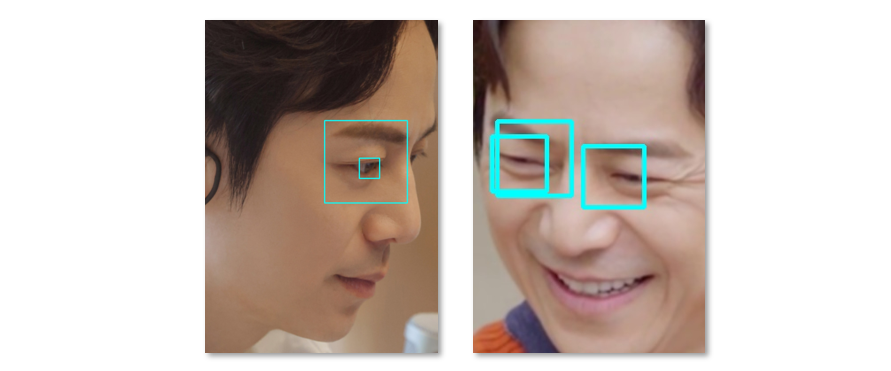
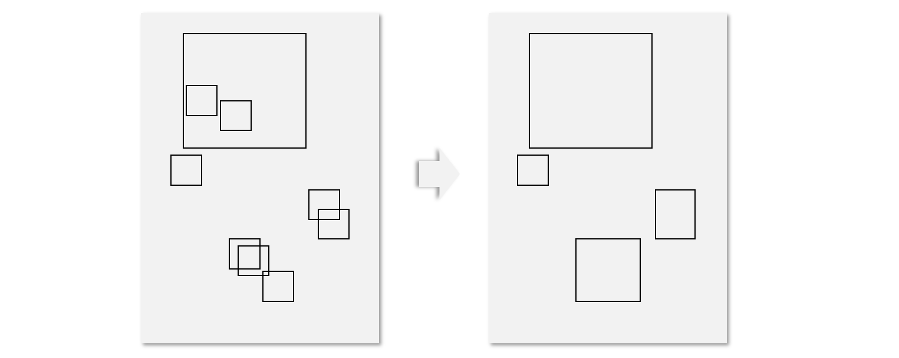

**背景**：使用opencv检测人眼的时候，由于模型在多个尺度下进行检测，所以同一个位置有可能产生多个边界框，如下图所示，于是需要把多余的边界框给干掉。

**描述**：给定一个数组，其中每个元素都是由4个数字表示的边界框坐标，定义[left, right, top, bottom]，现在需要合并所有相交和包含的边界框，返回独立的矩形列表，要求当然是时间复杂度越小越好。

输入： \[[0, 100, 0, 50], [100, 200, 100, 200]]