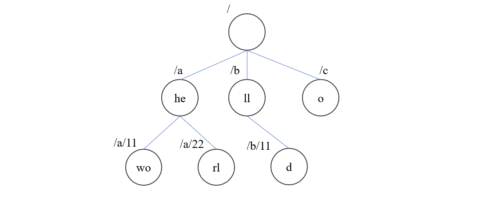

ZooKeeper 是为分布式应用提供一致性服务的软件，提供统一配置管理、集群管理、分布式锁、分布式命名服务等功能，为了实现这些功能，ZooKeeper 实现了一套自己的分布式通信协议，称为 ZooKeeper 原子广播协议，简写为 ZAB。

ZooKeeper 维护了一个树状的数据结构，类似与Unix文件系统结构，以 "/" 作为根，树中的每个节点叫做 Znode，是一个键值对，也就是说在创建节点的时候可以给它赋予一个值。

ZooKeeper 客户端可以创建节点并告知 ZooKeeper 监听该节点上的事件变化，当 ZooKeeper 监听到某个节点上的事件变化后，立即通知注册在该节点上的所有客户端，然后这些客户端再根据具体的事件类型选择要执行的操作。ZooKeeper 的所有功能都建立在这种运行机制上，所以如何保证这种机制无论在什么情况下都正确的运行便是 ZooKeeper 最核心的问题。

