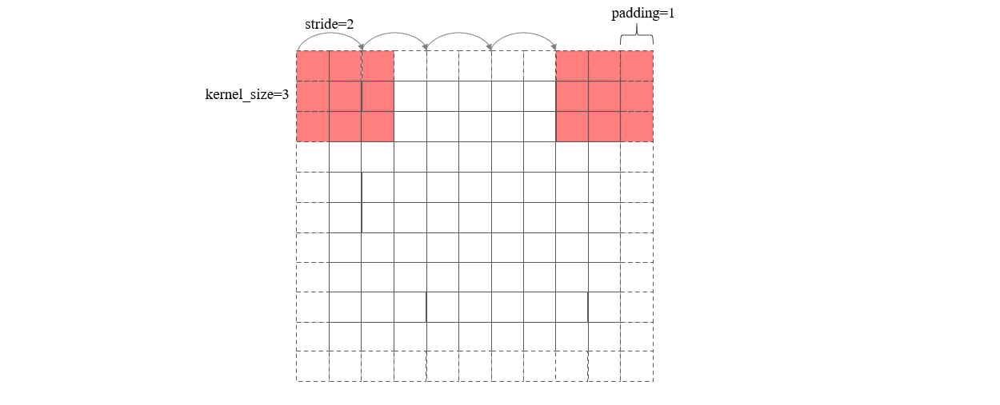
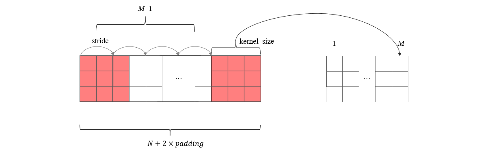

众所周知，在定义卷积层的时候，我们一般会设置卷积核大小(kernel_size)，卷积步长 (stride)，特征图填充宽度 (padding)等参数。这些值的设置让卷积核可以从图片的第一个像素刚好扫描到最后一个像素，如下图所示

不难发现，经过卷积后的特征图尺寸等于卷积核滑动的次数 + 1，在这里等于 5。现在假设卷积前的特征图宽度为 \(N\)，卷积后输出的特征图宽度为 \(M\)，那么它们和上述设置的参数之间的关系是怎样的呢？首先可以确定的是padding之后的矩阵宽度等于 \(N + 2 \times padding\)。另一方面，卷积核的滑动次数等于 \(M-1\)

根据上图的关系，可以建立下面的等式

\[
  N + 2\times padding=(M-1) \times stride + kernel\_size
  \]

于是输出矩阵的宽度就等于 

\[
  M = \frac{N + 2 \times padding - kernel\_size}{stride} + 1
  \]

特别地，如果需要卷积操作不改变矩阵宽度，即 \(M = N\)，则填充宽度为 

\[
  padding = \frac{(N - 1) \times stride - N + kernel\_size}{2}
  \]

最后，虽然上述分析针对的是卷积层，但池化层也是同样的道理，这里就不赘述了。

