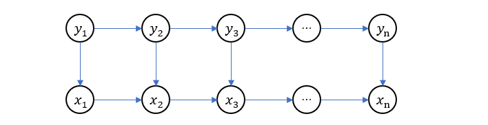

####隐马尔可夫模型

假设一个系统可以在多个状态之间转换，其中的**状态空间** \(\mathcal{S} = \{s_i \mid i=1,,,m\}\)，系统所处的不同状态构成了顺序的状态序列 \(y_1,y_2,y_3,..., y_n\)，并且满足马尔可夫性假设

\[
  p(y_{k+1}\mid y_k, y_{k-1}, ..., y_1) = p(y_{k+1}\mid y_k)
  \]

也就是说，系统当前状态只和上一个状态有关，与更早之前的状态没有联系。系统的状态是隐含变量，具体反映状态的是可观测变量 \(x_i\)，**观测空间**为 \(\mathcal{V} = \{v_i\mid i = 1,,,p\}\)，它只与 \(y_i\) 相关

\[
  b_{tk} = p(x_i = v_k\mid y_i = s_t)
  \]

由于系统可以在各状态间转换，设从当前状态 \(s_j\) 转移到 \(s_k\) 的概率密度函数为 \(a_{jk}\)，也就是说

\[
  a_{jk} = p(y_{i+1} = s_j \mid y_i = s_k) 
  \]

显然 \(a_{jk}\) 是一个 \(m \times m\) 的矩阵，称作**状态转移矩阵**，记为 \(A\)。为了确定初始状态，再定义**初始状态**的概率密度函数为 

\[
  \pi_i = p(y_1 = s_i)
  \]

上述系统被称为隐马尔可夫模型，它的概率图表示如下

每个状态变量 \(y_i\) 对应于一个观测变量 \(x_i\)，\(p(x_i \mid y_i)\)。所有变量的联合分布

\[
  \begin{aligned}
  &p(x_1, y_1, x_2, y_2, ..., x_n, y_n) \\
  &= p(x_1, y_1) p(x_2, y_2 \mid x_1, y_1) p(x_3, y_3\mid x_1, y_1, x_2, y_2) ... p(x_n, y_n\mid x_1, y_1, x_2, y_2, ..., x_{n-1}, y_{n-1})\\
  &= p(x_1, y_1)p(x_2, y_2\mid y_1)p(x_3, y_3\mid y_2) ... p(x_n, y_n\mid y_{n-1}) \\
  &= p(y_1)p(x_1\mid y_1) p(x_2\mid y_2)p(y_2\mid y_1)... p(x_n\mid y_n) p(y_n\mid y_{n-1})\\
  &= p(y_1)p(x_1\mid y_1) \prod_{i=2}^n p(x_i\mid y_i)p(y_i\mid y_{i-1})
  \end{aligned}
  \]

