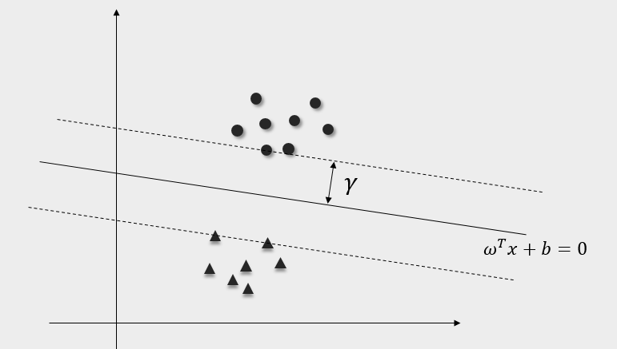
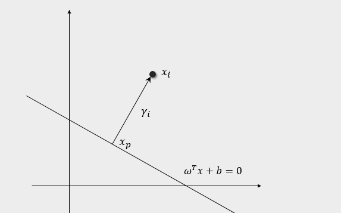
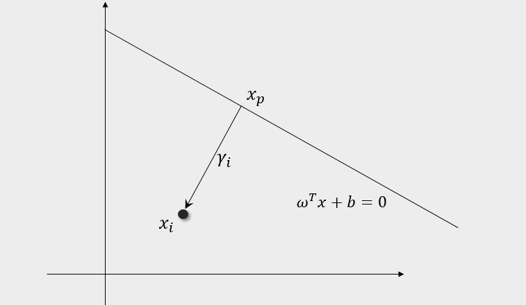

## 支持向量机

来源于不同类别的数据，它们的特征一般来说是可以区分的。对于某个特征，总是可以使用足够高维的向量来表示，这样大量的特征在高维空间中形成了点云。具有明显差异的两类特征就可以使用一个超平面进行分割，而一般这样的超平面可能不止一个，显然有的超平面会比其他的更加合理。支持向量机算法就是在这种目的下，希望找到一个超平面，使得特征点离超平面的最小间隔最大。所谓的最小间隔，就是指在所有点中，距离超平面最小的那个值。

假设上图中的实线即为这样的超平面，设其方程为

\[
\omega^T x +b = 0
\]

我们说这样的超平面使得特征点到超平面的最小间隔最大，这一说法涉及到三个概念，比较拗口，所以这里分开说明，首先是特征点得到超平面的间隔，第二个是最小间隔，最后是最小间隔最大。

为了计算空间中一个点到超平面的距离，我们考虑如下位置关系，假设点 $x_i$ 距离超平面的距离为 $\gamma_i$，我们过点作一条垂线，垂足为 $x_p$，显然 $x_p$ 满足方程

\[
\omega^T x_p + b = 0
\]

并且可以证明从 $x_p$ 指向 $x_i$ 的方向为 $\omega$，于是存在下述关系

\[
x_i = x_p + \gamma_i \frac{\omega}{||\omega||}
\]

将 $x_i$ 代入函数 $f(x) = \omega^T x + b$

\[
\begin{aligned}
f(x_i) &= \omega^T (x_p + \gamma_i \frac{\omega}{||\omega||}) + b\\
&= \omega^T x_p + b + \gamma_i ||\omega||\\
\gamma_i& = \frac{\omega^T}{||\omega||}x_i + \frac{b}{||\omega||}
\end{aligned}
\]

另一方面，如果 $x_i$ 位于超平面的另一边，如下图

end
