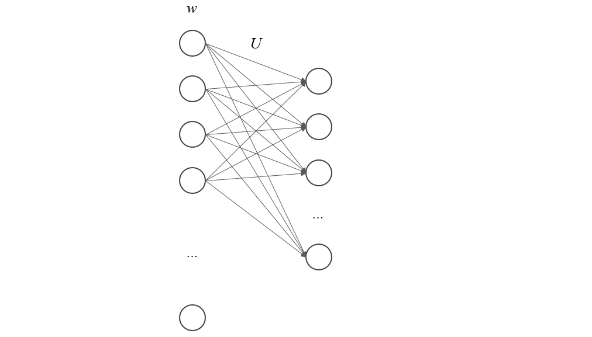

顾名思义，word2vec 是一种将词语转换成向量的技术。之所以需要这样的技术，是因为数学模型只能处理数字形式的输入，对于 NLP 这种用数学方法来建模自然语言的领域，将语句的基本单元——词语，进行向量化是基本操作。

当然，编码不是乱编，不是任意找个向量就可以替换一个词语，它得满足基本的语义要求。假设编码函数 \(f\) 将自然语言空间中的词语映射到 \(m\) 维的欧式空间 \((R^m, d)\)，其中\(d\)是度量函数，那么给定两个词语 \(A,B\)，若它们是近义词，那么 \(d[f(A), f(B)]\) 应该接近于 0，或者说向量\(f(A)\) 和 \( f(B)\) 应该有更高的相似度，若两者经常出现在一句话相近的位置，那么 \(p[f(B)\mid f(A)]\) 也应该接近于 1，这里的 \(p\) 是词语出现的概率。

现在，假如我们有一批样本 \(S=\{(w_i, w_j) \mid w_i,w_j \in W\}\)，其中 \(W\) 是语料库中的所有词语，每对样本都是从自然语句中相邻近位置挑出来的，那么按照我们对语义的要求，对于每对样本 \((w_i, w_j)\)， \(p[f(w_j) \mid f(w_i)]\) 应该有较大的值。若编码函数 \(f\) 的参数集用 \(\theta\) 表示，那么我们可以用极大似然估计的方法构造对数似然函数

\[
  L(\theta) = \log \prod_{(w_i, w_j)\in S} p(u_j\mid u_i)
  \]

其中 \(u_i = f(w_i), u_j = f(w_j)\) 是 \(m\) 维的词向量。\(L(\theta)\) 就是我们的优化目标函数，需要寻找合适的 \(\theta\) 使其最大化。接下来对 \(p(u_j\mid u_i)\) 进行建模，根据条件概率公式

\[
  p(u_j\mid u_i) = \frac{p(u_i, u_j)}{p(u_i)}
  \]

这里 \(p(u_i, u_j)\) 表示两个词语同时出现的概率， = \( \frac{\exp(u_i^\top u_j)}{C}\)

当然，仅仅是将词语转换成向量还是不够的，比如 onehot 编码就能完成这种任务，但是这样得出的词向量既不能正确给出词语间的距离信息（也就是近义词），也没有词语的语义信息（一个正常句子中每个词语的上下文），所以，使用 onehot 编码无法给出合理的词向量。

但是 onehot 编码可以作为词语的初始向量，这样有利于数学上的处理，先假设所有词语都相互正交，然后再寻找变换函数。比如从训练文档中提取所有不重复词语组成语料库 \(W\)，其大小为 \(n\)，那么每个词语都可以用一个长度为 \(n\) 的基向量来表示。再假设需要获得的词向量维度为 \(m\)，则变换函数的类型就为 \(f: R^n \rightarrow R^m\)。这是个很一般的函数，可简单也可复杂，如果就用线性函数来表示，那么有

\[
  f(w) = U w + b
  \]

其中 \(U\) 是大小为 \(m \times n\) 的矩阵，\(b\) 为 \(m\) 维向量。从另一个角度来看，上面的线性变换函数其实就是一个单层的神经网络

其中的输入层是词语的onehot编码，输出层是最终的词向量。

> 所谓的“语义信息”，这个词在每个场景下都比较抽象，在这篇介绍 word2vec 的文章里，我认为它特指一个正常的句子里面词语的上下文，比如 "生生不息，繁荣昌盛" 这句话，“不息”就是“生生”的语义信息，“昌盛”是“繁荣”的语义信息，反之亦然。
如果两个词意思相近，比如 “不灭”和“不息”，那么“生生不灭”也显然是一种合理的表达，也就是说近义词可以相互替换对方在句子中特定词汇的上下文。

为了量化词语的语义信息，word2vec 引入了条件概率 \(p(w_j \mid w_i)\) ，即给定词语 \(w_i\)，它的上下文出现词语 \(w_j\) 的概率大小。假如我们获得了一个比较不错的模型，它给出的 \(p(B\mid A)\) 具有较大的值，那么就说明在正常的句子中，词语 A 和 B 经常挨着出现。上面这句话实际就启发了我们如何来设计训练目标函数——给出一系列正常的语句，相邻词语间的条件概率都相对较大，仿照极大似然估计里面的似然函数，我们定义

\[
  L = \prod p(B\mid A) \quad  A,B \in W 
  \]

其中 \(A\) 和 \(B\) 互为上下文。

当然，“上下文”也是一个值得商榷的用词，究竟“上”多少，“下”多少？我们可以用一个“窗口”参数来量化，假设窗口为 2，那么一个词的上下文就是它前后两个词语之间的所有词语，比如下面这句话 
> 天 不生 牛顿，万古 如 长夜

那么“天”的上下文就是 “不生”和“牛顿”，“不生”的上下文就是“天”和“牛顿”，依次类推。将所有词语和它的一个上下文组成词对，可以得到下面的集合 
> （天，不生）、（天，牛顿）、（不生，天）、（不生，牛顿）、（牛顿，天）、（牛顿，不生）、（万古，如）、（万古，长夜）、（如、万古）、（如，长夜）、（长夜、如）、（长夜，万古）

这些词对就是我们训练模型的材料，即训练集，假设一个句子用 \(s\) 表示，它的第 \(i\) 个词为 \(s_i\)，那么上述训练集可以形式化表示为 \(\{(s_i, s_{i-j})\mid -c\le j \le c, j \ne 0\}\)，其中 \(c\) 为前面定义的上下文窗口。于是训练目标函数就可以进一步表示为

\[
  L = \prod_{s \in S} \prod_{s_i \in s}\prod_{-c\le j\le c, j\ne 0} p(s_{i - j}\mid s_i)
  \]

其中 \(S\) 是文档中的所有语句。为了消除连续乘积，我们取对数

\[
  l = \sum_{s \in S} \sum_{s_i \in s} \sum_{-c \le j \le c, j\ne 0} \log p(s_{i-j}\mid s_i)
  \]

接下来的问题是如何计算条件概率 \(p(s_j\mid s_i)\)，假设 \(u_i = f(s_i), u_j = f(s_j)\)，由于 \(f\) 是线性函数，那么可以认为 \(p(s_j\mid s_i) = p(u_j \mid u_i)\)。这样一来，我们可以使用 softmax 函数来建模此条件概率分布，即 
\[
  p(u_j\mid u_i) = \frac{\exp(u_i^T u_j)}{\sum_{k=1}^n \exp(u_i^T u_k)}
  \]

显然，上述表达式满足概率密度函数的合法性条件

\[
  \sum_{k} p(u_k\mid u_i) = \sum_{k}\frac{p(u_k, u_i)}{p(u_i)}= 1
  \]

于是优化目标函数可以用词向量写为

\[
  l(U, b) = \sum_{s \in S} \sum_{s_i \in s} \sum_{-c \le j \le c, j\ne 0} \log \frac{\exp(u_i^T u_j)}{\sum_{k=1}^n \exp(u_i^T u_k)}
  \]

最优解为 

\[
  U^*, b^* = \arg \max_{U, b} l(U, b)
  \]

通过以上推导，我们给出算法框架：

1. 根据训练文档生成训练集 \(\{(s_i, s_{i-j})\mid -c\le j \le c, j \ne 0\}\)；
2. 初始化权重矩阵 \(U\) 和偏移向量 \(b\)；
3. 定义 epoches, batches， 对于每一个 epoch 中的每个 batch
  b. 计算总体损失 \(l(U, b)\);
  c. 计算总体损失对 \(U,b\) 的负梯度，并更新权重矩阵。
4. 获得最优解 \(U^*, b^*\)。

观察条件概率计算公式

\[
  p(u_j\mid u_i) = \frac{\exp(u_i^T u_j)}{\sum_{k=1}^n \exp(u_i^T u_k)}
  \]

可以发现，每对词组仅仅分母就需要 2n 次矩阵向量乘法，n 次指数运算，n 次加法运算。为了减小计算量，下面考虑简化条件概率公式。

\[
  \begin{aligned}
  \log p(u_j\mid u_i) &=\log \frac{\exp(u_i^T u_j)}{\sum_{k=1}^n \exp(u_i^T u_k)}\\
  &=u_i^T u_j - \log \sum_{k=1}^n \exp(u_i^T u_j)
  \end{aligned}
  \]

While the approaches discussed so far still maintain the overall structure of the softmax, sampling-based approaches on the other hand completely do away with the softmax layer. They do this by approximating the normalization in the denominator of the softmax with some other loss that is cheap to compute. However, sampling-based approaches are only useful at training time -- during inference, the full softmax still needs to be computed to obtain a normalised probability.

In order to gain some intuitions about the softmax denominator's impact on the loss, we will derive the gradient of our loss function \(J_\theta\) w.r.t. the parameters of our model \(\theta\).
During training, we aim to minimize the cross-entropy loss of our model for every word \(w\) in the training set. This is simply the negative logarithm of the output of our softmax. If you are unsure of this connection, have a look at Karpathy's explanation to gain some more intuitions about the connection between softmax and cross-entropy. The loss of our model is then the following:

\(J_\theta = - \text{log} \dfrac{\text{exp}({h^\top v'_{w}})}{\sum_{w_i \in V} \text{exp}({h^\top v'_{w_i}})} \).

Note that in practice \(J_\theta\) would be the average of all negative log-probabilities over the whole corpus. To facilitate the derivation, we decompose \(J_\theta \) into a sum as \(\text{log} \dfrac{x}{y} = \text{log} x - \text{log} y \):

\(J_\theta = - h^\top v'_{w} + \text{log} \sum_{w_i \in V} \text{exp}(h^\top v'_{w_i}) \)

For brevity and to conform with the notation of Bengio and Senécal (2003; 2008) [11], [12] (note that in the first paper, they compute the gradient of the positive logarithm), we replace the dot product \( h^\top v'_{w} \) with \( - \mathcal{E}(w) \). Our loss then looks like the following:

\(J_\theta = \mathcal{E}(w) + \text{log} \sum_{w_i \in V} \text{exp}( - \mathcal{E}(w_i)) \)

For back-propagation, we can now compute the gradient \(\nabla \) of \(J_\theta \) w.r.t. our model's parameters \(\theta\):

\(\nabla_\theta J_\theta = \nabla_\theta \mathcal{E}(w) + \nabla_\theta \text{log} \sum_{w_i \in V} \text{exp}(- \mathcal{E}(w_i)) \)

As the gradient of \( \text{log} x \) is \(\dfrac{1}{x} \), an application of the chain rule yields:

\(\nabla_\theta J_\theta = \nabla_\theta \mathcal{E}(w) + \dfrac{1}{\sum_{w_i \in V} \text{exp}(- \mathcal{E}(w_i))} \nabla_\theta \sum_{w_i \in V} \text{exp}(- \mathcal{E}(w_i) \)

We can now move the gradient inside the sum:

\(\nabla_\theta J_\theta = \nabla_\theta \mathcal{E}(w) + \dfrac{1}{\sum_{w_i \in V} \text{exp}(- \mathcal{E}(w_i))} \sum_{w_i \in V} \nabla_\theta \text{exp}(- \mathcal{E}(w_i)) \)

As the gradient of \(\text{exp}(x)\) is just \(\text{exp}(x)\), another application of the chain rule yields:

\(\nabla_\theta J_\theta = \nabla_\theta \mathcal{E}(w) + \dfrac{1}{\sum_{w_i \in V} \text{exp}(- \mathcal{E}(w_i))} \sum_{w_i \in V} \text{exp}(- \mathcal{E}(w_i)) \nabla_\theta (- \mathcal{E}(w_i)) \)

We can rewrite this as:

\(\nabla_\theta J_\theta = \nabla_\theta \mathcal{E}(w) + \sum_{w_i \in V} \dfrac{\text{exp}(- \mathcal{E}(w_i))}{\sum_{w_i \in V} \text{exp}(- \mathcal{E}(w_i))} \nabla_\theta (- \mathcal{E}(w_i)) \)

Note that \( \dfrac{\text{exp}(- \mathcal{E}(w_i))}{\sum_{w_i \in V} \text{exp}(- \mathcal{E}(w_i))} \) is just the softmax probability \(P(w_i) \) of \(w_i\) (we omit the dependence on the context \(c\) here for brevity). Replacing it yields:

\(\nabla_\theta J_\theta = \nabla_\theta \mathcal{E}(w) + \sum_{w_i \in V} P(w_i) \nabla_\theta (- \mathcal{E}(w_i)) \)

Finally, repositioning the negative coefficient in front of the sum yields:

\(\nabla_\theta J_\theta = \nabla_\theta \mathcal{E}(w) - \sum_{w_i \in V} P(w_i) \nabla_\theta \mathcal{E}(w_i) \)

Bengio and Senécal (2003) note that the gradient essentially has two parts: a positive reinforcement for the target word \(w\) (the first term in the above equation) and a negative reinforcement for all other words \(w_i\), which is weighted by their probability (the second term). As we can see, this negative reinforcement is just the expectation \(\mathbb{E}_{w_i \sim P}\) of the gradient of \(\mathcal{E} \) for all words \(w_i\) in \(V\):

\(\sum_{w_i \in V} P(w_i) \nabla_\theta \mathcal{E}(w_i) = \mathbb{E}_{w_i \sim P}[\nabla_\theta \mathcal{E}(w_i)]\).

The crux of most sampling-based approach now is to approximate this negative reinforcement in some way to make it easier to compute, since we don't want to sum over the probabilities for all words in \(V\).

We can approximate the expected value \(\mathbb{E}\) of any probability distribution using the Monte Carlo method, i.e. by taking the mean of random samples of the probability distribution. If we knew the network's distribution, i.e. \(P(w)\), we could thus directly sample \(m\) words \( w_1 , \cdots , w_m \) from it and approximate the above expectation with:

\( \mathbb{E}_{w_i \sim P}[\nabla_\theta \mathcal{E}(w_i)] \approx \dfrac{1}{m} \sum\limits^m_{i=1} \nabla_\theta \mathcal{E}(w_i) \).

However, in order to sample from the probability distribution \( P \), we need to compute \( P \), which is just what we wanted to avoid in the first place. We therefore have find some other distribution \( Q \) (we call this the proposal distribution), from which it is cheap to sample and which can be used as the basis of Monte-Carlo sampling. Preferably, \(Q\) should also be similar to \(P\), since we want our approximated expectation to be as accurate as possible. A straightforward choice in the case of language modelling is to simply use the unigram distribution of the training set for \( Q \).

This is essentially what classical Importance Sampling (IS) does: It uses Monte-Carlo sampling to approximate a target distribution \(P\) via a proposal distribution \(Q\). However, this still requires computing \(P(w)\) for every word \(w\) that is sampled. To avoid this, Bengio and Senécal (2003) use a biased estimator that was first proposed by Liu (2001) [13]. This estimator can be used when \( P(w) \) is computed as a product, which is the case here, since every division can be transformed into a multiplication.
Essentially, instead of weighting the gradient \(\nabla_\theta \mathcal{E}(w_i)\) with the expensive to compute probability \(P_{w_i}\), we weight it with a factor that leverages the proposal distribution \(Q\). For biased IS, this factor is \(\dfrac{1}{R}r(w_i)\) where \( r(w) = \dfrac{\text{exp}(- \mathcal{E}(w))}{Q(w)} \) and \( R = \sum^m_{j=1} r(w_j) \).
Note that we use \( r \) and \( R \) instead of \( w\) and \(W\) as in Bengio and Senécal (2003, 2008) to avoid name clashes. As we can see, we still compute the numerator of the softmax, but replace the normalisation in the denominator with the proposal distribution \(Q\). Our biased estimator that approximates the expectation thus looks like the following:

\( \mathbb{E}_{w_i \sim P}[\nabla_\theta \mathcal{E}(w_i)] \approx \dfrac{1}{R} \sum\limits^m_{i=1} r(w_i) \nabla_\theta \mathcal{E}(w_i)\)

Note that the fewer samples we use, the worse is our approximation. We additionally need to adjust our sample size during training, as the network's distribution \(P\) might diverge from the unigram distribution \(Q \) during training, which leads to divergence of the model, if the sample size that is used is too small. Consequently, Bengio and Senécal introduce a measure to calculate the effective sample size in order to protect against possible divergence. Finally, the authors report a speed-up factor of \(19 \) over the regular softmax for this method.

Bengio and Senécal (2008) note that for Importance Sampling, substituting more complex distributions, e.g. bigram and trigram distributions, later in training to combat the divergence of the unigram distribution \(Q\) from the model's true distribution \(P\) does not help, as n-gram distributions seem to be quite different from the distribution of trained neural language models. As an alternative, they propose an n-gram distribution that is adapted during training to follow the target distribution \(P\) more closely. To this end, they interpolate a bigram distribution and a unigram distribution according to some mixture function, whose parameters they train with SGD for different frequency bins to minimize the Kullback-Leibler divergence between the distribution \( Q \) and the target distribution \( P\). For experiments, they report a speed-up factor of about \(100\).

Jean et al. (2015) propose to use Adaptive Importance Sampling for machine translation. In order to make the method more suitable for processing on a GPU with limited memory, they limit the number of target words that need to be sampled from. They do this by partitioning the training set and including only a fixed number of sample words in every partition, which form a subset \(V'\) of the vocabulary.

This essentially means that a separate proposal distribution \(Q_i \) can be used for every partition \(i\) of the training set, which assigns equal probability to all words included in the vocabulary subset \(V'_i\) and zero probability to all other words.

Noise Contrastive Estimation (NCE) (Gutmann and Hyvärinen, 2010) [14] is proposed by Mnih and Teh (2012) [15] as a more stable sampling method than Importance Sampling (IS), as we have seen that IS poses the risk of having the proposal distribution \(Q\) diverge from the distribution \(P\) that should be optimized. In contrast to the former, NCE does not try to estimate the probability of a word directly. Instead, it uses an auxiliary loss that also optimises the goal of maximizing the probability of correct words.

Recall the pairwise-ranking criterion of Collobert and Weston (2008) that ranks positive windows higher than "corrupted" windows, which we discussed in the previous post. NCE does a similar thing: We train a model to differentiate the target word from noise. We can thus reduce the problem of predicting the correct word to a binary classification task, where the model tries to distinguish positive, genuine data from noise samples, as can be seen in Figure 4 below.

For every word \(w_i\) given its context \(c_i \) of \(n\) previous words \(w_{t-1} , \cdots , w_{t-n+1}\) in the training set, we thus generate \(k\) noise samples \(\tilde{w}_{ik}\) from a noise distribution \(Q\). As in IS, we can sample from the unigram distribution of the training set. As we need labels to perform our binary classification task, we designate all correct words \(w_i\) given their context \(c_i\) as true (\(y=1\)) and all noise samples \(\tilde{w}_{ik}\) as false (\(y=0\)).

We can now use logistic regression to minimize the negative log-likelihood, i.e. cross-entropy of our training examples against the noise (conversely, we could also maximize the positive log-likelihood as some papers do):

\( J_\theta = - \sum_{w_i \in V} [ \text{log} P(y=1 | w_i,c_i) + k \mathbb{E}_{\tilde{w}_{ik} \sim Q} [ \text{log} P(y=0 | \tilde{w}_{ij},c_i)]] \).

Instead of computing the expectation \(\mathbb{E}_{\tilde{w}_{ik} \sim Q}\) of our noise samples, which would still require summing over all words in \(V\) to predict the normalised probability of a negative label, we can again take the mean with the Monte Carlo approximation:

\( J_\theta = - \sum_{w_i \in V} [ \text{log} P(y=1 | w_i,c_i) + k \sum_{j=1}^k \dfrac{1}{k} \text{log} P(y=0 | \tilde{w}_{ij},c_i)] \),

which reduces to:

\( J_\theta = - \sum_{w_i \in V} [ \text{log} P(y=1 | w_i,c_i) + \sum_{j=1}^k \text{log} P(y=0 | \tilde{w}_{ij},c_i)] \),

By generating \(k\) noise samples for every genuine word \(w_i\) given its context \(c\), we are effectively sampling words from two different distributions: Correct words are sampled from the empirical distribution of the training set \(P_{\text{train}}\) and depend on their context \(c\), whereas noise samples come from the noise distribution \(Q\). We can thus represent the probability of sampling either a positive or a noise sample as a mixture of those two distributions, which are weighted based on the number of samples that come from each:

\(P(y, w | c) = \dfrac{1}{k+1} P_{\text{train}}(w | c)+ \dfrac{k}{k+1}Q(w) \).

Given this mixture, we can now calculate the probability that a sample came from the training \(P_{\text{train}}\) distribution as a conditional probability of \(y\) given \(w\) and \(c\):

\( P(y=1 | w,c)= \dfrac{\dfrac{1}{k+1} P_{\text{train}}(w | c)}{\dfrac{1}{k+1} P_{\text{train}}(w | c)+ \dfrac{k}{k+1}Q(w)} \),

which can be simplified to:

\( P(y=1 | w,c)= \dfrac{P_{\text{train}}(w | c)}{P_{\text{train}}(w | c) + k Q(w)} \).

As we don't know \(P_{\text{train}}\) (which is what we would like to calculate), we replace \(P_{\text{train}}\) with the probability of our model \(P\):

\( P(y=1 | w,c)= \dfrac{P(w | c)}{P(w | c) + k Q(w)} \).

The probability of predicting a noise sample (\(y=0\)) is then simply \(P(y=0 | w,c) = 1 - P(y=1 | w,c)\). Note that computing \( P(w | c) \), i.e. the probability of a word \(w\) given its context \(c\) is essentially the definition of our softmax:

\(P(w | c) = \dfrac{\text{exp}({h^\top v'_{w}})}{\sum_{w_i \in V} \text{exp}({h^\top v'_{w_i}})} \).

For notational brevity and unambiguity, let us designate the denominator of the softmax with \(Z(c)\), since the denominator only depends on \(h\), which is generated from \(c\) (assuming a fixed \(V\)). The softmax then looks like this:

\(P(w | c) = \dfrac{\text{exp}({h^\top v'_{w}})}{Z(c)} \).

Having to compute \(P(w | c)\) means that -- again -- we need to compute \(Z(c)\), which requires us to sum over the probabilities of all words in \(V\). In the case of NCE, there exists a neat trick to circumvent this issue: We can treat the normalisation denominator \(Z(c)\) as a parameter that the model can learn.
Mnih and Teh (2012) and Vaswani et al. (2013) [16] actually keep \(Z(c)\) fixed at \(1\), which they report does not affect the model's performance. This assumption has the nice side-effect of reducing the model's parameters, while ensuring that the model self-normalises by not depending on the explicit normalisation in \(Z(c)\). Indeed, Zoph et al. (2016) [17] find that even when learned, \(Z(c)\) is close to \(1\) and has low variance.

If we thus set \(Z(c)\) to \(1\) in the above softmax equation, we are left with the following probability of word \(w\) given a context \(c\):

\(P(w | c) = \text{exp}({h^\top v'_{w}})\).

We can now insert this term in the above equation to compute \(P(y=1 | w,c)\):

\( P(y=1 | w,c)= \dfrac{\text{exp}({h^\top v'_{w}})}{\text{exp}({h^\top v'_{w}}) + k Q(w)} \).

Inserting this term in turn in our logistic regression objective finally yields the full NCE loss:

\( J_\theta = - \sum_{w_i \in V} [ \text{log} \dfrac{\text{exp}({h^\top v'_{w_i}})}{\text{exp}({h^\top v'_{w_i}}) + k Q(w_i)} + \sum_{j=1}^k \text{log} (1 - \dfrac{\text{exp}({h^\top v'_{\tilde{w}_{ij}}})}{\text{exp}({h^\top v'_{\tilde{w}_{ij}}}) + k Q(\tilde{w}_{ij})})] \).

Note that NCE has nice theoretical guarantees: It can be shown that as we increase the number of noise samples \(k\), the NCE derivative tends towards the gradient of the softmax function. Mnih and Teh (2012) report that \(25\) noise samples are sufficient to match the performance of the regular softmax, with an expected speed-up factor of about \(45\). For more information on NCE, Chris Dyer has published some excellent notes [18].

One caveat of NCE is that as typically different noise samples are sampled for every training word \(w\), the noise samples and their gradients cannot be stored in dense matrices, which reduces the benefit of using NCE with GPUs, as it cannot benefit from fast dense matrix multiplications. Jozefowicz et al. (2016) and Zoph et al. (2016) independently propose to share noise samples across all training words in a mini-batch, so that NCE gradients can be computed with dense matrix operations, which are more efficient on GPUs.

Jozefowicz et al. (2016) show that NCE and IS are not only similar as both are sampling-based approaches, but are strongly connected. While NCE uses a binary classification task, they show that IS can be described similarly using a surrogate loss function: Instead of performing binary classification with a logistic loss function like NCE, IS then optimises a multi-class classification problem with a softmax and cross-entropy loss function. They observe that as IS performs multi-class classification, it may be a better choice for language modelling, as the loss leads to tied updates between the data and noise samples rather than independent updates as with NCE. Indeed, Jozefowicz et al. (2016) use IS for language modelling and obtain state-of-the-art performance (as mentioned above) on the 1B Word benchmark.

Negative Sampling (NEG), the objective that has been popularised by Mikolov et al. (2013), can be seen as an approximation to NCE. As we have mentioned above, NCE can be shown to approximate the loss of the softmax as the number of samples \(k\) increases. NEG simplifies NCE and does away with this guarantee, as the objective of NEG is to learn high-quality word representations rather than achieving low perplexity on a test set, as is the goal in language modelling.

NEG also uses a logistic loss function to minimise the negative log-likelihood of words in the training set. Recall that NCE calculated the probability that a word \(w\) comes from the empirical training distribution \(P_{\text{train}}\) given a context \(c\) as follows:

\( P(y=1 | w,c)= \dfrac{\text{exp}({h^\top v'_{w}})}{\text{exp}({h^\top v'_{w}}) + k Q(w)} \).

The key difference to NCE is that NEG only approximates this probability by making it as easy to compute as possible. For this reason, it sets the most expensive term, \(k Q(w)\) to \(1\), which leaves us with:

\( P(y=1 | w,c)= \dfrac{\text{exp}({h^\top v'_{w}})}{\text{exp}({h^\top v'_{w}}) + 1} \).

\(k Q(w) = 1\) is exactly then true, when \(k= |V|\) and \(Q\) is a uniform distribution. In this case, NEG is equivalent to NCE. The reason we set \(k Q(w) = 1\) and not to some other constant can be seen by rewriting the equation, as \(P(y=1 | w,c)\) can be transformed into the sigmoid function:

\( P(y=1 | w,c)= \dfrac{1}{1 + \text{exp}({-h^\top v'_{w}})} \).

If we now insert this back into the logistic regression loss from before, we get:

\( J_\theta = - \sum_{w_i \in V} [ \text{log} \dfrac{1}{1 + \text{exp}({-h^\top v'_{w_i}})} + \sum_{j=1}^k \text{log} (1 - \dfrac{1}{1 + \text{exp}({-h^\top v'_{\tilde{w}_{ij}}})}] \).

By simplifying slightly, we obtain:

\( J_\theta = - \sum_{w_i \in V} [ \text{log} \dfrac{1}{1 + \text{exp}({-h^\top v'_{w_i}})} + \sum_{j=1}^k \text{log} (\dfrac{1}{1 + \text{exp}({h^\top v'_{\tilde{w}_{ij}}})}] \).

Setting \(\sigma(x) = \dfrac{1}{1 + \text{exp}({-x})}\) finally yields the NEG loss:

\( J_\theta = - \sum_{w_i \in V} [ \text{log} \sigma(h^\top v'_{w_i}) + \sum_{j=1}^k \text{log} \sigma(-h^\top v'_{\tilde{w}_{ij}})] \).

To conform with the notation of Mikolov et al. (2013), \(h\) must be replaced with \(v_{w_I}\), \(v'_{w_i}\) with \(v'_{w_O}\) and \(v_{\tilde{w}_{ij}}\) with \(v'_{w_i}\). Also, in contrast to Mikolov's NEG objective, we a) optimise the objective over the whole corpus, b) minimise negative log-likelihood instead of maximising positive log-likelihood (as mentioned before), and c) have already replaced the expectation \(\mathbb{E}_{\tilde{w}_{ik} \sim Q}\) with its Monte Carlo approximation. For more insights on the derivation of NEG, have a look at Goldberg and Levy's notes [19].

We have seen that NEG is only equivalent to NCE when \(k= |V|\) and \(Q\) is uniform. In all other cases, NEG only approximates NCE, which means that it will not directly optimise the likelihood of correct words, which is key for language modelling. While NEG may thus be useful for learning word embeddings, its lack of asymptotic consistency guarantees makes it inappropriate for language modelling.