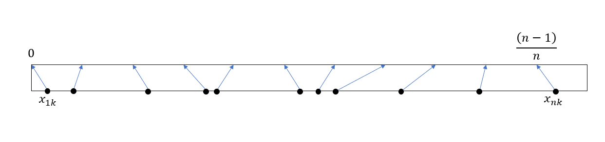
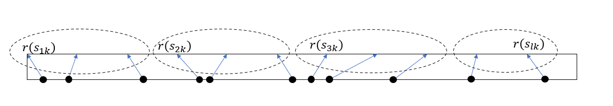

---
XGBoost 算法
---

#### 训练集

\[
    \mathcal{D} = \{(x_i, y_i)\},\quad x_i \in R^m, y_i \in R , i=1..n
    \]

#### 模型

\[
    \hat{y}_i = \phi(x_i) = \sum_{k=1}^K f_k(x_i), \quad f_k \in \mathcal{F}
    \]

这里的每个 \(f_k\) 都是决策树函数空间 \(\mathcal{F}\) 上的一个实例。而 \(\mathcal{F}\) 可以表示为 \(\mathcal{F} = \{w_{q(x)}\}\)，其中 \(q(x): R^m \rightarrow \{1..T\}, w \in R^T\)。解释一下：\(q(x)\) 是决策树的结构，它把 \(x\) 传输到树的 \(T\) 个叶节点之一，\(w\) 存储了每个叶节点的值，是一个\(T\) 维向量，通过 \(w_{q(x)}\) 得到样本的预测值，所以 \(w_{q(x)}\) 实际上就是一颗决策树。

#### 正则化目标函数

\[
    L(\phi) = \sum_{i=1}^n l(y_i, \hat{y_i}) + \sum_{k=1}^K \Omega(f_k)
    \]

其中 \(\Omega(f) = \gamma T + \frac 1 2 \lambda \mid\mid w \mid\mid^2\) 表示正则项，模型越复杂，正则项的值越大，因此在损失函数中加入正则项有利于控制模型的复杂度，从而抑制过拟合。

#### 梯度提升树

模型的迭代形式

\[
    \hat{y}_i = \phi_t(x_i) = \phi_{t-1}(x_i) + f_t(x_i)
    \]

第 t 步迭代的目标函数

\[
    L(f_t) = \sum_{i=1}^n l(y_i, \hat{y}_i^{t-1} + f_t(x_i)) + \Omega(f_t)
    \]

这可以看作是对 \(f_t\) 的泛函，对 \(l\) 二阶泰勒展开

\[
    l(y_i, \hat{y}_i^{t-1} + f_t(x_i)) \approx l(y_i, \hat{y}_i^{t-1}) + g_i f_t(x_i) +\frac 1 2 h_i f_t^2(x_i)
    \]

其中\(g_i = \frac { \partial l(y_i, \hat{y}^{t-1}_i)}{\partial \hat{y}^{t-1}_i} \)，\(h_i = \frac { \partial^2 l(y_i, \hat{y}^{t-1}_i)}{\partial (\hat{y}^{t-1}_i)^2} \)。

代入到目标函数后

\[
    \begin{aligned}
    L(f_t) &= \sum_{i=1}^n \left[ l(y_i, \hat{y}_i^{t-1}) + g_i f_t(x_i) 
    +\frac 1 2 h_i f_t^2(x_i)\right] + \Omega(f_t)\\
    &=\sum_{i=1}^n l(y_i, \hat{y}_i^{t-1})  + \sum_{i=1}^n \left[  g_i f_t(x_i) 
    +\frac 1 2 h_i f_t^2(x_i)\right] + \Omega(f_t)
    \end{aligned}
    \]

去掉与 \(f_t\) 无关的常量，优化目标不会变

\[
    \arg \min_{f_t} L^{(t)} = \arg\min_{f_t} \tilde{L}^{(t)}
    \]

\[
    \tilde{L}(f_t) = \sum_{i=1}^n \left[  g_i f_t(x_i) 
    +\frac 1 2 h_i f_t^2(x_i)\right] + \Omega(f_t)
    \]

对于一个样本 \(x_i\)，如果它被决策树 \(f_t\) 分配到了第 \(j\) 个叶节点，也就是说 \(q(x_i) = j\)，这时 \(f_t(x_i) = w_j\)，现在对所有样本按叶节点进行分组，定义集合 \(I_j = \{i \mid q(x_i) = j\}\)，那么目标函数又可以写成

\[
    \begin{aligned}
    &\tilde{L}(f_t) = \sum_{j=1}^T \left[\sum_{i \in I_j} g_i f_t(x_i) + \frac 1 2 \sum_{i \in I_j} h_i f_t^2(x_i) \right] + \Omega(f_t) \\
    &\Rightarrow \tilde{L}^{(t)}(w, q)= \sum_{j=1}^T \left[\sum_{i \in I_j} g_i w_j + \frac 1 2 \sum_{i \in I_j} h_i w_j^2 \right] + \gamma T + \frac 1 2 \lambda \sum_{j=1}^T w_j^2 \\
    &\Rightarrow \tilde{L}^{(t)}(w, q)= \sum_{j=1}^T \left[\sum_{i \in I_j} g_i w_j + \frac 1 2 \left(\sum_{i \in I_j}h_i+\lambda\right)   w_j^2 \right] + \gamma T
    \end{aligned}
    \]

上面的转换其实就是把损失对 \(f_t\) 的泛函转换成为 \(w, q\) 的函数，为了获得最优解，对 \(w_k\) 求偏导，并令其等于 0

\[
    \begin{aligned}
    &\frac{\partial \tilde{L}^{(t)}}{\partial w_k} = \sum_{i\in I_k}g_i + \left(\sum_{i\in I_k} h_i + \lambda\right)w_k = 0\\
    &\Rightarrow w_k^*= -\frac{\sum_{i\in I_k} g_i}{\sum_{i\in I_k} h_i + \lambda}
    \end{aligned}
    \]

再将 \(w^*\)代入 \(\tilde{L}^{(t)}(w, q)\) 得到关于 \(q\) 的泛函

\[
    \begin{aligned}
    \tilde{L}^{(t)}(q) &= \sum_{j=1}^T \left[\sum_{i \in I_j} g_i \left(-\frac{\sum_{i\in I_j} g_i}{\sum_{i\in I_j} h_i + \lambda}\right) + \frac 1 2 \left(\sum_{i \in I_j}h_i+\lambda\right)   \left(-\frac{\sum_{i\in I_j} g_i}{\sum_{i\in I_j} h_i + \lambda}\right)^2 \right] + \gamma T\\
    &=-\frac 1 2 \sum_{j=1}^T \left[ \frac{(\sum_{i\in I_j} g_i)^2}{\sum_{i\in I_j} h_i + \lambda} \right] + \gamma T
    \end{aligned}
    \]

再定义 
\[
    G_j =\sum_{i\in I_j} g_i ,\quad H_j = \sum_{i\in I_j} h_i
    \]

上述损失又可以化简为 
\[
    \tilde{L}^{(t)}(q) = -\frac 1 2 \sum_{j=1}^T \left[ \frac {G_j^2}{H_j+\lambda} \right] + \gamma T
    \]

上式只与 \(q\) 有关，也就是说任意给出一颗决策树，可以利用上式计算本轮迭代的总体损失。通过枚举所有决策树结构，选取令总体损失最小的 \(q\)，便完成了本轮优化。顺便提一句，上式可以看出来，对于第 \(j\) 个节点，其对损失的贡献大小等于

\[
    -\frac 1 2 \frac{G_j^2}{H_j + \lambda} + T    
    \]

实际情况下，枚举所有的决策树结构是不可能的，实际上，决策树的优化有一类比较通用的贪心算法，即通过计算分裂增益来寻找最佳的分裂点，比如 ID3 使用信息增益，C4.5 使用信息增益比，那么在这里，其实就有一个现成的分裂增益评价指标，即 \(\tilde{L}\) 在分裂前后的差值。注意，当前情况下我们的树有 \(T\) 个节点，从中任选一个节点进行分裂，假设编号为 \(k\) ，把 \(I_k\) 分成了两个部分 \(I_L\) 和 \(I_R\)，那么分裂后的损失就是在原来损失的基础上去掉第 \(k\) 个节点的损失，再新增两个新节点的损失

\[
    \tilde{L}^{(t)}(\hat{q}) =  -\frac 1 2 \sum_{j=1,j\ne k}^{T}  \left[ \frac {G_j^2}{H_j+\lambda} \right] -\frac 1 2 \frac {G_L^2}{H_L + \lambda} -\frac 1 2\frac {G_R^2}{H_R + \lambda} + \gamma (T+1)
    \]

其中
\[
    G_L = \sum_{i \in I_L} g_i,\quad H_L = \sum_{i \in I_L}h_i,\quad G_R = \sum_{i \in I_R} g_i,\quad H_R = \sum_{i -\in I_R}h_i
    \]

于是，分裂前后的总体损失增益就为 

\[
    \tilde{L}_{split} =\tilde{L}^{(t)}(q) - \tilde{L}^{(t)}(\hat{q})=\frac 1 2 \left(\frac {G_L^2}{H_L + \lambda} +\frac {G_R^2}{H_R + \lambda} -\frac{G_k^2}{H_k+\lambda}\right)- \gamma 
    \]

#### 精确贪心算法

精确的贪心算法严格按照贪心策略，在特征和值两个维度上搜索。对于任意节点，算法过程如下

1. 首先设当前节点样本集合为 \(I\)，样本特征维度等于 \(m\)；
2. 初始化：损失增益变量 \(gain = 0\)，最佳分裂特征 \(d = 1\)，最佳分裂点 \(z = \min(\mathbf{x}_d)\)，这里的 \(\mathbf{x}_d\) 是\(I\)中第 \(d\) 个特征组成的向量；
3. 计算 
\[
    G = \sum_{i \in I} g_i,\quad H = \sum_{i \in I}h_i
    \]
4. 对于 \(k = 1...m\)：
a. 假设在第 \(k\) 个特征上分裂，为了确定在哪个值上分裂，先对第 \(k\) 个特征上的所有值 \(\{x_{jk}\}_{j=1}^{\mid I\mid}\) 进行排序，得到排序后的向量 \(\{\bar{x}_{jk}\}_{j=1}^{\mid I \mid }\)；
b. 初始化 \(G_L = 0, H_L = 0\)，对于 \(j = 1...p\)，假设在值 \(\bar{x}_{jk}\) 上分裂，分裂后的两部分样本分别为 \(I_L\) 和 \(I_R\): 

    (1). 计算 
    \[
        G_L \leftarrow G_L + g_j, H_L \leftarrow H_L + h_j
    \]

    再根据 \(G\) 的定义，得到 
    \[
        G_R \leftarrow G - G_L, H_R \leftarrow H - H_L
        \]
    
    计算损失增益
    \[
        \Delta L =  \frac {G_L^2}{H_L + \lambda} +\frac {G_R^2}{H_R + \lambda} -\frac{G^2}{H+\lambda}
        \]
    
    当 \(\Delta L > gain\) 时，更新 \(gain = \Delta L, d = k, z = \bar{x}_{jk}\)；
5. 使用第 \(d\) 个特征对样本进行分裂，分裂点为 \(z\)。

#### 近似贪心算法

近似算法是为了解决数据集无法完全加载到内存而产生的问题，由于训练集数据量过于庞大，难以对每个数据点都进行一次分裂测试，一个朴素但有效的想法是对总体数据进行采样，使用少量候选分裂点来实现前面精确算法中的过程。对于第 \(k\) 个特征，考虑集合 \(D_k = \{x_{1k}, x_{2k}, ... x_{nk}\}, x_{1k} \le x_{2k} \le ... \le x_{nk}\) ，定义每个点所在的位置函数

\[
    r_k(z) = \frac{count(x\lt z)}{n}
    \]

该函数将非均匀分布的 \(D_k\) 间隔相等地映射到了区间 \([0, 1]\) 上，其中 \(r_k(x_{1k}) = 0, r_k(x_{nk}) = \frac{n-1}{n}\)

现在，考虑选取一个小于 1 的值 \(\epsilon\)，从样本中采样集合 \( \{s_{1k}, s_{2k}, ... s_{lk}\} , s_{1k} \le s_{2k} \le ... \le s_{lk}\)，使得

\[
    \begin{aligned}
    \mid r(s_{j+1, k}) - r(s_{jk}) \mid &\lt \epsilon\\
    \mid r(s_{j+2, k}) - r(s_{jk}) \mid &\gt \epsilon\\
    s_{1k} &= x_{1k}\\
    s_{lk} &= x_{nk}
    \end{aligned}
    \]

显然，分割点 \(s_{1k}, s_{2k}, ... s_{lk}\) 将集合 \(D_k\) 分成了多个大小相等的子集

对于每个子集，计算统计量 

\[
    G_{kv} = \sum_{j\in \{s_{vk} \le x_{jk} \lt s_{v+1,k}\}}g_j
    \]

\[
    H_{kv} = \sum_{j\in \{s_{vk} \le x_{jk} \lt s_{v+1,k}\}}h_j
    \]

然后对候选分割点应用前面叙述的精确贪心算法构建决策树，其中 \(G_{kv}, H_{kv}\) 代表第 \(v\)个点的一阶和二阶统计量。

为了提高准确程度，采样方法应该满足一定的准则，考虑集合 \(D_k = \{(x_{1k}, h_1), (x_{2k}, h_2), ..., (x_{nk}, h_n)\}\)，这是所有样本第 \(k\) 个特征以及对应的统计量 \(h\) 组成的二元组集合。再定义排序函数

\[
    r_k(z) = \frac{1}{\sum_{(x, h) \in D_k} h}\sum_{(x, h) \in D_k, x < z} h
    \]

这个函数乍一看有点不太好理解，如果我们令 \(h = 1\)，得到

\[
    r_k(z) = \frac{\sum_{(x, h) \in D_k, x < z} 1}{\sum_{(x, h) \in D_k} 1} = \frac{count(x < z)}{n}
    \]

可以看到，这是小于 \(z\) 的样本所占总体训练集的比例。如果取消 \(h=1\) 的假设，那么 \(r_k(z)\) 其实就是以 \(h\) 作为权重的样本特征的值小于 \(z\) 的比例。假如利用排序函数，找到一组候选点 

\[
    \{s_{k1}, s_{k2}, ... , s_{kl}\}, s_{k1} = \min(\mathbf{x}_{ki}), s_{kl} = \max (\mathbf{x}_{ki})
    \]

使得

\[
    \mid r_k(s_{k, j}) - r_k(s_{k-1, j}) \mid \lt \epsilon
    \]

其中 \(\epsilon\) 为预设的采样率，这时总的候选分割点数量就等于 \(\frac 1 {\epsilon}\)。利用这些点可以把训练集分到多个桶，对每个桶里每个点的 \(g, h\) 求和作为分割点的统计量

\[
    \begin{aligned}
    G_{kv} &= \sum_{j \in \{j \mid s_{k, v-1} \lt x_{kj} \le s_{kv}\}} g_j \\
    H_{kv} &= \sum_{j \in \{j \mid s_{k, v-1} \lt x_{kj} \le s_{kv}\}} h_j
    \end{aligned}
    \]

于是，在第 \(k\) 个特征上，我们得到了一组候选分割点 \(\{s_{ki}\}_{i=1}^l\)，以及对应的统计量 \(\{G_{ki}\}_i^l, \{H_{ki}\}_i^l\)，利用这些信息，我们可以按照前述的精确算法同样的流程寻找最佳分裂点。接下来还需要解决两个小问题——为何上述候选分割点是合理的，以及如何寻找这些候选分割点。

在 AdaBoost 算法里面，被错误分类的数据点在构建新树的时候有更高的权重，这一思想也被 xgboost 引入了进来，

#### 超参数解释

- [eta] 学习速率，在论文中被称为缩减系数(shrinkage)，对每棵树的贡献乘以一个小于 1 的系数，令模型的更新趋于保守，有助于防止过拟合；

- [gamma] 节点分裂的损失增量阈值，节点分裂有助于减少损失，如果减少量小于 gamma 值，那么就不分裂，gamma 越大，则节点的分裂条件越严格；

- [max_depth] 树的最大深度，深度越大，模型越复杂，也越容易过拟合；

- [min_child_weight] 节点拥有样本的最小数量，只有当分裂后的子节点拥有的样本数量都大于该值时才能分裂。增加该值，有利于模型避免特殊样本的影响（因为特殊样本很少，父节点不容易单独为这些特殊样本分裂出新节点），从而减小过拟合，但是有可能造成欠拟合；

- [max_delta_step] 

- [subsample] 子采样率，构建每棵树时从训练集中采样的比例，合适的子采样率有助于减小过拟合；

- [sampling_method] 采样方法，uniform 采样适用于子采样率大于 0.5 的情况，gradient_base 采样方法中，每个训练样本被采样的概率正比于 \(\sqrt{g^2 + \lambda  h^2}\)，子采样率可以减小到 0.1，但只适用于 tree_method 等于 gpu_hist 的请况；

- [colsample_bytree, colsample_bylevel, colsample_bynode] 列采样率，列采样是在随机森林算法里应用的技术，xgboost 将其借鉴了过来，这三个参数分别控制三个阶段的列采样率，bytree 表示在构建树时，bylevel 表示树的深度增加时，bynode 表示节点分裂时；

- [lambda] L2 正则项系数，也就是 \(\Omega(f) = \gamma T + \frac 1 2 \lambda \mid\mid w \mid\mid^2\) 中的 \(\lambda\)，它抑制了树中的权重值大小；

- [alpha] L1 正则项系数，也就是 \(\Omega(f) = \gamma T + \frac 1 2 \lambda \mid\mid w \mid\mid^2\) 中的 \(\gamma\)，它抑制了树中的叶节点数量；

- [tree_method] 树构建方法，exact 表示使用精确贪心算法，approx 表示使用近似贪心算法，hist 表示使用优化后的近似贪心算法，gpu_hist 表示使用 gpu 实现的 hist 算法；

- [sketch_eps] 

\[
    \frac{T_i^{j+1} - T_i^j}{\Delta t} = \lambda \left( \frac{T_{i+1}^j -2T_i^j + T_{i-1}^j }{\Delta x^2} \right)
    \]

\[
    \Delta x^2 T_i^{j+1} -  \Delta x^2 T_i^j = \lambda \Delta t T_{i+1}^j - 2\lambda \Delta tT_i^j + \lambda \Delta t T_{i-1}^j
    \]

\[
    \lambda \Delta t T_{i-1}^j + (\Delta x^2 - 2\lambda \Delta t) T_i^j - \Delta x^2 T_i^{j+1} + \lambda \Delta t T_{i+1}^j = 0
    \] 

\[
    T_{i}^0 = t_f , i = 1...M
    \]