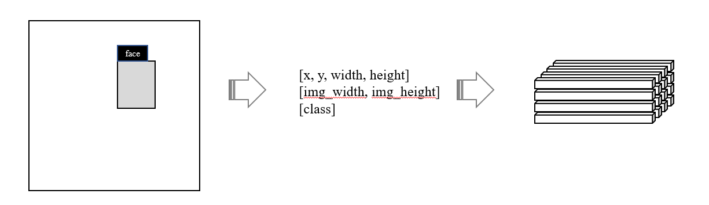
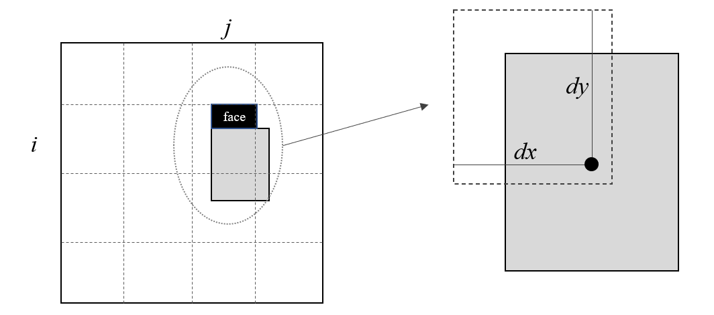
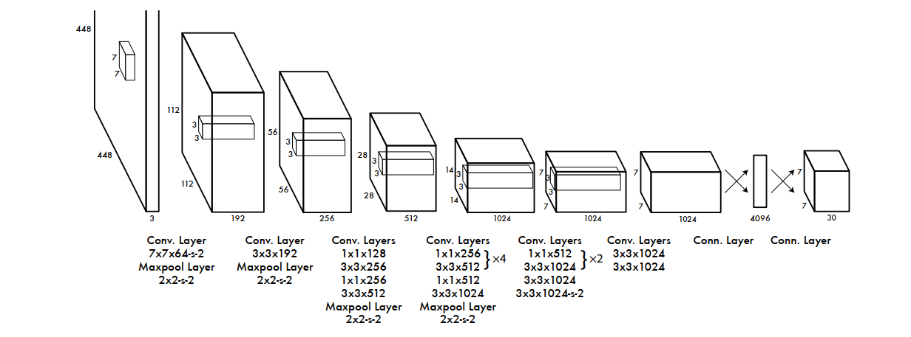
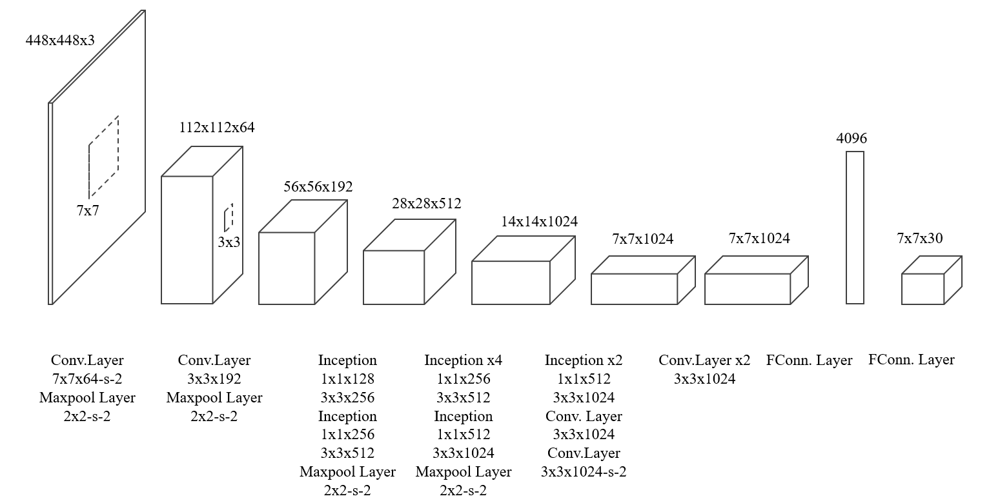
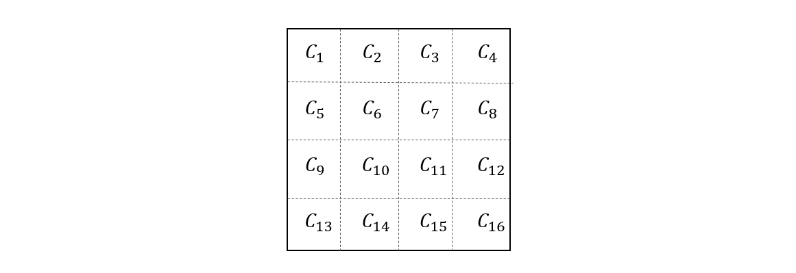

#### Ground Truth 定义

任何一个监督学习系统都必须有相应的 Ground Truth，比如房价预测训练中的实际房价，股票预测中的实际涨跌等等，对于单变量预测的学习任务来说，其 ground truth 可能只是一个数值量，形式很简单，甚至通常不会引起我们的注意。但是神经网络的输出在某些情况下具有很复杂的形式，比如张量这种高维矩阵类型。而我们拿到的标注通常是很直观的，比如对于目标检测来说，可能只是一个物体 bounding box 坐标。因此，为了计算损失，需要将标注数据转换成神经网络输出的三维阵列形式。

上图的转换过程中，最直观的是左边的标注图，但事实上，它的存储形式类似于中间的数据格式，我们的任务是要把它转换成右边的三维阵列。

下面我们描述yolo的第一个版本所使用的转换方法。首先，将图片分割成 \(S\times S \) 个格子，需要检测的物体显然与这些格子有一个相对关系，假设物体的中心落在第 \((i, j)\) 个格子里面，这时，计算物体中心相对于其所在格子左上角的偏移百分比 \(d_x, d_y\) 作为新的物体位置表示，比如 \((0, 0)\) 表示物体中心刚好位于格子左上角，\((1, 1)\) 表示物体中心刚好位于格子右下角。

然后，为了归一化物体的尺寸，令 \(w = width / img\_width, h = height/img\_height\) 即可，

另外，在标注数据中，由于我们确切地知道目标位于当前格子上，所以我们定义当前格子具有物体的概率等于 1，即\(P(Object) = 1\)。但是，物体与格子并不一定完全重合，为了衡量它们之间的重合度，我们使用交并比 \(IOU\) 来度量，然后再定义物体位于格子中的置信度 \(confidence = P(Object)* IOU\)。

由于需要检测的物体不止一个类别，所以还应该在格子拥有某个物体的基础上，定义此物体的类别概率\(P(Class_i | Object)\)，假如总的物体类别有 20 种，那么将会有 20 个这样的值来表达物体属于每个类别的概率。对于标注数据来说，显然只有一个值等于 1，其余都为 0 。

现在我们可以总结一下，对于一个格子来说，标注数据被转换成了 3 种类型的信息，即

1. 位置: \([d_x, d_y, w, h]\)
2. confidence: \(P(Obj) * IOU\)
3. 条件类别概率：\([P(C_1| Obj), ..., P(C_{20}|Obj)]\)

我们把这些值统一排成一个向量 \(A_{ij}\)，这里的 \(i, j\) 表示这个向量是与第 \(i, j\) 个格子相关联的，由于格子的总数量有 SxS 个，所以我们可以得到 SxS 个向量，只不过这些格子都不包含物体，所以它们对应向量的所有值都为 0。把这些向量按照格子的顺序依次排列，最终便可以得到前面我们提到的三维数据阵列，也就是所谓的 Ground Truth。

值得注意的是，在 yolo 中，每个格子预测了物体的多个不同的位置和大小以及confidence，这样原本的向量 \(A_{ij}\) 就变成了下述形式

\[
  A_{ij} = [d_{x_1}, d_{y_1}, w_1, h_1, c_1, d_{x_2}, d_{y_2}, w_2, h_2, c_2,..., P(C_1| Obj), ..., P(C_{20}|Obj)]
  \]

当 \(S=7, B = 2\) 时，最终的输出数据阵列的大小就为 \(7\times 7 \times (5 \times 2 + 20)\)。

#### 网络结构

yolo 网络受到 GoogleNet 的启发，引入了一个简化版的 inception 模块，也就是在 1x1 卷积层后面接 3x3 卷积层。上图是论文中的网络结构图，但是我觉得前面的部分有点误导，下面是修正后的结构图

可以看到，网络中总共有 24 个卷积层负责提取特征，倒数第二层全连接层把提取的特征图映射到一维向量上，最后一层再把该向量变换成更浅的特征图，其大小为 \(7\times7\times30\)。这里的 \(7\times 7\) 与前面对图片划分的格子一一对应，也就是说，网络最终输出结果就是对每个格子上拥有物体情况的预测。在训练阶段，利用网络输出的结果和前面推导的 Ground Truth 即可计算损失。 

#### 损失函数

损失函数采用简单易优化的平方损失，但由于网络输出的结构中，每个向量由几个不同含义的数据组成，因此总体损失的计算也应该分成几个不同的部分。下面我们逐个叙述。

首先是对于边界框中心偏移预测值 \(d_x, d_y\)，假设其 Ground Truth 为 \(\hat{d}_x, \hat{d}_y\)，那么损失为 \((d_x - \hat{d}_x)^2 + (d_y-\hat{d_y})^2\)。在前面，我们约定了每个格子预测 B 个物体边界框，但是只有一个最优预测，在这里使用预测框与格子的交并比来确定。定义 \(\mathbb{I}_{ij}^{obj}\) 为第 \(i\) 个格子的第 \(j\) 个预测为最优预测的指示变量，也就是说，第 \(i\) 个格子的所有预测中，如果第 \(j\) 个预测与格子的交并比最大，那么 \(\mathbb{I}_{ij}^{obj} = 1\) ，否则 \(\mathbb{I}_{ij}^{obj} = 0\)，利用这样的约定，我们可以得出关于中心偏移预测的总体损失

\[
\lambda_{coor} \sum_{i = 1}^{S^2} \sum_{j = 1}^B \mathbb{I}_{ij}^{obj} \left[(d_{x_j} - \hat{d}_x)^2 + (d_{y_j} - \hat{d}_y)^2\right]
  \]

其中 \(\lambda_{coor} \) 是位置预测误差的权重。

第二部分是关于边界框尺寸的预测误差，这和位置预测类似，我们可以写成下述形式 

\[
\lambda_{coor} \sum_{i = 1}^{S^2} \sum_{j = 1}^B \mathbb{I}_{ij}^{obj} \left[(w_j - \hat{w})^2 + (h_j - \hat{h})^2\right]
\]

但是这样简单的计算平方误差有一个问题，比如两个物体，一个尺寸为 100，另一个尺寸为 10，如果预测差异都是 10，显然对于大物体来说只有 10% 的误差，而对于小物体，则有 100% 的误差，显然损失是不一样的，但按上述公式计算的损失相同，为了抑制物体尺寸带来的这种问题，yolo 选择先对尺寸进行开方，减小尺寸差异，然后再求平方误差

\[
\lambda_{coor} \sum_{i = 1}^{S^2} \sum_{j = 1}^B \mathbb{I}_{ij}^{obj} \left[(\sqrt{w_j} - \sqrt{\hat{w}})^2 + (\sqrt{h_j} - \sqrt{\hat{h}})^2\right]
\]

第三部分是关于 confidence 的预测误差，显然对于每一个格子，都有一个预测值，按照平方误差公式，有 

\[
  \sum_{i=1}^{S^2} \left(  C_i - \hat{C}_i\right)^2
  \]

但相应的 Ground Truth 中大部分格子的 confidence 都是 0，如果直接按照上面的平方误差计算损失，则会导致所有预测都倾向于 0，于是在 yolo 中，把具有物体的格子和没有物体的格子分成两个组，并给没有物体的格子较低的权重来计算误差

\[
  \sum_{i=1}^{S^2} \mathbb{I}_{i}^{obj} \left(  C_i - \hat{C}_i\right)^2 +\lambda_{noobj} \sum_{i=1}^{S^2} \mathbb{I}_{i}^{noobj} \left(  C_i - \hat{C}_i\right)^2
  \]

其中，\(\mathbb{I}_{i}^{obj}\) 为第 \(i\) 个格子含有物体的指示变量，\(\mathbb{I}_{i}^{noobj}\) 为第 \(i\) 个格子不含物体的指示变量。再考虑到每个格子会预测多个 confidence，因此再次修改为 

\[
  \sum_{i=1}^{S^2} \mathbb{I}_{ij}^{obj} \left(  C_{ij} - \hat{C}_i\right)^2 +\lambda_{noobj} \sum_{i=1}^{S^2} \mathbb{I}_{i}^{noobj} \left(  C_{i} - \hat{C}_i\right)^2
  \]

最后一个部分是类别预测误差，定义 \(p_i(c\mid o)\) 为格子内含有物体时，预测物体类别为 \(c\) 的条件概率，则误差公式为

\[
  \sum_{i = 1}^{S^2} \mathbb{I}_{i}^{obj} \sum_{c \in classes} \left( p_i(c \mid o) -  \hat{p}_i(c \mid o)\right)^2
  \]

通过以上的分析，最终得到每张图片的预测损失计算公式

\[
  \begin{aligned}
  &\lambda_{coor} \sum_{i = 1}^{S^2} \sum_{j = 1}^B \mathbb{I}_{ij}^{obj} \left[(d_{x_j} - \hat{d}_x)^2 + (d_{y_j} - \hat{d}_y)^2\right] \\
  &+  \lambda_{coor} \sum_{i = 1}^{S^2} \sum_{j = 1}^B \mathbb{I}_{ij}^{obj} \left[(\sqrt{w_j} - \sqrt{\hat{w}})^2 + (\sqrt{h_j} - \sqrt{\hat{h}})^2\right] \\
  &+\sum_{i=1}^{S^2} \mathbb{I}_{ij}^{obj} \left(  C_i - \hat{C}_i\right)^2 +\lambda_{noobj} \sum_{i=1}^{S^2} \mathbb{I}_{i}^{noobj} \left(  C_i - \hat{C}_i\right)^2\\
  &+ \sum_{i = 1}^{S^2} \mathbb{I}_{i}^{obj} \sum_{c \in classes} \left( p_i(c \mid o) -  \hat{p}_i(c \mid o)\right)^2
  \end{aligned}
  \]

#### 训练过程

