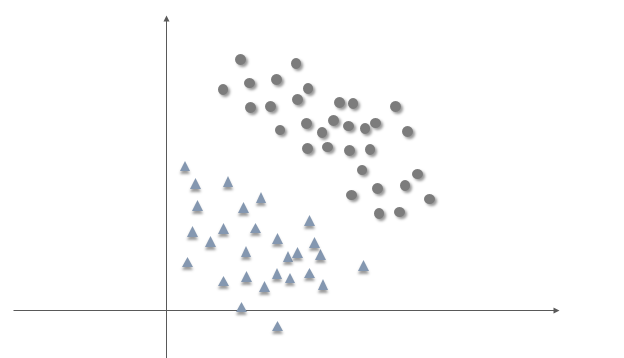

## Support Vector Machine Algorithm

Consider the following training set whose elements belong to two different types

$$
S = \{(x^{(i)}, y_i )\,\mid i = 1,,,n\}
$$

where $$x^{(i)}$$ is a feature vector in *d* -dimensions, and we use $$y \in \{1,-1\}$$ to denote the class labels. To simplify our discussion, I will use *d* = 2, and the dataset can be shown in a plane as following

There exist infinite
