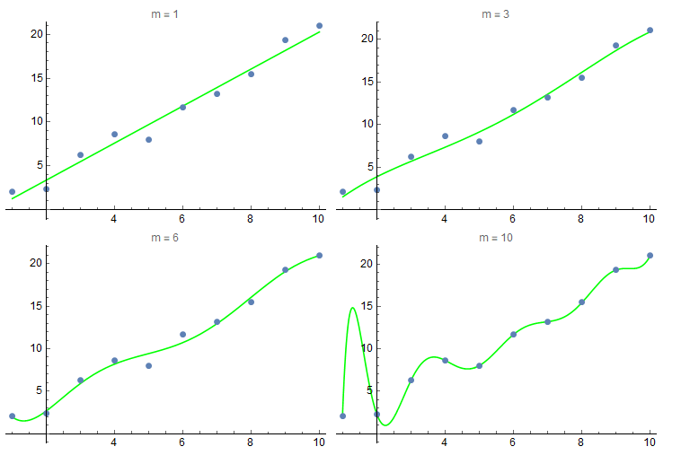

## 回归问题的贝叶斯理论

考虑一组标量观测值 $\mathbf{x} = \{x_1, x_2,...,x_n\}$，并假设这组值是独立的从高斯分布中抽取的，均值和方差分别为 $$\mu, \sigma^2$$，即

$$
x_i \sim N(\mu, \sigma^2)
$$

那么取得特定值的概率为

$$
p(x_i \mid \mu, \sigma^2) = \frac{1}{\sqrt{2 \pi} \sigma }\exp\left(-  \frac{(x_i-\mu)^2}{2 \sigma^2}\right)
$$

根据观测点的独立性，得到整个观测组的概率就为

$$
\begin{aligned}
p(\mathbf{x} \mid \mu, \sigma^2) &= \prod_{i = 1}^n \frac{1}{\sqrt{2\pi}\sigma}\exp\left(
  -  \frac{(x_i-\mu)^2}{2 \sigma^2}
  \right)\\
  &= \frac{1}{(\sqrt{2\pi}\sigma)^n}\exp\left(
-\sum_{i=1}^n  \frac{(x_i-\mu)^2}{2 \sigma^2}
    \right)
  \end{aligned}
$$

然后利用极大似然估计来求参数 $$\mu, \sigma^2$$，对原始概率取对数得到对数似然函数

$$
\ln(p(\mathbf{x}\mid \mu, \sigma^2)) =-\frac 1 {2\sigma^2} \sum_{i=1}^n  (x_i-\mu)^2 - \frac n 2 \ln 2\pi -  n \ln \sigma
$$

最大化似然函数，令其对参数 $$\mu, \sigma^2$$ 求导取0 可得极大似然解

$$
\mu_{ML} = \frac 1 n \sum_{i=1}^n x_i\\
\sigma_{ML}^2 = \frac 1 n \sum_{i=1}^n  (x_i-\mu_{ML})^2
$$

下面来证明上述估计的偏性，对于 $$\mu_{ML}$$

$$
E(\mu_{ML}) = \frac 1 n \sum_{i = 1}^n E(x_i) = \frac 1 n \sum_{i=1}^n \mu = \mu
$$

也就是说 $$\mu_{ML}$$ 对均值的估计是无偏的，而对于 $$\sigma_{ML}$$

$$
\begin{aligned}
\sigma^2_{ML} &= \frac 1 n  \sum_{i=1}^n  (x_i-\mu_{ML})^2\\
&=\frac  1 n \sum_{i=1}^n (x_i - \mu + \mu - \mu_{ML})^2\\
&= \frac 1 n \sum_{i=1}^n (x_i-\mu)^2 +\frac 1 n \sum_{i=1}^n (\mu_{ML} - \mu)^2 + \frac 2 n \sum_{i=1}^n (x_i - \mu)(\mu - \mu_{ML})\\
&= \frac 1 n \sum_{i=1}^n (x_i-\mu)^2 + (\mu_{ML} - \mu)^2 + \frac 2 n (\mu - \mu_{ML})\sum_{i=1}^n (x_i - \mu)
\end{aligned}
$$

而又由于 $\sigma^2 = \frac 1 n \sum_{i=1}^n (x_i-\mu)^2$，且 $\mu_{ML} = \frac 1 n\sum_{i=1}^n x_i$，所以上式可写成

$$
\sigma_{ML}^2 = \sigma^2 - (\mu_{ML} - \mu)^2
$$

然后对其求平均

$$
E(\sigma_{ML}^2) = E(\sigma^2) - E[(\mu_{ML} - \mu)^2]
$$

右边第一项 $$E(\sigma^2) = \sigma^2$$，右边第二项 $$E[(\mu_{ML} - \mu)^2]$$，其实就是方差的定义，即

$$
\begin{aligned}
E[(\mu_{ML} - \mu)^2] &= Var(\mu_{ML})\\
&= Var(\frac 1 n \sum_{i=1}^n x_i) \\
&=\frac 1 {n^2} \sum_{i=1}^n Var(x_i)\\
&= \frac{\sigma^2} {n}
\end{aligned}
$$

于是得到

$$
E(\sigma_{ML}^2) = \frac{n-1}{n} \sigma^2
$$

也就是说使用 $$\sigma_{ML}$$ 来估计方差实际上是有偏差的，如果要得到无偏估计，只需要乘以一个系数

$$
\hat {\sigma} = \frac 1 {n-1} \sum_{i=1}^n (x_i -\mu_{ML})^2
$$

对于曲线拟合问题，我们不仅要知道这组自变量 $$\mathbf{x}$$，还应知道它们所对应的自变量，这里用向量 $\mathbf{t} = \{t_1, t_2 , ... ,t_n\}$ 表示。然后假设拟合曲线

$$
y(x,\omega) = \omega_0 + \omega_1 x + \omega_2 x^2 + ... + \omega_m x^m
$$

其中 $$m$$ 是曲线的最高阶数，显然阶数越高，模型越复杂。$$\omega$$ 是系数向量，是作为模型的参数而写在参数列表里。在这里，曲线拟合的任务就是通过已知数据集来确定参数向量 $$\omega$$ 的值。若定义误差函数

$$
err(\omega) = \frac 1 2\sum_{i=1}^n (y(x_i, \omega) - t_i)^2
$$

也就是说，使用模型 $$y(x, \omega)$$ 来计算其对已知数据集产生的误差，然后计算平方和得到总体的误差度量。如果我们的模型能相当精确地拟合，那么总体误差也将会达到一个相当小的水平。所以很合理的直觉是，选择适当的系数向量来使误差函数尽可能地小。那么我们的目标就是

$$
\min_{\omega}\, err(\omega)
$$

上述的分析很符合直觉思考，包括误差函数的选取也很合理，但是并未触碰到本质上的东西，所以产生了一些问题。比如说，假如我们的数据是从带噪音的线性模型中提取的，那么使用线性的模型即可很好地拟合，但若事先不知道这一点而使用了较高阶的模型，那么得到的结果就不会那么尽如人意了，甚至会出现过拟合的现象。

（使用不同阶数的模型得到的拟合结果，高阶模型导致过拟合）

所以模型复杂度的选取需要我们非常小心地处理，如果我们拿到的数据本身十分复杂，一眼看不出究竟该用怎样的模型，这就难办了。

下面我们再从概率论的观点考察这一曲线拟合问题，假设对于某一 $$x$$，目标值 $$t$$ 服从高斯分布，并且分布均值为 $$y(x,\omega)$$ （这是显然的，因为我们用 $$y(x,\omega)$$ 来拟合曲线，就表明这是我们认为的最有可能出现的结果），方差为 $$\sigma^2$$，即

$$
t \sim N(y(x, \omega), \sigma^2)\\
p(t\mid x, \omega, \sigma^2) = \frac{1}{\sqrt{2\pi}\sigma}\exp\left(-\frac{(t-y(x,\omega))^2}{2\sigma^2}\right)
$$

似然函数为

$$
\begin{aligned}
p(\mathbf{t}\mid \mathbf{x}, \omega, \sigma^2) &= \prod_{i=1}^n \frac{1}{\sqrt{2\pi}\sigma}\exp\left(-\frac{(t_i-y(x_i,\omega))^2}{2\sigma^2}\right)\\
&= \frac{1}{(\sqrt{2\pi}\sigma)^n}\exp\left(
-\sum_{i=1}^n \frac{(t_i-y(x_i,\omega))^2}{2\sigma^2}
  \right)
\end{aligned}
$$

取对数后得到

$$
\ln{p} =- \frac{1}{2\sigma^2}\sum_{i=1}^n (t_i - y(x_i,\omega))^2 -\frac n 2 \ln{2\pi} - \frac n 2 \ln{\sigma^2}
$$

针对 $$\omega$$ 最大化对数似然函数得到似然解 $$\omega_{ML}$$ ，这等价于最小化

$$
\frac{1}{2\sigma^2}\sum_{i=1}^n (t_i - y(x_i,\omega))^2
$$

这与前面定义的问题 $$\min \, err(\omega)$$ 如出一辙，也就是说前面的最小化误差函数是极大似然估计得自然结论。另一方面，对 $$\sigma^2$$ 求导，可以得到方差的极大似然解

$$
\sigma_{ML}^2 = \frac 1 n \sum_{i=1}^n (t_i - y(x_i,\omega_{ML}))^2
$$

于是我们得到了根据 $$x$$ 预测 $$t$$ 的概率分布

$$
p(t\mid x, \omega_{ML}, \sigma_{ML}^2) = \frac 1 {\sqrt{2\pi}\sigma_{ML}}\exp\left(
-\frac{(t - y(x, \omega_{ML}))^2}{2\sigma_{ML}^2}
  \right)
$$

这是一个比单纯的点估计 $$y(x,\omega)$$ 更有意思的结论，因为它给出了取得特定值的确信程度。

为了表达上的简洁，我们把 $$y(x, \omega)$$ 写成向量积的形式

$$
y(x, \omega) = \omega^T \hat{x}
$$

其中 $$\hat{x}$$ 是 *x* 的各阶指数组成的列向量 $\hat{x} = \{1, x_1,x_2,,, x_m\}^T$$ 。

利用共轭先验，我们可以假设参数 $$\omega$$ 的先验分布为均值为 0 的多元高斯分布，并且协方差矩阵为 $\sigma_{\omega}^2 \mathbf{I}$，即

$$
p(\omega\mid\sigma_{\omega}^2) =\left( \frac{1}{2\pi \sigma_{\omega}^2}\right)^{\frac{m+1}2} \exp\left(
-\frac 1 {2\sigma_{\omega}^2} \omega^T \omega
  \right)
$$

给定数据集，我们可以利用贝叶斯定理来得到 $$\omega$$ 的后验分布

$$
p(\omega \mid \mathbf{x}, \mathbf{t}) = \frac{p(\mathbf{t}\mid \omega, \mathbf{x}) p(\omega)}{p(\mathbf{t})}
$$

注意为了表达逻辑清晰，上式省略了超参数 $$\sigma^2, \sigma_{\omega}^2$$。由于 $$p(\mathbf{t})$$ 与这里的各种模型参数都无关（这可以看作是目标值的先验分布，与回归模型的系数，系数的分布方差以及目标值后验分布方差都无关），于是

$$
p(\omega \mid \mathbf{x}, \mathbf{t}) \varpropto p(\mathbf{t}\mid \omega, \mathbf{x}) p(\omega)
$$

那么最大化 $$p(\omega \mid \mathbf{x}, \mathbf{t}) $$ 等价于最大化 $$p(\mathbf{t}\mid \omega, \mathbf{x}) p(\omega)$$，再将超参数放回来，就有

$$
\begin{aligned}
p(\mathbf{t}\mid \omega, \mathbf{x}, \sigma^2) p(\omega\mid \sigma_{\omega}) &=  \frac{1}{(\sqrt{2\pi}\sigma)^n}\exp\left(
-\sum_{i=1}^n \frac{(t_i-\omega^T \hat{x}_i)^2}{2\sigma^2}
  \right) \\
  &\cdot \left( \frac{1}{2\pi \sigma_{\omega}^2}\right)^{\frac{m+1}2} \exp\left(
  -\frac 1 {2\sigma_{\omega}^2} \omega^T \omega
    \right)\\

\end{aligned}
$$

对上式取负对数

$$
\begin{aligned}
-\ln(p(\mathbf{t}\mid \omega, \mathbf{x}, \sigma^2) p(\omega\mid \sigma_{\omega})) &=\frac 1 {2\sigma^2} \sum_{i=1}^n (t_i-\omega^T \hat{x}_i)^2 + \frac 1 {2\sigma_{\omega}^2} \omega^T \omega +C\\
&=\frac 1 {\sigma^2}\left(\frac 1 2  \sum_{i=1}^n (t_i-\omega^T \hat{x}_i)^2 + \frac \lambda 2  \omega^T \omega \right)+C\\
&=\frac 1 {\sigma^2} L(\omega) +C
\end{aligned}
$$

其中 $$C$$ 是一个与 $$\omega$$ 无关的量，$$\lambda = \frac{\sigma^2}{\sigma_{\omega}^2}$$。于是在给定 $$\sigma^2,\sigma_{\omega}^2$$ 的情况下，最大化 $$\omega$$ 的后验概率就等价于最小化 $$L(\omega)$$，而

$$
L(\omega) = err(\omega) + \frac \lambda 2 \omega^T \omega
$$

可以发现，相较于单纯地优化误差函数 $$err(\omega)$$ ，上式还增加了额外的项，直观地看，这一项对 $$\omega$$ 的有效数量和值产生了抑制作用，也可以说是控制了模型的复杂度。

但是上述过程得到的也只是系数向量 $$\omega$$ 的点估计，没有说明它等于某个具体向量的概率是多少，这是我们下面要解决的问题。

还是考虑 $$\omega$$ 的后验分布

$$
p(\omega\mid \mathbf{t}) = \frac{p(\mathbf{t}\mid \omega)p(\omega)}{p(\mathbf{t})}
$$

这里我们省略了 $$\mathbf{x}$$ ，将 $$p(\mathbf{t}\mid \omega)$$ 作如下变形

$$
\begin{aligned}
p(\mathbf{t}\mid \omega) &= \frac{1}{(\sqrt{2\pi}\sigma)^n}\exp\left(
-\sum_{i=1}^n \frac{(t_i-\omega^T \hat{x}_i)^2}{2\sigma^2}
  \right)\\
  &=\frac{1}{(\sqrt{2\pi}\sigma)^n}\exp\left(
  -\frac 1 {2\sigma^2} (\mathbf{t} - \omega^T A)^T (\mathbf{t} - \omega^T A)
    \right)\\
    &= \frac{1}{(\sqrt{2\pi})^n |\sigma^2 \mathbf{I}|^{\frac n 2}}\exp\left(-\frac 1 2 (\mathbf{t} - \omega^T A)^T (\sigma^2 \mathbf{I})^{-1}(\mathbf{t} - \omega^T A)\right)
  \end{aligned}
$$

上面为了将求和写成向量乘法的形式，引入了新的符号 $$A = [\hat{x}_1,\hat{x}_2,..., \hat{x}_n]$$，这是一个 m x n 的矩阵。

 从上式可以看出，似然函数其实是一个均值为 $$\omega^T \hat{x}$$，协方差矩阵为 $$\sigma^2 \mathbf{I}$$ 的高斯分布。于是

$$
\begin{aligned}
p(\omega \mid \mathbf{t} ) &= \frac{1}{p(\mathbf{t})} \frac{1}{(\sqrt{2\pi})^n |\sigma^2 \mathbf{I}|^{\frac n 2}}\exp\left(-\frac 1 2 (\mathbf{t} - \omega^T \hat{x})^T (\sigma^2 \mathbf{I})^{-1}(\mathbf{t} - \omega^T \hat{x})\right)\\
&\cdot \left( \frac{1}{2\pi \sigma_{\omega}^2}\right)^{\frac{m+1}2} \exp\left(
-\frac 1 {2\sigma_{\omega}^2} \omega^T \omega
  \right)\\
  &= \frac 1 {p(t)} \frac 1 {(\sqrt{2\pi})^{m+n+1} \sigma^n \sigma_{\omega}^{m+1}}\exp\left(-\frac 1 {2\sigma^2} (\mathbf{t}-\omega^T\hat{x})^T(\mathbf{t}-\omega^T\hat{x}) - \frac 1 {2\sigma_{\omega}^2} \omega^T \omega
     \right)\\
\end{aligned}
$$

单独考虑指数项

$$
\begin{aligned}
&-\frac 1 {2\sigma^2}
 (\mathbf{t}-\omega^T\hat{x})^T(\mathbf{t}-\omega^T\hat{x}) - \frac 1 {2\sigma_{\omega}^2} \omega^T \omega\\
 &= -\frac 1 2 \left[\sigma^{-2} \mathbf{t}^T \mathbf{t} + \omega^T (\sigma^{-2}\hat{x} \hat{x}^T + \sigma_{\omega}^{-2})\omega  \right]
\end{aligned}
$$

前面假设了参数 $$\omega$$ 服从均值为 0，方差为 $$\sigma_{\omega}^2\mathbf{I}$$ 的高斯分布，为了泛用性，这里放宽一下条件，设先验分布为一般高斯分布

$$
p(\omega)= N(\mu_{\omega}, \Sigma_{\omega}) = \frac{1}{(\sqrt{2\pi})^{m+1} |\Sigma_{\omega}|^{\frac{m+1}{2}}}
\exp\left(
-\frac 1 2 (\omega - \mu_{\omega})^T \Sigma_{\omega}^{-1}(\omega-  \mu_{\omega})
  \right)
  $$

并且根据贝叶斯定理，可以算出 $$\omega$$ 的后验分布

$$
p(\omega\mid \mathbf{t}) = \frac{p(\mathbf{t}\mid \omega) p(\omega)}{p(\mathbf{t})}
$$

这里的 $$p(\mathbf{t}\mid \omega)$$ 就是前面的似然函数，只不过省略了 $$\mathbf{x}, \sigma^2$$ 而已。将上式展开

$$
\begin{aligned}
p(\omega\mid\mathbf{t}) &= \frac{1}{p(\mathbf{t})} \frac{1}{(\sqrt{2\pi}\sigma)^n}\exp\left(
-\sum_{i=1}^n \frac{(t_i-\omega^T \hat{x})^2}{2\sigma^2}
  \right)\\
  &\cdot \frac{1}{(\sqrt{2\pi})^{m+1} |\Sigma_{\omega}|^{\frac{m+1}{2}}}
  \exp\left(
  -\frac 1 2 (\omega - \mu_{\omega})^T \Sigma_{\omega}^{-1}(\omega-  \mu_{\omega})
    \right)
\end{aligned}
$$

由于选择了与似然函数共轭的先验分布，所以后验分布也具有高斯分布的形式，我们假设它的均值和协方差矩阵分别为 $$\mu_0, \Sigma_0$$，那么

$$
p(\omega\mid\mathbf{t}) =
$$

end
