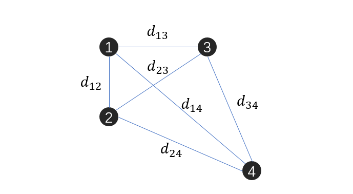
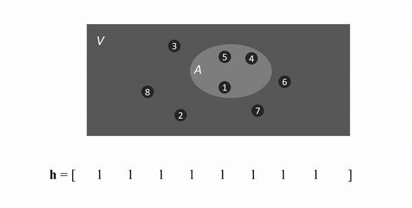

考虑数据集 $V = \{x_i\}_1^n$，为了形容这些点之间的距离关系，我们可以定义一个 *n x n*  矩阵 $$M$$ ，其中 $$M_{ij} = \|x_i - x_j\|$$。比如图1所示的点集

所形成的矩阵为

$$
M = \left[
\begin{aligned}
0      &\quad d_{12}& d_{13}&\quad d_{14}\\
d_{12} &\quad 0     & d_{23}&\quad d_{24}\\
d_{13} &\quad d_{23}& 0     &\quad d_{34}\\
d_{14} &\quad d_{24}& d_{34}&\quad 0
\end{aligned}
\right]
$$

通常我们认为，距离越近的点，其联系越紧密。比如特征空间中的点，若离得很近，就说明两者的相似度很高。于是可以使用一个函数将矩阵 $$M$$ 的元素映射成度量点对之间相似度的值，并且为了减少信息量，规定如果两个点离得过于远，那么就将其置为 0，比如

$$
f(d) = \left\{
\begin{aligned}
&e^{-d} \quad e^{-d} \ge \theta\\
&0\quad else
\end{aligned}
  \right.
$$

这里的 $$\theta$$ 为阈值参数，介于 0 和 1 之间，当 $$d$$ 趋近于 0 的时候，函数值接近于 1，也就是说两者趋于相同，反之则愈来愈不像。使用这种方式变换后的矩阵称为相似矩阵 (similarity matrix)，我们用 $$W$$ 表示，并在下面用 $$w_{ij} = w(x_i, x_j)$$ 来代表其中的元素。

然后我们定义数据集之间的关系，首先，如果集合 *A,B* 不相交，则定义

$$
cut(A, B) = \sum_{x_i \in A}\sum_{x_j \in B} w(x_i, x_j)
$$

总体来看，如果两个集合在空间中离得很远，那么 $$cut(A, B)$$ 也会相对较小。这就给与我们以启发：若给定一点集，我们是否可以将其分成这样两个部分，使得 $$cut$$ 值是所有分割中最小的？反过来就是说，可以通过优化 $$cut$$ 来对点集进行分类。

。。。。。。。。。

content future

。。。。。。。。。

如果两个集合呈包含关系，例如 $$A\subseteq V$$，那么定义

$$
assoc(A, V) = \sum_{x_i \in A} \sum_{x_j \in V} w(x_i, x_j)= \sum_{x_i \in A} \sum_{j=1}^n w(x_i, x_j)
$$

显然，集合 *A* 越大，$$assoc(A, V)$$ 的值就越大。

然后定义

$$
\begin{aligned}
Ncut(A, B) &= \frac{cut(A, B)}{assoc(A, V)} + \frac{cut(A, B)}{assoc(B, V)}\\
&= \frac{\sum_{x_i \in A}\sum_{x_j\in B} w(x_i, x_j)}{\sum_{x_i \in A}\sum_{j=1}^n w(x_i, x_j)} +  \frac{\sum_{x_i \in A}\sum_{x_j\in B} w(x_i, x_j)}{\sum_{x_i \in B}\sum_{j=1}^n w(x_i, x_j)}
\end{aligned}
$$

上述形式虽然直观，但不够数学化，并不能找到合适的优化目标。于是我们再定义
集合 *V* 包含 *A* 情况的指示向量 $\mathbf{h}$，$$\mathbf{h}$$ 是一个 *n* 维向量，它的元素与 *V* 中的元素对应，如果 $$x_i \in A$$ 那么 $$\mathbf{h}$$ 的第 *i* 个元素 $$h_i = 1$$ ，否则等于 $$h_i = -1$$。

（指示向量的构造过程示意）

那么可以将上面的公式各项重写为（为了简化，令 $$w_{ij} = w(x_i, x_j)$$）

$$
\begin{aligned}
\sum_{x_i \in A}\sum_{x_j\in B} w(x_i, x_j) &= \sum_{h_i = 1}\sum_{h_j = -1}-w_{ij}h_i h_j\\
\sum_{x_i \in A}\sum_{j=1}^n w(x_i, x_j) &= \sum_{h_i=1} \sum_{j
   = 1}^n w_{ij}\\
\sum_{x_i \in B}\sum_{j=1}^n w(x_i, x_j) &= \sum_{h_i=-1}^n \sum_{j = 1}^n w_{ij}
\end{aligned}
$$

然后再对指示向量进行变换，令

$$
\mathbf{p} = \frac{1+\mathbf{h}}{2}\\
\mathbf{q} = \frac{1-\mathbf{h}}{2}
$$

可以发现，$$\mathbf{p}$$ 将 $$\mathbf{h}$$ 中的全部 1 保留，其余的都为 0，而 $$\mathbf{q}$$ 则相反，将全部的 -1 变成了 1，其余的也为 0。这样做的原因是为了将求和写成矩阵形式，即

$$
\begin{aligned}
 \sum_{h_i = 1}\sum_{h_j = -1}-w_{ij}h_i h_j &= \sum_{i=1}^n \sum_{j=1}^n w_{ij}  p_i q_j\\
 &= \sum_{i=1}^n \sum_{j=1}^n w_{ij}p_i (1-p_j)\\
 &= \sum_{i=1}^n  \sum_{j=1}^n w_{ij}p_i - \sum_{i=1}^n\sum_{j=1}^n w_{ij}p_i p_j\\
 &=\sum_{i=1}^n  \sum_{j=1}^n w_{ij}p_i - \mathbf{p}^T W \mathbf{p}
 \end{aligned}
$$

再定义 $$d_i = \sum_{j=1}^n w_{ij}$$，上式又可继续写作

$$
= \mathbf{d}^T \mathbf{p} -  \mathbf{p}^T W \mathbf{p}
$$

其中 $\mathbf{d}^T = [d_1\quad d_2\quad ... \quad d_n]$。再引入对角矩阵 *D*

$$
D = \left[
\begin{aligned}
d_1&\quad 0  & ..&\quad 0\\
0  &\quad d_2& ..&\quad 0\\
0  &\quad 0  & ..&\quad 0\\
0  &\quad 0  & ..&\quad d_n
\end{aligned}
\right]
$$

以及，全 1 向量 $\mathbf{1}^T = [1\quad 1 \quad ... \quad 1]$，则有

$$
\mathbf{d}^T = \mathbf{1}^T \mathbf{D}
$$

并且可以证明

$$
\mathbf{1}^T \mathbf{D} \mathbf{p} = \mathbf{p}^T \mathbf{D}\mathbf{p}
$$

利用上面的推导可得

$$
\begin{aligned}
 \sum_{h_i = 1}\sum_{h_j = -1}-w_{ij}h_i h_j &= \mathbf{p}^T (D-W)\mathbf{p}\\ &= \frac 1 4 (1+\mathbf{h})^T (D-W)(1+\mathbf{h})
 \end{aligned}
$$

同理，也可以下面这种形式

$$
\begin{aligned}
 \sum_{h_i = 1}\sum_{h_j = -1}-w_{ij}h_i h_j &= \mathbf{q}^T (D-W)\mathbf{q}\\ &= \frac 1 4 (1-\mathbf{h})^T (D-W)(1-\mathbf{h})
 \end{aligned}
$$

另一方面

$$
\sum_{h_i=1} \sum_{j = 1}^n w_{ij} = \sum_{h_i=1}d_i = \frac{ \sum_{h_i=1}d_i}{}
$$

---------------------

---------------------

设 $$a, b$$ 分别是集合 $$A, B$$ 的元素数量，定义

$$
\begin{aligned}
Ratiocut(A, B) &= \frac{cut(A, B)} {a} + \frac{cut(A, B)}{b}\\
&= \frac 1 {a + b} cut(A, B) \left(
\frac {a+ b} a + \frac {a+b} b
  \right)\\
  &= \frac 1 {a + b} cut(A, B) \left(
  \frac b a + \frac a b + 2
    \right)\\
  &= \frac 1 {a+b} \sum_{x_i \in A}\sum_{x_j \in B} w_{ij}\left(\sqrt{\frac b a} + \sqrt{\frac a b}\right)^2\\
  &=\frac 1 {2(a+b)}\left( \sum_{x_i \in A}\sum_{x_j \in B} w_{ij}\left(\sqrt{\frac b a} + \sqrt{\frac a b}\right)^2
+\sum_{x_i \in B}\sum_{x_j \in A} w_{ij}\left(-\sqrt{\frac a b} - \sqrt{\frac b a}\right)^2
  \right)
\end{aligned}
$$

如果再定义向量 $\mathbf{f} = [f_1 \quad f_2 ... \quad f_n]$，其中

$$
f_i =\left\{ \begin{aligned}
\sqrt{\frac b a} \quad x_i \in A\\
-\sqrt{\frac a b} \quad x_i \in B
\end{aligned}
\right.
$$

那么 *Rationcut* 可写成

$$
Ratiocut(A, B) = \frac 1 {2 (a+b)}  \left(
\sum_{x_i \in A}\sum_{x_j \in B} w_{ij}(f_i- f_j)^2 + \sum_{x_i \in B}\sum_{x_j \in A}w_{ij} (f_i - f_j)^2
  \right)\\
  =\frac{1}{2(a+b)}\sum_{i = 1}^n \sum_{j=1}^n w_{ij}(f_i - f_j)^2
$$

再根据

$$
\begin{aligned}
\sum_{i = 1}^n \sum_{j=1}^n w_{ij}(f_i - f_j)^2 &= \sum_{i  =1}^n\sum_{j=1}^n w_{ij}f_i^2 + \sum_{i  =1}^n\sum_{j=1}^n w_{ij}f_j^2
-2\sum_{i  =1}^n\sum_{j=1}^n w_{ij}f_i f_j\\
&=\sum_{i=1}^n d_i f_i^2 + \sum_{j=1}^n d_j f_j^2 -2\mathbf{f}^T W \mathbf{f}\\
&=2 \mathbf{f}^T (D- W)\mathbf{f}
\end{aligned}
$$

于是

$$
Ratiocut(A, B) = \frac {1}{a+b} \mathbf{f}^T (D- W)\mathbf{f} = \frac {1}{a+b} \mathbf{f}^T L\mathbf{f}
$$

其中 $$L = D - W$$ 称为拉普拉斯矩阵。

end
