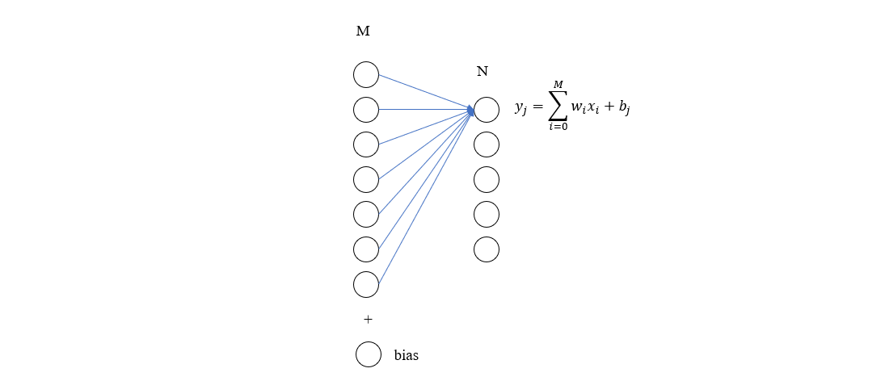
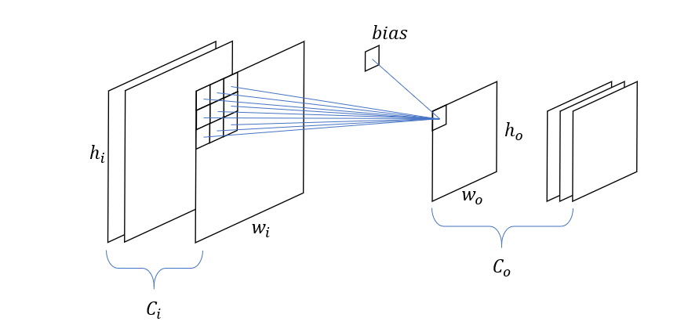

##### 全连接层

设输入维度为 \(M\)，输出维度为 \(N\)，那么每个输出节点都需要与 \(M\) 个 输入节点相连，参数量为 \(M \times N\)，再考虑到每个输出节点对应一个 bias 项，于是总的参数量为 \(M \times N + N\)。
每个输出节点由 \(M\) 个输入节点与权重相乘并求和得到，因此乘法计算量为 \(M\)，加法计算量为 \(M-1+1\)，于是浮点计算量为 \(2M \times N\)。

##### 卷积层

设卷积输入特征维度为 \(w_i, h_i, C_i\)，输出维度为 \(w_o, h_o, C_o\)，卷积核大小为 \(k\)。那么对于输出特征的每个通道来说，卷积核数量为 \(C_i\)，于是共有 \(C_i \times C_o\) 个卷积核，参数量为 \(C_i\times C_o \times k^2\)。再考虑到每个输出通道对应一个 bias，于是总的参数量为 \(C_i\times C_o\times k^2 + C_o\)
输出通道的每个节点计算公式为 

\[
  y_{st} = \sum_{i=0}^k \sum_{j=0}^k k_{ij} x_{p+i,p+j} + b_c
  \]

这里有  \(k^2 \times w_o \times h_o\) 次乘法运算，\(k^2 \times w_o \times  h_o - 1 + 1\) 次加法运算，于是总的浮点运算量为 \((2k^2 \times  w_o \times h_o) \times (w_o\times h_o \times C_o)\)

