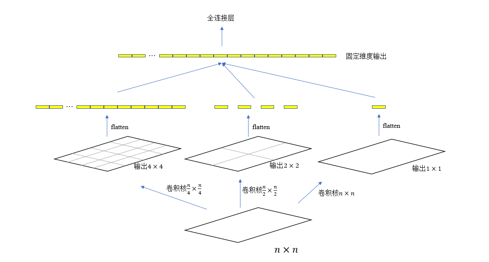

##### ImageNet 与 ILSVRC 

<!-- 在 21 世纪第一个 10 年接近尾声的时候，

ILSVRC 是 ImageNet Large Scale Visual Recognition Competition 的简称， -->

##### RCNN

原理：

对于每张图片，使用 selective search 方法提取数千个 region proposal，将每个 region resize 到相等的尺寸，然后输入到卷积网络提取特征，再经过全连接层得到维度为 4096 的特征向量，利用这些特征向量作为训练数据，针对每个类别训练 SVM 模型。

缺点：

* 训练开销大，每张图片的 region proposal 有数千个，需要在每张图片上重复地应用卷积网络来提取特征。
* 图像几何变形，为了保证每个特征向量的维度相同，需要将输入卷积网络的每个 region 进行非等比例放缩，这不利于特征提取。

##### SPPNet

空间金字塔池化 SPP

* 无视输入图片的尺寸，始终得到固定尺寸的输出；
* 在多个尺度上提取特征，可以提高识别精度；
* 每张图片只需要应用一次卷积网络，然后使用SPP提取特征，可以获得比RCNN更快的训练速度
* 与卷积网络架构正交，可以接入各种卷积网络。

在 RCNN 的基础上引入 SPP 层，可以有效解决前面提到的两个缺点。
