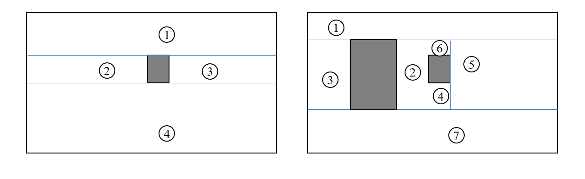
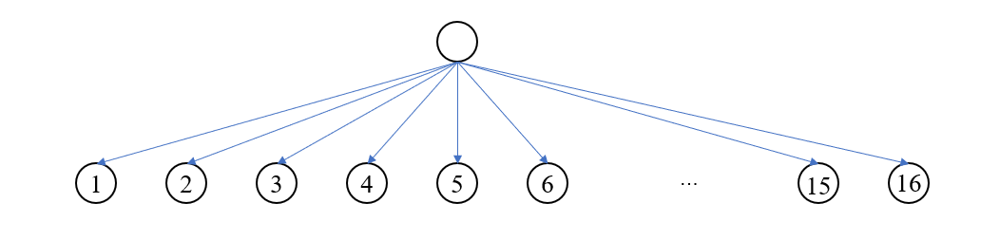
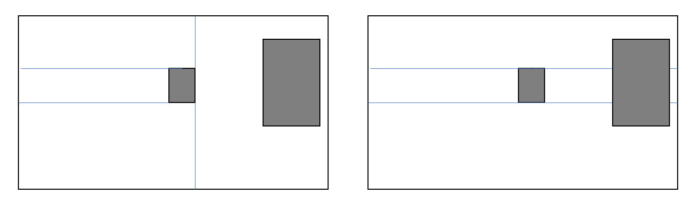
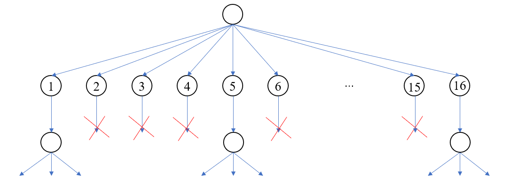

**问题** 给定一个矩形作为背景，在其中放置一个矩形物体，可以将大矩形分割成若干个大小不等的矩形，放置的矩形物体越多，分割方案也越多。

现在给出大矩形的坐标，以及若干矩形物体的坐标（矩形物体完全位于大矩形内部，且矩形物体之间不相交），要求编程输出分割最大的矩形坐标。

**解答**

首先分析放置一个矩形的分割情况，一个矩形可以把背景分割成 4 个部分，其中每个点可以横向或者纵向绘制线段，因此总共有 \(2^4 = 16\) 种分割方案。

在放置第二个矩形物体的时候，会出现两种情况，一种情况是落入前一步的小矩形内，第二情况是破坏原来的分割方案。

对于第一种情况，物体可以继续分割其所在的矩形，而第二种情况则直接淘汰掉，表现在树结构上可以看作是剪枝

加入更多的物体其实就是不断的对树进行扩展，并在这一过程中剪枝。最终可以得到多条可行的路径，我们只需追溯这些路径就可以看到物体对背景的分割情况，