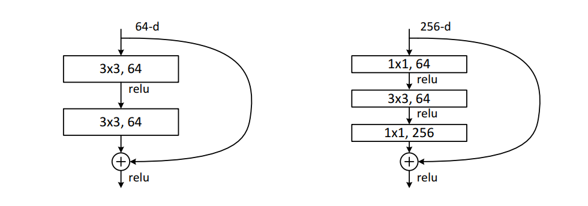

ResNet 通过建立短路连接，实现了一般神经网络难以模拟的恒等映射，其常用的具体架构一般有 resnet18，resnet34，resnet50，resnet101 和 resnet152 这五种，本文将从代码层面详细分析如何搭建这些结构。

首先，从最粗略的层面来看，各种 resnet 都有一个大致相同的结构，可以说是骨架中的骨架，即（conv -> bn -> relu -> maxpool -> 4 x res_layer -> avgpool），其简化代码如下

```python
class ResNet(nn.Module):
  def __init__(self):

    self.conv1 = nn.Conv2d()
    self.bn1 = nn.BatchNorm2d()
    self.relu = nn.ReLU()
    self.maxpool = nn.MaxPool2d()
    self.layer1 = res_layer()
    self.layer2 = res_layer()
    self.layer3 = res_layer()
    self.layer4 = res_layer()
    self.avgpool = nn.AvgPool()

  def forward(self, x):
    x = self.conv1(x)
    x = self.bn1(x)
    x = self.relu(x)
    x = self.maxpool(x)
    
    x = self.layer1(x)
    x = self.layer2(x)
    x = self.layer3(x)
    x = self.layer4(x)
    
    x = self.avgpool(x)
    return x

```

通过调节各个 res layer 的残差块数量, 就可以实现不同深度的版本. 具体分布如下表所示

||layer1|layer2|layer3|layer4|
|--|--|--|--|--|
|resnet18|2|2|2|2|
|resnet34|3|4|6|3|
|resnet50|3|4|6|3|
|resnet101|3|4|23|3|
|resnet152|3|8|36|3|

而残差块又分为两种类型, 即 basic block 和 bottleneck block, 其结构参考下图所示



其中 basic block 由两个核大小相同的卷积层组成, 而 bottleneck block 则有 3 个卷积层, 其中第一层和第三层为 1 by 1 卷积. 另一个重要的区别是 basic block 两个卷积层的输出通道相同, 而 bottleneck block 的最后一层输出通道是前一层输出通道的 4 倍. 

我们首先来看 basic block 的简化代码

```python 
class BasicBlock(nn.Module):
  def __init__(self, in_channels, out_channels):
    self.conv1 = conv3x3(in_channels, out_channels)
    self.bn1 = nn.BatchNorm2d()
    self.relu = nn.ReLU()
    self.conv2 = conv3x3(out_channels, out_channels)
    self.bn2 = nn.BatchNorm2d()
    if in_channels == out_channels:
      self.shortcut=nn.Sequential(
        nn.Conv2d(out_channels),
        nn.BatchNorm2d()
      )
    
  def forward(self, x):
    identity = x
    x = self.conv1(x)
    x = self.bn1(x)
    x = self.relu(x)

    x = self.conv2(x)
    x = self.bn2(x)

    if self.shortcut:
      identity = self.shortcut(identity)
    
    x = x + identity
    x = self.relu(x)

    return x
```

在这里, 由于输入通道数可能和输出通道数不同, 所以利用 shortcut 层将输入张量的维度变换到卷积层的输出维度, 以便实现两者相加. 

bottleneck block 的实现也大同小异, 只不过需要注意最后一层的通道扩展

```python
class Bottleneck(nn.Module):

  expansion = 4 ## 最后一层的输出通道扩展倍数

  def __init__(self, in_channels, out_channels):
    self.conv1 = conv1x1(in_channels, out_channels)
    self.bn1 = nn.BatchNorm2d()
    self.conv2 = conv3x3(out_channels, out_channels)
    self.bn2 = nn.BatchNorm2d()
    self.conv3 = conv1x1(out_channels, out_channels * expansion)
    self.bn3 = nn.BatchNorm2d()
    self.relu = nn.ReLU()
    if in_channels != out_channenls * expansion
      self.shortcut = nn.Sequential(
        nn.Conv2d(in_channels, out_channels * expansion)
      )

  def forward(self, x):
    identity = x
    x = self.conv1(x)
    x = self.bn1(x)
    x = self.relu(x)

    x = self.conv2(x)
    x = self.bn2(x)
    x = self.relu(x)
    
    x = self.conv3(x)
    x = self.bn3(x)

    if self.shortcut:
      identity = self.shortcut(x)
    
    x = x + identity
    x = self.relu(x)

    return x

```

根据原论文中的叙述, basic block 一般作为 resnet18 和 resnet34 的残差块, 其他架构用 bottleneck block. 