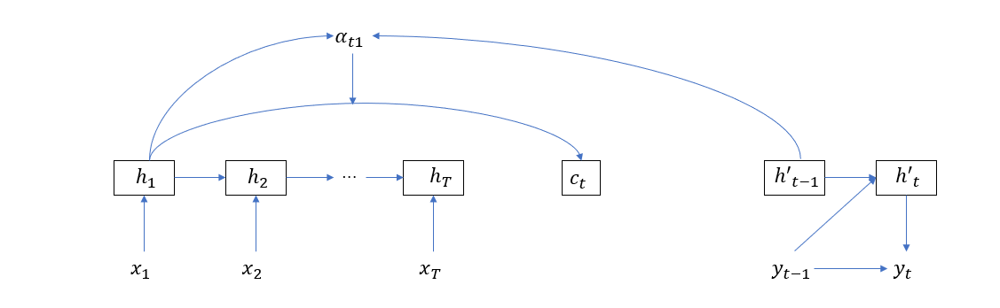
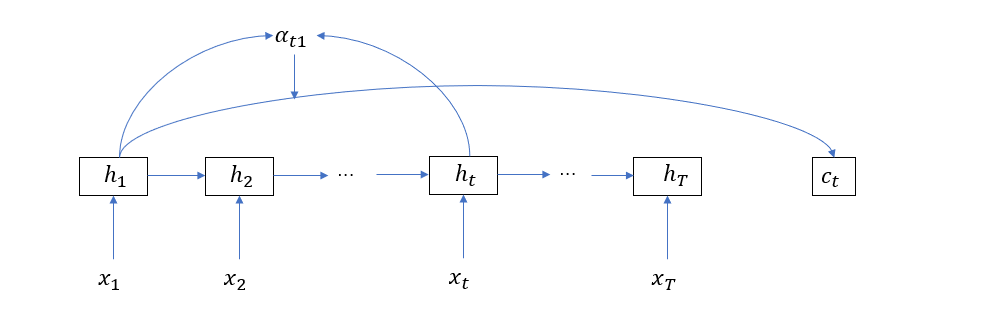

##### 自注意力机制

在 Seq2Seq 模型中，引入的注意力机制着眼于建立输出值与输入序列各单词的关联关系，以最简单的 Seq2Seq 结构为例，权重值的计算依赖于输入单元和输出单元。如下图所示，在计算注意力向量\(c_t\) 的时候，\(h_1\) 的权重 \(\alpha_{t1}\) 依赖于输入隐层单元 \(h_1\) 和输出隐层单元 \(h'_{t-1}\)。

而自注意力则关注输入序列或输出序列各单词之间的关联关系，如果非要用和上图类似的模式，那么自注意力的计算将如下图所示

同之前的叙述类似，其计算公式为

\[
  c_t = softmax(a(h_t, h)) \cdot h_t
  \]