##### 自注意力机制

在 Seq2Seq 模型中，引入的注意力机制着眼于建立输出值与输入序列各单词的关联关系，以最简单的 Seq2Seq 结构为例，权重值的计算依赖于输入单元和输出单元。如下图所示，在计算注意力向量\(c_t\) 的时候，\(h_1\) 的权重 \(\alpha_{t1}\) 依赖于输入隐层单元 \(h_1\) 和输出隐层单元 \(h'_{t-1}\)。

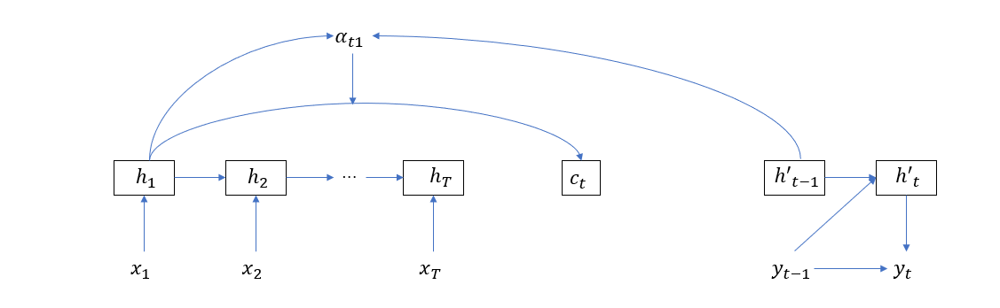

而自注意力则关注输入序列或输出序列各单词之间的关联关系，如果非要用和上图类似的模式，那么自注意力的计算将如下图所示

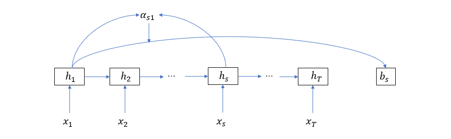

同之前的叙述类似，其计算公式为

\[
  \begin{aligned}
  c_t &= \sum_{i=1}^T \alpha_{ti} h_i =\alpha_t H   \\
  \alpha_{j} &= softmax(e_j)\\
  e_{ji} &= a(h_j, h_i)
  \end{aligned}
  \]

其中 \(H = [h_1 \quad h_2 ... \quad h_T]\)，尺寸为 \(n\times T\)， \(a\) 为对齐模型，假设它的形式为两个向量参数的点积，即 \(a(h_j, h_i) = h_j^\top h_i\)，则有

\[
  \begin{aligned}
  e_j &= [e_{j1} \quad e_{j2} \quad ... \quad e_{jT}] \\
      &= [h_j^\top h_1 \quad h_j^\top h_2 \quad ... \quad h_j^\top h_T]\\
      &=h_j^\top H
  \end{aligned}
  \]

那么自注意力值的矩阵形式就为

\[
  \begin{aligned}
  c &= [c_1 \quad c_2 \quad ... \quad c_T] \\
    &= [\alpha_1 \quad \alpha_2 \quad ... \quad \alpha_T] H\\
    &= softmax([e_1 \quad e_2 \quad ... \quad e_T] )H \\
    &= softmax( [h_1^\top\quad h_2^\top\quad ... \quad h_T^\top]^\top H) H \\ 
    &= softmax(H^\top H) H
  \end{aligned}
  \]

上式的计算图如下

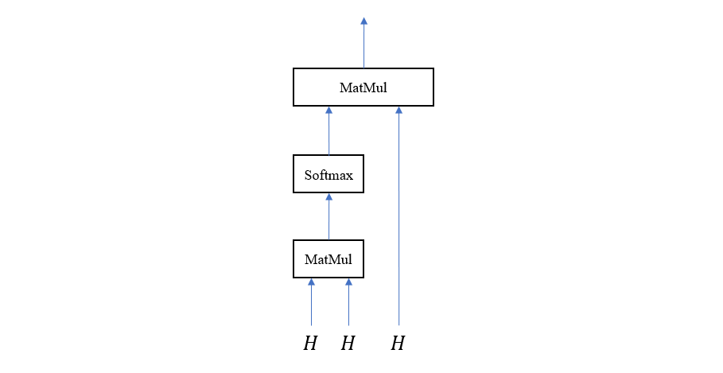

由于我们采用了点积对齐模型，所以这种注意力模型也叫点积注意力 (Dot-Product Attention)

##### Transfomer 的自注意力模块

来自 google 的论文 [Attention Is All You Need](https://arxiv.org/abs/1706.03762) 提出了一种被称为 Transformer 的新的 Encoder-Decoder 结构。它的特点是以注意力模块作为基本计算单元，而不是像之前的模型那样以 RNN 或者 LSTM 等结构作为基本构建块。所以这篇论文的名称就很有意思，如果事先不了解情况，会觉得不知所云，但实际上它的内涵很简单，那就是只保留注意力机制，或者更明确地说——使用注意力模块代替 RNN / LSTM 单元。下面我们就来看看 Transfomer 是如何从之前的 Encoder-Decoder 结构一步一步演化过来的（note：下面提到的这些网络结构不一定都是真实存在的，而是我们为了最终能得到 Transformer 而进行的实验，在某种程度上，这些结构反映了论文的作者们思维过程）。首先，我们给出传统的不带注意力机制的 Encoder-Decoder 网络

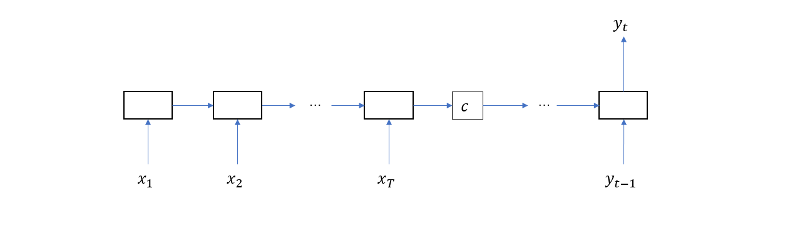

然后是带注意力机制的 Encoder-Decoder 网络（note：这里只画出了 \(c_t\) 的其中一个依赖节点）

接下来是带自注意力机制的 Encoder-Decoder 网络，为了区别注意力向量，这里我们用 \(b_s\) 代表第 \(s\) 个输入单词相关的自注意力向量

这里再多说几句，self-attention 是我们根据 attention 的计算过程而类比出来的，当我们在 attention 的上下文中讨论时，\(c_t\) 是整个输入单词和第 \(t\) 个输出值的语义关系向量。而在 self-attention 的情况下，\(b_s\) 是整个输入单词序列与第 \(s\) 个单词的语义关系向量。所以 attention 跨越了解码和编码阶段，而 self-attention 则仍然处于编码阶段，将完整的自注意力 Encoder 的结构画出来如下图

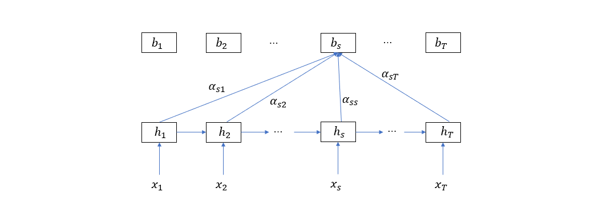

在解码阶段，自注意力向量将被用于计算注意力向量，就像之前把隐层状态用来计算注意力向量类似，补上 Decoder 的结构如下图

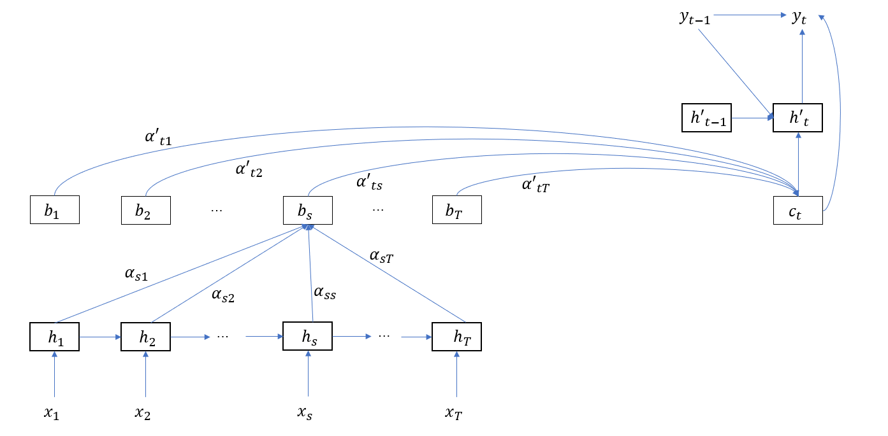

从这里就可以看出，自注意力向量在 Encoder 和 Decoder 端上都单独形成了一层，这时，RNN / LSTM 隐层单元就显得有点多余，所以最后让我们删掉 RNN / LSTM 单元，仅保留注意力结构

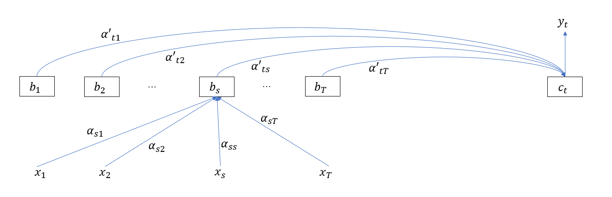

到这里，Transformer 已经颇具雏形了， 其中 \(b_s\) 的计算公式为

\[
  b_s = \sum_{i = 1}^T \alpha_{si} x_i
  \]

再结合上一节的讨论，写成矩阵形式

\[
  b = [b_1 \quad b_2 \quad ... \quad b_T] = softmax(X^\top X) X
  \]

其中 \(X = [x_1 \quad x_2 \quad ... \quad x_T]\)。将上式用计算图表示如下

从这里我们可以看到，去掉 RNN/LSTM 单元后，直接通过矩阵乘法就可以对输入数据进行编码，不像之前那样，首先输入 \(x_1\) 得到 \(h_1\)，然后再输入 \(x_2\) 才能得到 \(h_2\)，依次类推。顺序输入没有充分利用计算能力，而采用纯自注意力的编码器和解码器具有更高的计算效率。

##### Mulit-Head 注意力

Multi-Head 注意力是以上一节介绍的点积注意力模块为基本块而组成的，它的目的是构造多个子空间的注意力向量。所以，首先需要将输入向量映射到子空间，方法是使用全连接层，具体表现在乘以一个矩阵 \(X_s = X W\)。假设输入向量的维度为 \(d=512\)，需要构造 \(h=8\) 个子空间注意力，则每个子空间的维度为 \(64\)，于是矩阵 \(W\) 的尺寸就为 \(512 \times 64\)，子空间维度为 \(64\)，将这 8 个子空间注意力向量拼接起来又得到一个 512 维的联合注意力向量。这样一来，Multi-Head 注意力的输入和输出便和普通注意力模块的输入输出统一起来了，前者可以无缝替换后者。计算图如下所示

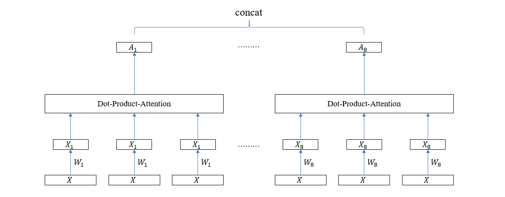

在这个计算图里面，每个 Head 的 3 个输入向量共享一个全连接层权重矩阵，但实际上，为了增强模型的泛化能力，可以独立地训练这些全连接层，于是上图可以稍微改变一下

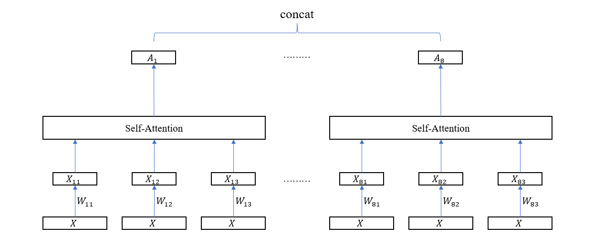

因为涉及到多个子空间的注意力向量计算，每个子空间的计算图就是一个 Head，所以这种方法就叫 Multi-Head Attention。

##### Transformer 的 Encoder-Decoder 结构

在第二节，我们从传统的 Seq2Seq 一路推到了以自注意力模块作为基础构建块的 Encoder-Decoder 结构，从原理上理解了 "Attention Is All You Need" 这句话的实际含义。但是，第二节给出的最终结构只能算是一个雏形，它能用，但不够好。正式的 Transformer 结构，从全局来看，分为 Encoder 和 Decoder 两个部分，其中 Encoder 接收输入序列，Decoder 接收输出序列并输出该序列的下一个单词，如下图所示

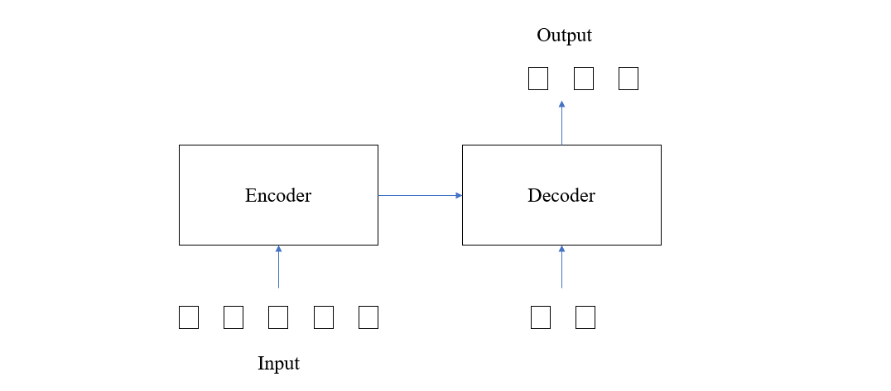

这里的解码器同以往的 Seq2Seq 结构类似，也需要利用前面的单词来计算后面的单词，不同的地方在于，在 Seq2Seq 结构中，因为一次只能输入一个单词，所以只能通过 \(y_{t_1}\) 来计算 \(y_t\)，而在 Transformer 中，因为可以同时输入一个单词序列，所以解码器采用的方法是以上一次计算的输出序列作为本次计算的输入，然后输出增加了一个单词的序列，并如此迭代，直到输出句尾标记（即\<EOS>）。显然，采用这种方式的优点在于，每预测一个单词，它前面的所有单词都能起到作用。

接下来我们将重点聚集到 Encoder 和 Decoder 的内部结构，如下图所示，每个 Encoder 都是由多个 Encoder Layer 组成的，前一个 Encoder Layer 的输出是后一个 Encoder Layer 的输入，Decoder 也是类似的结构，只不过每个 Decoder Layer 除了接收前一个 Decoder Layer 的输出值外，还要接收 Encoder 的输出值。

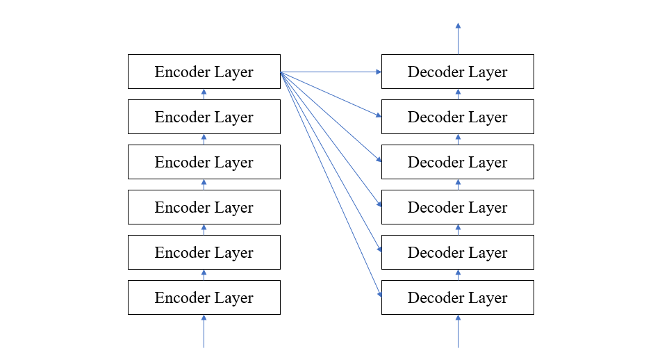

对于每个 Encoder Layer 来说，它又被分为两个主要层，第一个是我们前面讨论的注意力层（采用 Multi-Head 注意力），第二个就是普通的全连接层，并且在每个层前后还采用了残差连接，每层之后还进行了 normalzation。其结构如下图

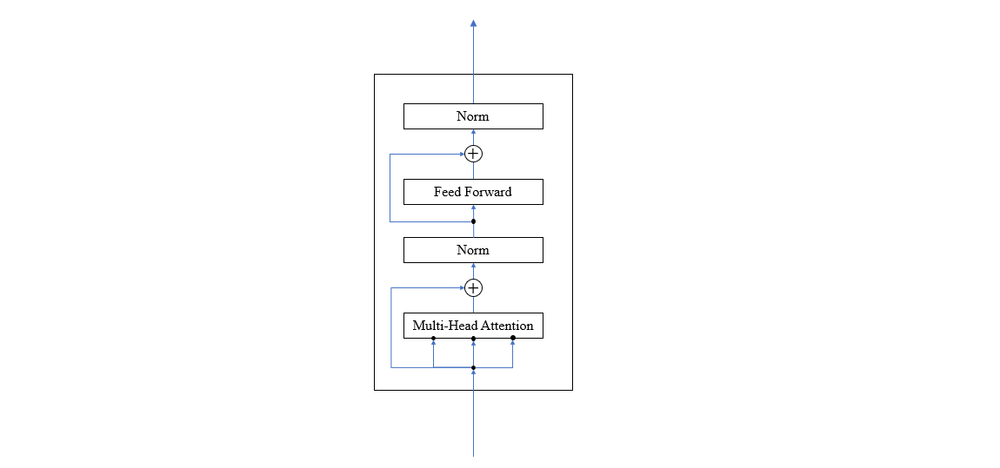

Decoder Layer 类似，不同的地方是多了一个注意力层，如下图所示

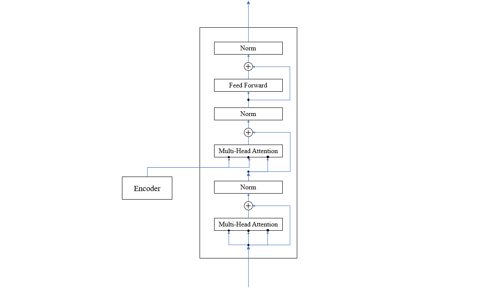

