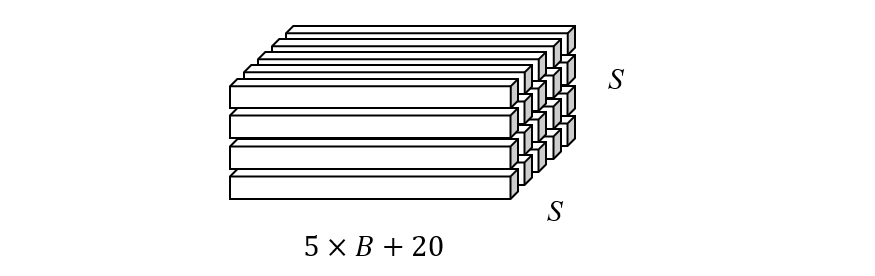
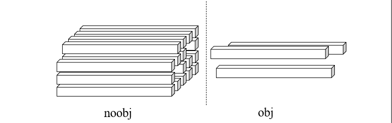
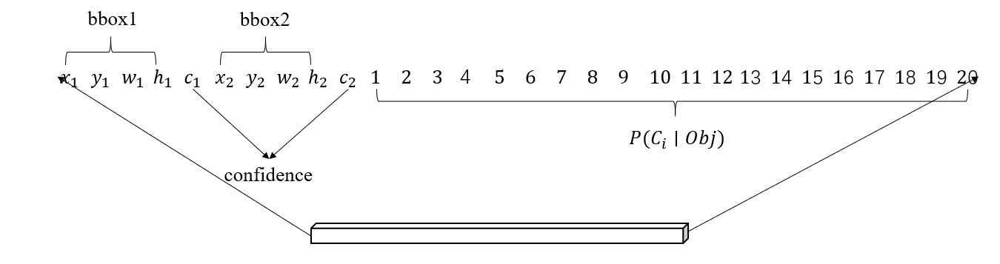

#### 损失函数

论文中 yolo 网络的输出内容是尺寸为 \(batch\_size \times S \times S \times (5 \times B + 20)\) 的张量，假设 \(batch\_size=1\)，我们可以把这个输出看作是一个数据立方体



其中每个向量都是其对应位置上的格子预测情况，再假设网络输出变量和 groud truth 如下

```python
X, y = ...
pred=net(X)
```

根据损失函数的定义

\[
  \begin{aligned}
  &\lambda_{coor} \sum_{i = 1}^{S^2} \sum_{j = 1}^B \mathbb{I}_{ij}^{obj} \left[(d_{x_j} - \hat{d}_x)^2 + (d_{y_j} - \hat{d}_y)^2\right] \\
  &+  \lambda_{coor} \sum_{i = 1}^{S^2} \sum_{j = 1}^B \mathbb{I}_{ij}^{obj} \left[(\sqrt{w_j} - \sqrt{\hat{w}})^2 + (\sqrt{h_j} - \sqrt{\hat{h}})^2\right] \\
  &+\sum_{i=1}^{S^2} \mathbb{I}_{ij}^{obj} \left(  C_i - \hat{C}_i\right)^2 +\lambda_{noobj} \sum_{i=1}^{S^2} \mathbb{I}_{i}^{noobj} \left(  C_i - \hat{C}_i\right)^2\\
  &+ \sum_{i = 1}^{S^2} \mathbb{I}_{i}^{obj} \sum_{c \in classes} \left( p_i(c \mid o) -  \hat{p}_i(c \mid o)\right)^2
  \end{aligned}
  \]

我们按格子上有无物体把上述数据立方体分成两个部分（这里我们假设其中三个格子有物体）



```python
coo_mask=y[:,:,:,4]>0 ## 包含物体的格子掩码
noo_mask=y[:,:,:,4]==0 ## 不含物体的格子掩码
noo_pred=pred[noo_mask] ## 不含有物体格子预测向量组
noo_y=y[noo_mask] ## 不含有物体格子的ground truth预测向量组
```

对于不含物体的预测向量，即上图左边的部分，按照损失函数公式，只需计算如下值

\[
  \lambda_{noobj} \sum_{i=1}^{S^2} \mathbb{I}_{i}^{noobj} \left(  C_i - \hat{C}_i\right)^2
  \]

这里的 \(C_i\) 和 \(\hat{C}_i\) 分别是预测存在物体和存在实际物体的置信度，当 \(B=2\) 的时候，它在向量中的位置为 5 和 10，对于不含物体的格子，这里的 \(\hat{C}_i\) 直接就等于 0，于是计算代码就为 

```python 
noo_pred_c=noo_pred[:, [4,9]] ## 不含物体格子的预测置信度
noo_y_c=noo_y[:, [4,9]] ## 不含物体格子的置信度 ground truth
noo_loss_c=F.mse_loss(noo_pred_c, noo_y_c, reduction='sum') ## 不含物体格子的预测置信度损失
```

对于包含物体的向量组，我们将计算公式分解成四个部分，首先是最简单的

\[
  \sum_{i=1}^{S^2} \mathbb{I}_{ij}^{obj} \left(  C_i - \hat{C}_i\right)^2 
  \]

上式的 \(\mathbb{I}_{ij}^{obj}\) 表明，每个格子的多个预测框中，只有一个最优的预测框参与计算。它们在向量中的位置如下



而为了确定最优预测框，论文采用的方法是计算预测框与真实物品框的交并比，我们先来看矩形交的计算，设两个矩形分别为 \([x_1, y_1, w_1, h_1]\) 和 \([x_2, y_2, w_2, h_2]\) 

\[
  \begin{aligned}
  &\lambda_{coor} \sum_{i = 1}^{S^2} \sum_{j = 1}^B \mathbb{I}_{ij}^{obj} \left[(d_{x_j} - \hat{d}_x)^2 + (d_{y_j} - \hat{d}_y)^2\right] \\
  &+  \lambda_{coor} \sum_{i = 1}^{S^2} \sum_{j = 1}^B \mathbb{I}_{ij}^{obj} \left[(\sqrt{w_j} - \sqrt{\hat{w}})^2 + (\sqrt{h_j} - \sqrt{\hat{h}})^2\right] \\
  &+\\
  &+ \sum_{i = 1}^{S^2} \mathbb{I}_{i}^{obj} \sum_{c \in classes} \left( p_i(c \mid o) -  \hat{p}_i(c \mid o)\right)^2
  \end{aligned}
  \]

首先可以发现，公式中将所有格子分成了有物体 (obj) 的和没有物体 (noobj) 的两类，其中预测框的坐标和尺寸误差以及物体类别的条件概率误差的计算仅依赖有物体的格子，置信度的误差依赖于所有格子，但是有物体的格子和没有物体的格子所占的权重不同。因此我们先按置信度是否大于 0 对 pred 和 target 建立遮罩，注意置信度在数组上的索引为 4

```python
coo_mask=target[:,:,:,4]>0 ## 含有物体置信度大于 0 的格子掩码
noo_mask=target[:,:,:,4]==0 ## 不含物体的格子掩码
```

然后分别处理有物体的格子和没有物体的格子上的预测信息，对于不含物体的格子，计算置信度损失

```python
noo_pred=pred[noo_mask] ## 不含有物体格子的预测信息
noo_target=target[noo_mask] ## 不含有物体格子的ground truth
noo_pred_c=noo_pred[:, [4,9]] ## 不含物体格子预测的置信度
noo_target_c=noo_target[:, [4,9]] ## 不含物体格子的置信度 ground truth

noo_loss_c=F.mse_loss(noo_pred_c, noo_target_c, reduction='sum') ## 不含物体格子的预测置信度损失
```

这就是公式中的 

\[
\sum_{i=1}^{S^2} \mathbb{I}_{i}^{noobj} (C_i - \hat{C_i})^2
\]

而对于含有物体的格子，情况要复杂很多，我们首先取出预测框

```python
coo_pred=pred[coo_mask] ## 含有物体格子的预测信息，shape=(N, 30)， N = 图片的物体数量
box_pred=coo_pred[:, :10] ## 边界框预测信息，长度 N，每一行包含两个预测框
box_pred=box_pred.unsqueeze(1).view(-1, 2, 5) ## 将每一行的10个数据拆分成两个向量，每个向量对应一个预测框
```

用同样的方法取出ground truth

```python
coo_target=target[coo_mask]
box_target=coo_target[:,:10]
box_target=box_target.unsqueeze(1).view(-1, 2, 5)
```

而为了计算剩余的损失，需要先计算每个格子和多个预测框的最佳交并比


