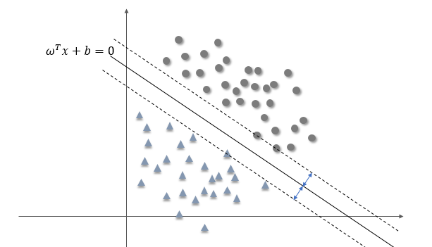

## 支持向量机

考虑属于两个类别的样本集合

$$
S = \{(x^{(i)}, y_i )\,\mid i = 1,,,n\}
$$

其中 $$x^{(i)}$$ 是维度为 *d* 的特征向量，$$y_i$$ 表示样本类别，等于 1 或者 -1。如果两个类别线性可分，那么将特征点集合投影到二维面上大致如下图所示

为了将对数据进行分类，我们可以选择一个超平面对两类数据进行切割，显然这里有无数种切割方式，但是有的分隔面比其他面效果更好。支持向量机的任务就是找到这样一个分隔面，使得所有特征点到它的最小距离达到最大值，或者换句话说就是，使得两类特征点到分隔面的最小距离相等，如下图所示

假设上图中的实线即为这样的超平面，设其方程为

$$
\omega^T x +b = 0
$$

我们说这样的分隔面使得特征点到它的最小距离最大，后续的讨论都将围绕这一目标来进行。

为了计算空间中一个点到超平面的距离，我们考虑如下位置关系，假设点 $$x^{(i)}$$ 距离超平面的距离为 $$\gamma_i$$，我们过这一点作一条垂线，垂足为 $$x_p$$，显然 $$x_p$$ 满足方程

$$
\omega^T x_p + b = 0
$$

并且可以证明从 $$x_p$$ 指向 $$x^{(i)}$$ 的方向为 $$\omega$$ ，于是存在下述关系

$$
x^{(i)} = x_p + \gamma_i \frac{\omega}{\|\omega\|}
$$

将 $$x^{(i)}$$ 代入函数 $$f(x) = \omega^T x + b$$

$$
\begin{aligned}
f(x^{(i)}) &= \omega^T (x_p + \gamma_i \frac{\omega}{\|\omega\|}) + b\\
&= \omega^T x_p + b + \gamma_i \|\omega\|\\
&=\gamma_i \|\omega\|\\
\gamma_i& =\frac{f(x^{(i)})}{\|\omega\|} =\frac{\omega^T}{\|\omega\|}x^{(i)} + \frac{b}{\|\omega\|}
\end{aligned}
$$

对于第二个类别的数据，$$x^{(i)}$$ 位于超平面的另一边，如下图

则类似地有

$$
x^{(i)} = x_p - \gamma_i \frac{\omega}{\|\omega\|}
$$

$$
\gamma_i =-\left( \frac{\omega^T}{\|\omega\|}x^{(i)} + \frac{b}{\|\omega\|}\right)
$$

设第一个类别的标签为 $$y_i = 1$$，第二类别为 $$y_i = -1$$，那么可以将距离统一写成

$$
\gamma_i =y_i \left(\frac{\omega^T}{\|\omega\|}x^{(i)} + \frac{b}{\|\omega\|}\right)
$$

这里的 $$\gamma_i$$， 就是特征点到超平面的间隔。对于一个特定的超平面，用 $$\omega, b$$ 来定义，不同的特征到它有不同的间隔值，而最小的那个间隔就被定义为

$$
\gamma = \min_{i=1,,,n} \gamma_i
$$

为了找到最合适的分隔面，我们定义的目标就是搜寻 $\omega, b$， 使得上述得到的最小间隔有最大的值，即

$$
\max_{\omega, b}\,\gamma
$$

其中 $$\gamma$$ 应满足

$$
\quad y_i \left(\frac{\omega^T}{\|\omega\|}x^{(i)} + \frac{b}{\|\omega\|}\right) \ge \gamma\,\,,\, i = 1,,,n
$$

这就是优化问题的约束条件。考虑将不等式两边同时乘以 $$\omega$$

$$
\quad y_i \left(\omega^Tx^{(i)} + b\right) \ge \|\omega\|\gamma\,\,,\, i = 1,,,n
$$

对于特定的问题，尽管还没有解出来，但是我们知道其固有的 $$\gamma$$ 是定值，而 $$\omega$$ 就不那么确定了，我们可以对其各分量等比例缩放，却不会对超平面的位置与方向造成影响，于是我们可以令

$$
\|\omega\| \gamma = 1
$$

那么优化问题就变成了

$$
\max_{\omega, b} \frac 1 {\|\omega\|}\\
s.t.\quad g(x^{(i)}) \le 0 ,\, i = 1,,,n
$$

其中 $$g(x^{(i)}) =- y_i(\omega^T x^{(i)} + b)+1$$。上面的问题也等价于

$$
\min_{\omega, b} \frac 1 2 \|\omega\|^2\\
s.t.\quad g(x^{(i)}) \le 0 ,\, i = 1,,,n
$$

这是一个有不等式约束的凸优化问题，可以利用拉格朗日乘子法求解，首先建立拉格朗日函数

$$
L(\omega, b,\alpha) = \frac 1 2 \|\omega\|^2 + \sum_{i=1}^n \alpha_i [- y_i(\omega^T x^{(i)} + b)+1]
$$

其中 $$\alpha$$ 为拉格朗日乘子向量，规定它的每个分量都为非负值。

然后定义

$$
\Theta_p(\omega, b) = \max_{\alpha_i \ge 0} L(\omega, b, \alpha)
$$

由于 $$\alpha_i$$ 的任意性，如果任一约束条件得不到满足，都能使拉格朗日函数趋于无穷大，而当所有约束条件都满足时，有

$$
\Theta_p(\omega, b) = \frac 1 2 \|\omega\|^2
$$

所以上述带不等式约束的凸优化问题，可以转换成不带约束的凸优化问题

$$
\min_{\omega, b} \max_{\alpha_i \ge 0} L(\omega, b, \alpha)
$$

前面的约束 $$g(x_i) \le 0$$ 在这里是自然成立的，因为如果有一项不成立，将取不到极小值。

如果满足一定的条件，那么上述问题又可转换成其对偶形式

$$
\max_{\alpha_i \ge 0}\min_{\omega, b}  L(\omega, b, \alpha)
$$

待续

end
